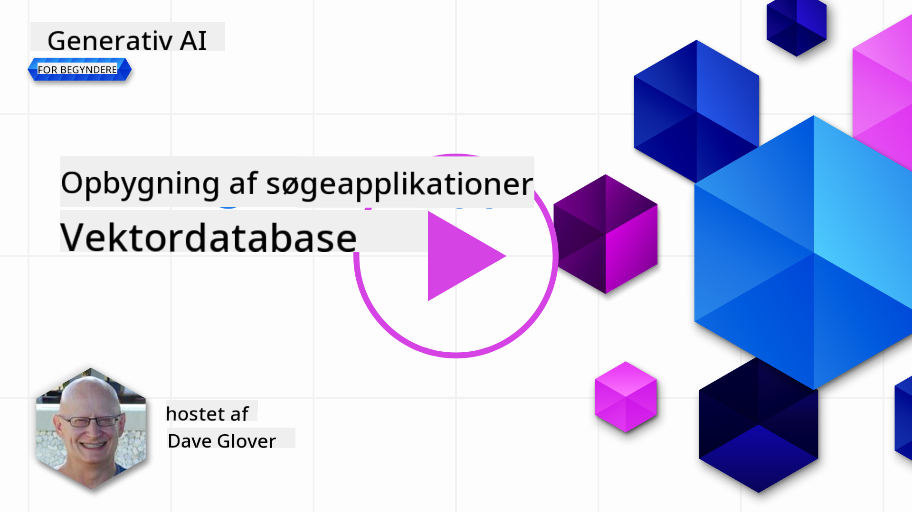
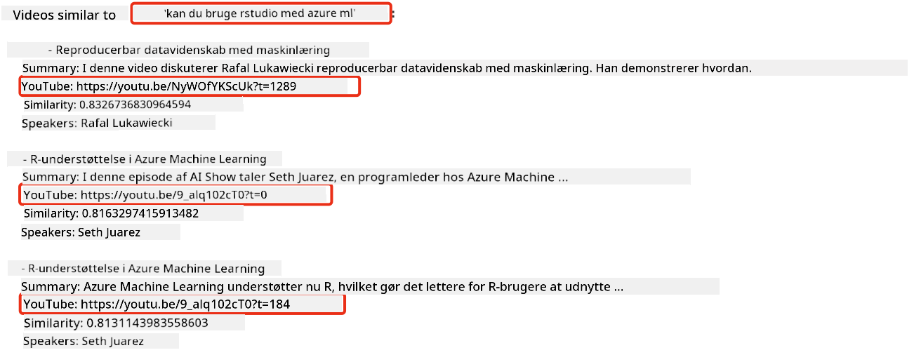
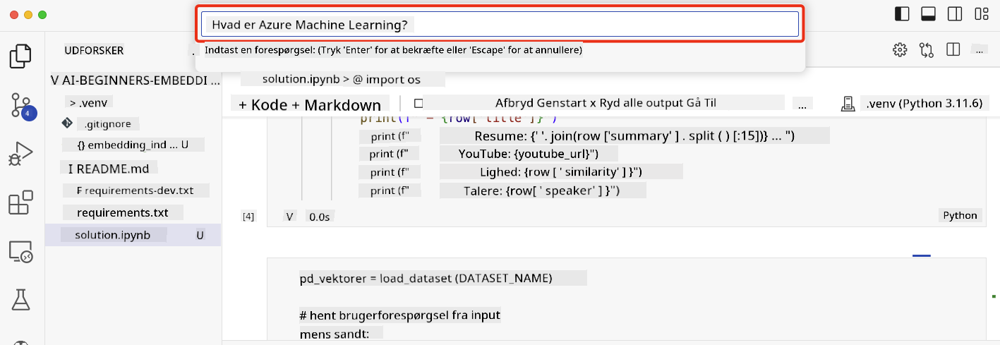

<!--
CO_OP_TRANSLATOR_METADATA:
{
  "original_hash": "d46aad0917a1a342d613e2c13d457da5",
  "translation_date": "2025-05-19T18:33:11+00:00",
  "source_file": "08-building-search-applications/README.md",
  "language_code": "da"
}
-->
# Bygge en søgeapplikation

[](https://aka.ms/gen-ai-lesson8-gh?WT.mc_id=academic-105485-koreyst)

> > _Klik på billedet ovenfor for at se videoen af denne lektion_

Der er mere til LLM'er end chatbots og tekstgenerering. Det er også muligt at bygge søgeapplikationer ved hjælp af Embeddings. Embeddings er numeriske repræsentationer af data, også kendt som vektorer, og kan bruges til semantisk søgning efter data.

I denne lektion skal du bygge en søgeapplikation til vores uddannelses-startup. Vores startup er en non-profit organisation, der tilbyder gratis uddannelse til studerende i udviklingslande. Vores startup har et stort antal YouTube-videoer, som studerende kan bruge til at lære om AI. Vores startup ønsker at bygge en søgeapplikation, der giver studerende mulighed for at søge efter en YouTube-video ved at skrive et spørgsmål.

For eksempel kunne en studerende skrive 'Hvad er Jupyter Notebooks?' eller 'Hvad er Azure ML', og søgeapplikationen vil returnere en liste over YouTube-videoer, der er relevante for spørgsmålet, og endnu bedre, søgeapplikationen vil returnere et link til det sted i videoen, hvor svaret på spørgsmålet findes.

## Introduktion

I denne lektion vil vi dække:

- Semantisk vs nøgleordssøgning.
- Hvad er Tekst-Embeddings.
- Oprettelse af en Tekst-Embeddings Indeks.
- Søgning i en Tekst-Embeddings Indeks.

## Læringsmål

Efter at have gennemført denne lektion vil du være i stand til at:

- Skelne mellem semantisk og nøgleordssøgning.
- Forklare hvad Tekst-Embeddings er.
- Oprette en applikation ved hjælp af Embeddings til at søge efter data.

## Hvorfor bygge en søgeapplikation?

Oprettelse af en søgeapplikation vil hjælpe dig med at forstå, hvordan man bruger Embeddings til at søge efter data. Du vil også lære at bygge en søgeapplikation, som studerende kan bruge til hurtigt at finde information.

Lektion inkluderer en Embedding Indeks af YouTube-transskriptionerne for Microsoft [AI Show](https://www.youtube.com/playlist?list=PLlrxD0HtieHi0mwteKBOfEeOYf0LJU4O1) YouTube-kanal. AI Show er en YouTube-kanal, der lærer dig om AI og maskinlæring. Embedding Indekset indeholder Embeddings for hver af YouTube-transskriptionerne indtil oktober 2023. Du vil bruge Embedding Indekset til at bygge en søgeapplikation til vores startup. Søgeapplikationen returnerer et link til det sted i videoen, hvor svaret på spørgsmålet findes. Dette er en fantastisk måde for studerende at finde den information, de har brug for, hurtigt.

Følgende er et eksempel på en semantisk forespørgsel for spørgsmålet 'kan du bruge rstudio med azure ml?'. Tjek YouTube-URL'en, du vil se, at URL'en indeholder et tidsstempel, der fører dig til det sted i videoen, hvor svaret på spørgsmålet findes.



## Hvad er semantisk søgning?

Nu tænker du måske, hvad er semantisk søgning? Semantisk søgning er en søgeteknik, der bruger semantikken, eller betydningen, af ordene i en forespørgsel til at returnere relevante resultater.

Her er et eksempel på en semantisk søgning. Lad os sige, at du leder efter at købe en bil, du kunne søge efter 'min drømmebil', semantisk søgning forstår, at du ikke `dreaming` om en bil, men snarere leder efter at købe din `ideal` bil. Semantisk søgning forstår din intention og returnerer relevante resultater. Alternativet er `keyword search`, som bogstaveligt ville søge efter drømme om biler og ofte returnere irrelevante resultater.

## Hvad er Tekst-Embeddings?

[Text embeddings](https://en.wikipedia.org/wiki/Word_embedding?WT.mc_id=academic-105485-koreyst) er en tekstrepræsentationsteknik brugt i [natural language processing](https://en.wikipedia.org/wiki/Natural_language_processing?WT.mc_id=academic-105485-koreyst). Tekst-embeddings er semantiske numeriske repræsentationer af tekst. Embeddings bruges til at repræsentere data på en måde, der er let for en maskine at forstå. Der er mange modeller til at bygge tekst-embeddings, i denne lektion vil vi fokusere på at generere embeddings ved hjælp af OpenAI Embedding Model.

Her er et eksempel, forestil dig, at følgende tekst er i en transskription fra en af episoderne på AI Show YouTube-kanalen:

```text
Today we are going to learn about Azure Machine Learning.
```

Vi ville sende teksten til OpenAI Embedding API, og det ville returnere følgende embedding bestående af 1536 tal, også kendt som en vektor. Hvert tal i vektoren repræsenterer et andet aspekt af teksten. For korthedens skyld er her de første 10 tal i vektoren.

```python
[-0.006655829958617687, 0.0026128944009542465, 0.008792596869170666, -0.02446001023054123, -0.008540431968867779, 0.022071078419685364, -0.010703742504119873, 0.003311325330287218, -0.011632772162556648, -0.02187200076878071, ...]
```

## Hvordan oprettes Embedding indekset?

Embedding indekset for denne lektion blev oprettet med en række Python-scripts. Du finder scripts sammen med instruktioner i [README](./scripts/README.md?WT.mc_id=academic-105485-koreyst) i 'scripts'-mappen for denne lektion. Du behøver ikke køre disse scripts for at gennemføre denne lektion, da Embedding Indekset er leveret til dig.

Scripts udfører følgende operationer:

1. Transskriptionen for hver YouTube-video i [AI Show](https://www.youtube.com/playlist?list=PLlrxD0HtieHi0mwteKBOfEeOYf0LJU4O1) afspilningslisten downloades.
2. Ved hjælp af [OpenAI-funktioner](https://learn.microsoft.com/azure/ai-services/openai/how-to/function-calling?WT.mc_id=academic-105485-koreyst), forsøges det at udtrække talerens navn fra de første 3 minutter af YouTube-transskriptionen. Talerens navn for hver video gemmes i Embedding Indekset navngivet `embedding_index_3m.json`.
3. Transskriptionsteksten deles derefter op i **3 minutters tekstsegmenter**. Segmentet inkluderer omkring 20 ord, der overlapper med det næste segment for at sikre, at Embedding for segmentet ikke afbrydes og for at give bedre søgekontekst.
4. Hvert tekstsegment sendes derefter til OpenAI Chat API for at opsummere teksten til 60 ord. Resuméet gemmes også i Embedding Indekset `embedding_index_3m.json`.
5. Endelig sendes segmentteksten til OpenAI Embedding API. Embedding API returnerer en vektor på 1536 tal, der repræsenterer den semantiske betydning af segmentet. Segmentet sammen med OpenAI Embedding vektoren gemmes i et Embedding Indeks `embedding_index_3m.json`.

### Vektordatabaser

For lektionens enkelhed er Embedding Indekset gemt i en JSON-fil navngivet `embedding_index_3m.json` og indlæst i en Pandas DataFrame. Men i produktion ville Embedding Indekset blive gemt i en vektordatabase såsom [Azure Cognitive Search](https://learn.microsoft.com/training/modules/improve-search-results-vector-search?WT.mc_id=academic-105485-koreyst), [Redis](https://cookbook.openai.com/examples/vector_databases/redis/readme?WT.mc_id=academic-105485-koreyst), [Pinecone](https://cookbook.openai.com/examples/vector_databases/pinecone/readme?WT.mc_id=academic-105485-koreyst), [Weaviate](https://cookbook.openai.com/examples/vector_databases/weaviate/readme?WT.mc_id=academic-105485-koreyst), for blot at nævne nogle få.

## Forståelse af cosinus-similaritet

Vi har lært om tekst-embeddings, det næste skridt er at lære, hvordan man bruger tekst-embeddings til at søge efter data og især finde de mest lignende embeddings til en given forespørgsel ved hjælp af cosinus-similaritet.

### Hvad er cosinus-similaritet?

Cosinus-similaritet er et mål for lighed mellem to vektorer, du vil også høre dette omtalt som `nearest neighbor search`. For at udføre en cosinus-similaritetssøgning skal du _vektorisere_ for _forespørgsels_ tekst ved hjælp af OpenAI Embedding API. Beregn derefter _cosinus-similaritet_ mellem forespørgselsvektoren og hver vektor i Embedding Indekset. Husk, at Embedding Indekset har en vektor for hver YouTube-transskriptionstekstsegment. Sorter endelig resultaterne efter cosinus-similaritet, og de tekstsegmenter med den højeste cosinus-similaritet er de mest lignende til forespørgslen.

Fra et matematisk perspektiv måler cosinus-similaritet cosinus af vinklen mellem to vektorer projiceret i et flerdimensionelt rum. Denne måling er fordelagtig, fordi hvis to dokumenter er langt fra hinanden ved euklidisk afstand på grund af størrelse, kan de stadig have en mindre vinkel mellem dem og derfor højere cosinus-similaritet. For mere information om cosinus-similaritetsligninger, se [Cosinus-similaritet](https://en.wikipedia.org/wiki/Cosine_similarity?WT.mc_id=academic-105485-koreyst).

## Bygge din første søgeapplikation

Næste skridt er at lære, hvordan man bygger en søgeapplikation ved hjælp af Embeddings. Søgeapplikationen vil give studerende mulighed for at søge efter en video ved at skrive et spørgsmål. Søgeapplikationen vil returnere en liste over videoer, der er relevante for spørgsmålet. Søgeapplikationen vil også returnere et link til det sted i videoen, hvor svaret på spørgsmålet findes.

Denne løsning blev bygget og testet på Windows 11, macOS og Ubuntu 22.04 ved hjælp af Python 3.10 eller senere. Du kan downloade Python fra [python.org](https://www.python.org/downloads/?WT.mc_id=academic-105485-koreyst).

## Opgave - bygge en søgeapplikation for at give studerende mulighed

Vi introducerede vores startup i begyndelsen af denne lektion. Nu er det tid til at give de studerende mulighed for at bygge en søgeapplikation til deres vurderinger.

I denne opgave vil du oprette Azure OpenAI Services, der vil blive brugt til at bygge søgeapplikationen. Du vil oprette følgende Azure OpenAI Services. Du skal bruge et Azure-abonnement for at gennemføre denne opgave.

### Start Azure Cloud Shell

1. Log ind på [Azure portalen](https://portal.azure.com/?WT.mc_id=academic-105485-koreyst).
2. Vælg Cloud Shell-ikonet i øverste højre hjørne af Azure portalen.
3. Vælg **Bash** for miljøtypen.

#### Opret en ressourcegruppe

> For disse instruktioner bruger vi ressourcegruppen navngivet "semantic-video-search" i East US.
> Du kan ændre navnet på ressourcegruppen, men når du ændrer placeringen for ressourcerne,
> tjek [modeltilgængelighedstabellen](https://aka.ms/oai/models?WT.mc_id=academic-105485-koreyst).

```shell
az group create --name semantic-video-search --location eastus
```

#### Opret en Azure OpenAI Service ressource

Fra Azure Cloud Shell skal du køre følgende kommando for at oprette en Azure OpenAI Service ressource.

```shell
az cognitiveservices account create --name semantic-video-openai --resource-group semantic-video-search \
    --location eastus --kind OpenAI --sku s0
```

#### Få endpoint og nøgler til brug i denne applikation

Fra Azure Cloud Shell skal du køre følgende kommandoer for at få endpoint og nøgler til Azure OpenAI Service ressource.

```shell
az cognitiveservices account show --name semantic-video-openai \
   --resource-group  semantic-video-search | jq -r .properties.endpoint
az cognitiveservices account keys list --name semantic-video-openai \
   --resource-group semantic-video-search | jq -r .key1
```

#### Udrul OpenAI Embedding model

Fra Azure Cloud Shell skal du køre følgende kommando for at udrulle OpenAI Embedding model.

```shell
az cognitiveservices account deployment create \
    --name semantic-video-openai \
    --resource-group  semantic-video-search \
    --deployment-name text-embedding-ada-002 \
    --model-name text-embedding-ada-002 \
    --model-version "2"  \
    --model-format OpenAI \
    --sku-capacity 100 --sku-name "Standard"
```

## Løsning

Åbn [løsningens notebook](../../../08-building-search-applications/python/aoai-solution.ipynb) i GitHub Codespaces og følg instruktionerne i Jupyter Notebook.

Når du kører notebook'en, bliver du bedt om at indtaste en forespørgsel. Indtastningsfeltet vil se sådan ud:



## Godt arbejde! Fortsæt din læring

Efter at have gennemført denne lektion, tjek vores [Generative AI Learning collection](https://aka.ms/genai-collection?WT.mc_id=academic-105485-koreyst) for at fortsætte med at forbedre din viden om Generativ AI!

Gå videre til Lektion 9, hvor vi vil se på, hvordan man [bygger billedgenereringsapplikationer](../09-building-image-applications/README.md?WT.mc_id=academic-105485-koreyst)!

**Ansvarsfraskrivelse**:  
Dette dokument er blevet oversat ved hjælp af AI-oversættelsestjenesten [Co-op Translator](https://github.com/Azure/co-op-translator). Mens vi bestræber os på nøjagtighed, skal du være opmærksom på, at automatiserede oversættelser kan indeholde fejl eller unøjagtigheder. Det originale dokument på dets oprindelige sprog bør betragtes som den autoritative kilde. For kritisk information anbefales professionel menneskelig oversættelse. Vi er ikke ansvarlige for eventuelle misforståelser eller fejltolkninger, der måtte opstå som følge af brugen af denne oversættelse.