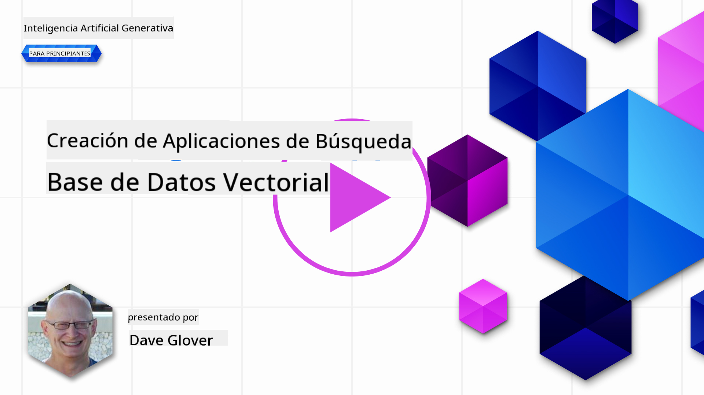
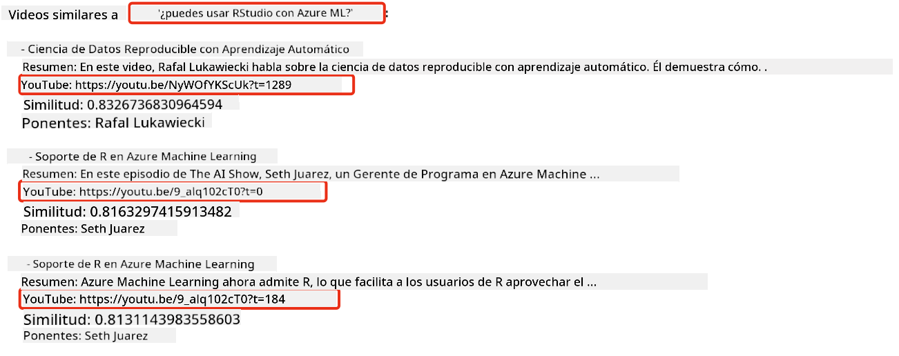
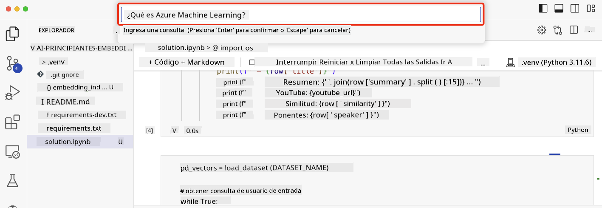

<!--
CO_OP_TRANSLATOR_METADATA:
{
  "original_hash": "d46aad0917a1a342d613e2c13d457da5",
  "translation_date": "2025-05-19T10:19:29+00:00",
  "source_file": "08-building-search-applications/README.md",
  "language_code": "es"
}
-->
# Construyendo Aplicaciones de Búsqueda

[](https://aka.ms/gen-ai-lesson8-gh?WT.mc_id=academic-105485-koreyst)

> > _Haz clic en la imagen de arriba para ver el video de esta lección_

Los LLMs son más que chatbots y generación de texto. También es posible construir aplicaciones de búsqueda usando Embeddings. Los Embeddings son representaciones numéricas de datos, también conocidas como vectores, y pueden ser utilizados para búsquedas semánticas de datos.

En esta lección, vas a construir una aplicación de búsqueda para nuestra startup educativa. Nuestra startup es una organización sin fines de lucro que proporciona educación gratuita a estudiantes en países en desarrollo. Nuestra startup tiene una gran cantidad de videos de YouTube que los estudiantes pueden usar para aprender sobre IA. Nuestra startup quiere construir una aplicación de búsqueda que permita a los estudiantes buscar un video de YouTube escribiendo una pregunta.

Por ejemplo, un estudiante podría escribir '¿Qué son los Jupyter Notebooks?' o '¿Qué es Azure ML?' y la aplicación de búsqueda devolverá una lista de videos de YouTube que son relevantes para la pregunta, y mejor aún, la aplicación de búsqueda devolverá un enlace al lugar en el video donde se encuentra la respuesta a la pregunta.

## Introducción

En esta lección, cubriremos:

- Búsqueda semántica vs búsqueda por palabras clave.
- Qué son los Embeddings de Texto.
- Creación de un Índice de Embeddings de Texto.
- Búsqueda en un Índice de Embeddings de Texto.

## Objetivos de Aprendizaje

Después de completar esta lección, podrás:

- Diferenciar entre búsqueda semántica y búsqueda por palabras clave.
- Explicar qué son los Embeddings de Texto.
- Crear una aplicación utilizando Embeddings para buscar datos.

## ¿Por qué construir una aplicación de búsqueda?

Crear una aplicación de búsqueda te ayudará a entender cómo usar Embeddings para buscar datos. También aprenderás cómo construir una aplicación de búsqueda que los estudiantes puedan usar para encontrar información rápidamente.

La lección incluye un Índice de Embeddings de las transcripciones de YouTube para el canal de YouTube de Microsoft [AI Show](https://www.youtube.com/playlist?list=PLlrxD0HtieHi0mwteKBOfEeOYf0LJU4O1). El AI Show es un canal de YouTube que te enseña sobre IA y aprendizaje automático. El Índice de Embeddings contiene los Embeddings para cada una de las transcripciones de YouTube hasta octubre de 2023. Utilizarás el Índice de Embeddings para construir una aplicación de búsqueda para nuestra startup. La aplicación de búsqueda devuelve un enlace al lugar en el video donde se encuentra la respuesta a la pregunta. Esta es una excelente manera para que los estudiantes encuentren rápidamente la información que necesitan.

El siguiente es un ejemplo de una consulta semántica para la pregunta '¿puedes usar rstudio con azure ml?'. Mira la URL de YouTube, verás que la URL contiene un sello de tiempo que te lleva al lugar en el video donde se encuentra la respuesta a la pregunta.



## ¿Qué es la búsqueda semántica?

Ahora podrías preguntarte, ¿qué es la búsqueda semántica? La búsqueda semántica es una técnica de búsqueda que utiliza la semántica, o el significado, de las palabras en una consulta para devolver resultados relevantes.

Aquí hay un ejemplo de una búsqueda semántica. Supongamos que estás buscando comprar un coche, podrías buscar 'mi coche soñado', la búsqueda semántica entiende que no estás `dreaming` sobre un coche, sino que estás buscando comprar tu `ideal` coche. La búsqueda semántica entiende tu intención y devuelve resultados relevantes. La alternativa es `keyword search` que buscaría literalmente sueños sobre coches y a menudo devolvería resultados irrelevantes.

## ¿Qué son los Embeddings de Texto?

[Embeddings de texto](https://en.wikipedia.org/wiki/Word_embedding?WT.mc_id=academic-105485-koreyst) son una técnica de representación de texto utilizada en [procesamiento de lenguaje natural](https://en.wikipedia.org/wiki/Natural_language_processing?WT.mc_id=academic-105485-koreyst). Los Embeddings de texto son representaciones numéricas semánticas del texto. Los Embeddings se utilizan para representar datos de una manera que sea fácil de entender para una máquina. Hay muchos modelos para construir Embeddings de texto, en esta lección nos centraremos en generar Embeddings utilizando el Modelo de Embedding de OpenAI.

Aquí hay un ejemplo, imagina que el siguiente texto está en una transcripción de uno de los episodios en el canal de YouTube AI Show:

```text
Today we are going to learn about Azure Machine Learning.
```

Pasaríamos el texto a la API de Embedding de OpenAI y devolvería el siguiente embedding que consiste en 1536 números, también conocido como un vector. Cada número en el vector representa un aspecto diferente del texto. Para abreviar, aquí están los primeros 10 números en el vector.

```python
[-0.006655829958617687, 0.0026128944009542465, 0.008792596869170666, -0.02446001023054123, -0.008540431968867779, 0.022071078419685364, -0.010703742504119873, 0.003311325330287218, -0.011632772162556648, -0.02187200076878071, ...]
```

## ¿Cómo se crea el índice de Embeddings?

El índice de Embeddings para esta lección se creó con una serie de scripts de Python. Encontrarás los scripts junto con instrucciones en el [README](./scripts/README.md?WT.mc_id=academic-105485-koreyst) en la carpeta 'scripts' para esta lección. No necesitas ejecutar estos scripts para completar esta lección ya que el Índice de Embeddings se proporciona para ti.

Los scripts realizan las siguientes operaciones:

1. Se descarga la transcripción de cada video de YouTube en la lista de reproducción del [AI Show](https://www.youtube.com/playlist?list=PLlrxD0HtieHi0mwteKBOfEeOYf0LJU4O1).
2. Usando [Funciones de OpenAI](https://learn.microsoft.com/azure/ai-services/openai/how-to/function-calling?WT.mc_id=academic-105485-koreyst), se intenta extraer el nombre del orador de los primeros 3 minutos de la transcripción de YouTube. El nombre del orador para cada video se almacena en el Índice de Embeddings llamado `embedding_index_3m.json`.
3. El texto de la transcripción se divide en **segmentos de texto de 3 minutos**. El segmento incluye aproximadamente 20 palabras que se superponen con el siguiente segmento para asegurar que el Embedding del segmento no se corte y para proporcionar un mejor contexto de búsqueda.
4. Cada segmento de texto se pasa a la API de Chat de OpenAI para resumir el texto en 60 palabras. El resumen también se almacena en el Índice de Embeddings `embedding_index_3m.json`.
5. Finalmente, el texto del segmento se pasa a la API de Embedding de OpenAI. La API de Embedding devuelve un vector de 1536 números que representan el significado semántico del segmento. El segmento junto con el vector de Embedding de OpenAI se almacena en un Índice de Embeddings `embedding_index_3m.json`.

### Bases de Datos de Vectores

Para simplificar la lección, el Índice de Embeddings se almacena en un archivo JSON llamado `embedding_index_3m.json` y se carga en un DataFrame de Pandas. Sin embargo, en producción, el Índice de Embeddings se almacenaría en una base de datos de vectores como [Azure Cognitive Search](https://learn.microsoft.com/training/modules/improve-search-results-vector-search?WT.mc_id=academic-105485-koreyst), [Redis](https://cookbook.openai.com/examples/vector_databases/redis/readme?WT.mc_id=academic-105485-koreyst), [Pinecone](https://cookbook.openai.com/examples/vector_databases/pinecone/readme?WT.mc_id=academic-105485-koreyst), [Weaviate](https://cookbook.openai.com/examples/vector_databases/weaviate/readme?WT.mc_id=academic-105485-koreyst), por nombrar algunos.

## Comprendiendo la similitud de coseno

Hemos aprendido sobre los Embeddings de texto, el siguiente paso es aprender cómo usar los Embeddings de texto para buscar datos y en particular encontrar los Embeddings más similares a una consulta dada usando la similitud de coseno.

### ¿Qué es la similitud de coseno?

La similitud de coseno es una medida de similitud entre dos vectores, también escucharás esto referido como `nearest neighbor search`. Para realizar una búsqueda de similitud de coseno necesitas _vectorizar_ el texto de _consulta_ usando la API de Embedding de OpenAI. Luego calcula la _similitud de coseno_ entre el vector de consulta y cada vector en el Índice de Embeddings. Recuerda, el Índice de Embeddings tiene un vector para cada segmento de texto de la transcripción de YouTube. Finalmente, ordena los resultados por similitud de coseno y los segmentos de texto con la mayor similitud de coseno son los más similares a la consulta.

Desde una perspectiva matemática, la similitud de coseno mide el coseno del ángulo entre dos vectores proyectados en un espacio multidimensional. Esta medida es beneficiosa, porque si dos documentos están lejos por distancia euclidiana debido al tamaño, aún podrían tener un ángulo más pequeño entre ellos y por lo tanto mayor similitud de coseno. Para más información sobre las ecuaciones de similitud de coseno, consulta [Similitud de coseno](https://en.wikipedia.org/wiki/Cosine_similarity?WT.mc_id=academic-105485-koreyst).

## Construyendo tu primera aplicación de búsqueda

A continuación, vamos a aprender cómo construir una aplicación de búsqueda usando Embeddings. La aplicación de búsqueda permitirá a los estudiantes buscar un video escribiendo una pregunta. La aplicación de búsqueda devolverá una lista de videos que son relevantes para la pregunta. La aplicación de búsqueda también devolverá un enlace al lugar en el video donde se encuentra la respuesta a la pregunta.

Esta solución fue construida y probada en Windows 11, macOS y Ubuntu 22.04 usando Python 3.10 o posterior. Puedes descargar Python desde [python.org](https://www.python.org/downloads/?WT.mc_id=academic-105485-koreyst).

## Asignación - construyendo una aplicación de búsqueda, para habilitar a los estudiantes

Presentamos nuestra startup al comienzo de esta lección. Ahora es el momento de habilitar a los estudiantes para que construyan una aplicación de búsqueda para sus evaluaciones.

En esta asignación, crearás los Servicios de Azure OpenAI que se utilizarán para construir la aplicación de búsqueda. Crearás los siguientes Servicios de Azure OpenAI. Necesitarás una suscripción a Azure para completar esta asignación.

### Inicia el Azure Cloud Shell

1. Inicia sesión en el [portal de Azure](https://portal.azure.com/?WT.mc_id=academic-105485-koreyst).
2. Selecciona el icono de Cloud Shell en la esquina superior derecha del portal de Azure.
3. Selecciona **Bash** para el tipo de entorno.

#### Crear un grupo de recursos

> Para estas instrucciones, estamos utilizando el grupo de recursos llamado "semantic-video-search" en East US.
> Puedes cambiar el nombre del grupo de recursos, pero al cambiar la ubicación de los recursos,
> verifica la [tabla de disponibilidad de modelos](https://aka.ms/oai/models?WT.mc_id=academic-105485-koreyst).

```shell
az group create --name semantic-video-search --location eastus
```

#### Crear un recurso de Servicio de Azure OpenAI

Desde el Azure Cloud Shell, ejecuta el siguiente comando para crear un recurso de Servicio de Azure OpenAI.

```shell
az cognitiveservices account create --name semantic-video-openai --resource-group semantic-video-search \
    --location eastus --kind OpenAI --sku s0
```

#### Obtener el endpoint y las claves para uso en esta aplicación

Desde el Azure Cloud Shell, ejecuta los siguientes comandos para obtener el endpoint y las claves para el recurso de Servicio de Azure OpenAI.

```shell
az cognitiveservices account show --name semantic-video-openai \
   --resource-group  semantic-video-search | jq -r .properties.endpoint
az cognitiveservices account keys list --name semantic-video-openai \
   --resource-group semantic-video-search | jq -r .key1
```

#### Desplegar el modelo de Embedding de OpenAI

Desde el Azure Cloud Shell, ejecuta el siguiente comando para desplegar el modelo de Embedding de OpenAI.

```shell
az cognitiveservices account deployment create \
    --name semantic-video-openai \
    --resource-group  semantic-video-search \
    --deployment-name text-embedding-ada-002 \
    --model-name text-embedding-ada-002 \
    --model-version "2"  \
    --model-format OpenAI \
    --sku-capacity 100 --sku-name "Standard"
```

## Solución

Abre el [notebook de solución](../../../08-building-search-applications/python/aoai-solution.ipynb) en GitHub Codespaces y sigue las instrucciones en el Jupyter Notebook.

Cuando ejecutes el notebook, se te pedirá que ingreses una consulta. El cuadro de entrada se verá así:



## ¡Buen Trabajo! Continúa tu Aprendizaje

Después de completar esta lección, consulta nuestra [colección de aprendizaje de IA Generativa](https://aka.ms/genai-collection?WT.mc_id=academic-105485-koreyst) para seguir avanzando en tu conocimiento de IA Generativa.

¡Dirígete a la Lección 9 donde veremos cómo [construir aplicaciones de generación de imágenes](../09-building-image-applications/README.md?WT.mc_id=academic-105485-koreyst)!

**Descargo de responsabilidad**:  
Este documento ha sido traducido utilizando el servicio de traducción de IA [Co-op Translator](https://github.com/Azure/co-op-translator). Aunque nos esforzamos por lograr precisión, tenga en cuenta que las traducciones automáticas pueden contener errores o imprecisiones. El documento original en su idioma nativo debe considerarse como la fuente autorizada. Para información crítica, se recomienda la traducción profesional humana. No nos hacemos responsables de ningún malentendido o interpretación errónea que surja del uso de esta traducción.