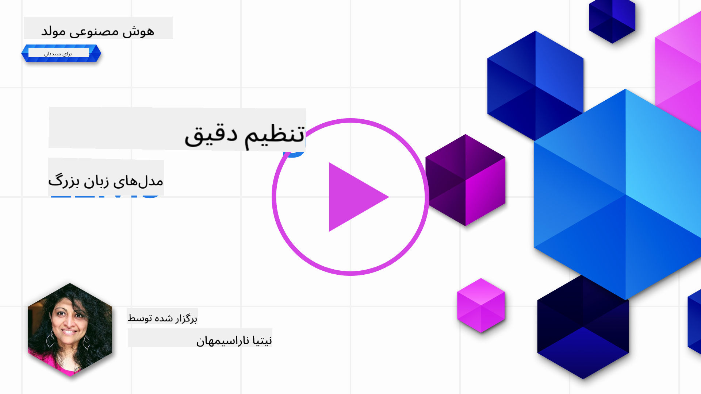
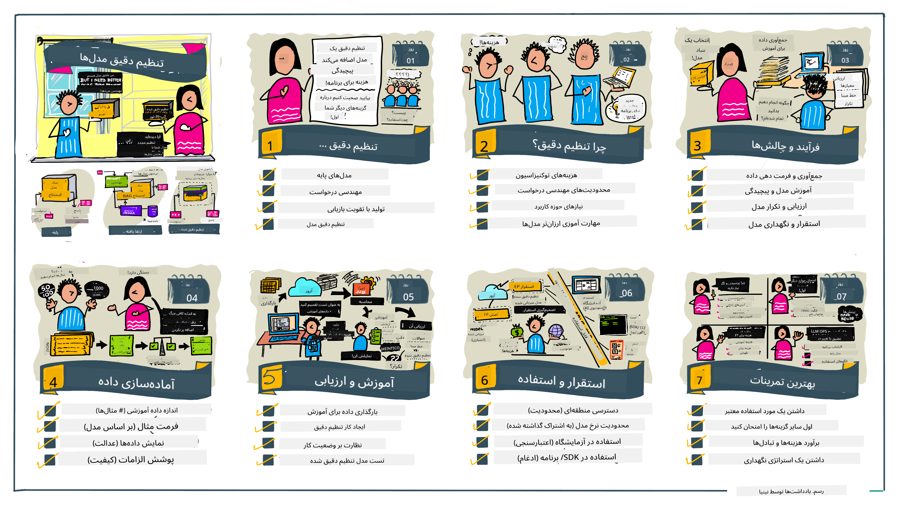

<!--
CO_OP_TRANSLATOR_METADATA:
{
  "original_hash": "68664f7e754a892ae1d8d5e2b7bd2081",
  "translation_date": "2025-05-20T07:36:58+00:00",
  "source_file": "18-fine-tuning/README.md",
  "language_code": "fa"
}
-->

# تنظیم دقیق LLM شما

استفاده از مدل‌های زبان بزرگ برای ساخت برنامه‌های هوش مصنوعی مولد با چالش‌های جدیدی همراه است. یک مسئله کلیدی اطمینان از کیفیت پاسخ (دقت و ارتباط) در محتوای تولید شده توسط مدل برای درخواست کاربر است. در درس‌های قبلی، تکنیک‌هایی مانند مهندسی پرسش و تولید تقویت‌شده با بازیابی را که سعی در حل مشکل با _تغییر ورودی پرسش_ به مدل موجود دارند، بررسی کردیم.

در درس امروز، یک تکنیک سوم، **تنظیم دقیق**، را بررسی می‌کنیم که سعی در حل چالش با _آموزش مجدد مدل با داده‌های اضافی_ دارد. بیایید به جزئیات بپردازیم.

## اهداف آموزشی

این درس مفهوم تنظیم دقیق برای مدل‌های زبان پیش‌آموزش‌داده‌شده را معرفی می‌کند، مزایا و چالش‌های این رویکرد را بررسی می‌کند و راهنمایی‌هایی درباره زمان و چگونگی استفاده از تنظیم دقیق برای بهبود عملکرد مدل‌های هوش مصنوعی مولد شما ارائه می‌دهد.

تا پایان این درس، شما باید بتوانید به سوالات زیر پاسخ دهید:

- تنظیم دقیق برای مدل‌های زبان چیست؟
- تنظیم دقیق چه زمانی و چرا مفید است؟
- چگونه می‌توانم یک مدل پیش‌آموزش‌داده‌شده را تنظیم دقیق کنم؟
- محدودیت‌های تنظیم دقیق چیست؟

آماده‌اید؟ بیایید شروع کنیم.

## راهنمای تصویری

می‌خواهید قبل از شروع به کار، تصویر بزرگ‌تری از آنچه پوشش خواهیم داد داشته باشید؟ این راهنمای تصویری را بررسی کنید که سفر یادگیری این درس را توصیف می‌کند - از یادگیری مفاهیم اصلی و انگیزه تنظیم دقیق، تا درک فرآیند و بهترین روش‌ها برای اجرای وظیفه تنظیم دقیق. این موضوعی جذاب برای کشف است، بنابراین فراموش نکنید که صفحه [منابع](./RESOURCES.md?WT.mc_id=academic-105485-koreyst) را برای لینک‌های اضافی جهت حمایت از سفر یادگیری خود هدایت کنید!

## تنظیم دقیق برای مدل‌های زبان چیست؟

به طور تعریف، مدل‌های زبان بزرگ بر روی مقادیر زیادی از متن‌های مختلف از جمله اینترنت _پیش‌آموزش‌داده‌شده_ هستند. همانطور که در درس‌های قبلی یاد گرفتیم، به تکنیک‌هایی مانند _مهندسی پرسش_ و _تولید تقویت‌شده با بازیابی_ نیاز داریم تا کیفیت پاسخ‌های مدل به سوالات کاربر ("پرسش‌ها") را بهبود بخشیم.

یک تکنیک محبوب مهندسی پرسش شامل دادن راهنمایی بیشتر به مدل درباره آنچه در پاسخ انتظار می‌رود، یا با ارائه _دستورالعمل‌ها_ (راهنمایی صریح) یا _دادن چند مثال_ (راهنمایی ضمنی) است. به این روش _یادگیری چند نمونه‌ای_ گفته می‌شود اما دو محدودیت دارد:

- محدودیت‌های توکن مدل می‌تواند تعداد مثال‌هایی که می‌توانید بدهید را محدود کند و اثربخشی را محدود کند.
- هزینه‌های توکن مدل می‌تواند افزودن مثال‌ها به هر پرسش را گران کند و انعطاف‌پذیری را محدود کند.

تنظیم دقیق یک عمل رایج در سیستم‌های یادگیری ماشین است که در آن یک مدل پیش‌آموزش‌داده‌شده را با داده‌های جدید آموزش مجدد می‌دهیم تا عملکرد آن را در یک وظیفه خاص بهبود بخشیم. در زمینه مدل‌های زبان، می‌توانیم مدل پیش‌آموزش‌داده‌شده را با یک مجموعه مثال‌های انتخاب‌شده برای یک وظیفه یا دامنه کاربردی خاص تنظیم دقیق کنیم تا یک **مدل سفارشی** ایجاد کنیم که ممکن است برای آن وظیفه یا دامنه خاص دقیق‌تر و مرتبط‌تر باشد. یک مزیت جانبی تنظیم دقیق این است که می‌تواند تعداد مثال‌های مورد نیاز برای یادگیری چند نمونه‌ای را کاهش دهد - کاهش استفاده از توکن و هزینه‌های مرتبط.

## چه زمانی و چرا باید مدل‌ها را تنظیم دقیق کنیم؟

در _این_ زمینه، هنگامی که درباره تنظیم دقیق صحبت می‌کنیم، به تنظیم دقیق **نظارت‌شده** اشاره می‌کنیم که آموزش مجدد با **افزودن داده‌های جدید** که بخشی از مجموعه داده‌های اصلی آموزش نبوده‌اند، انجام می‌شود. این متفاوت از رویکرد تنظیم دقیق بدون نظارت است که در آن مدل بر روی داده‌های اصلی با پارامترهای مختلف بازآموزش می‌شود.

نکته کلیدی که باید به یاد داشته باشید این است که تنظیم دقیق یک تکنیک پیشرفته است که برای دستیابی به نتایج مطلوب نیاز به سطح خاصی از تخصص دارد. اگر به درستی انجام نشود، ممکن است بهبودهای مورد انتظار را فراهم نکند و حتی ممکن است عملکرد مدل را برای دامنه هدف شما کاهش دهد.

بنابراین، قبل از اینکه یاد بگیرید "چگونه" مدل‌های زبان را تنظیم دقیق کنید، باید بدانید "چرا" باید این مسیر را انتخاب کنید و "چه زمانی" فرآیند تنظیم دقیق را شروع کنید. با پرسیدن این سوالات از خود شروع کنید:

- **مورد استفاده**: مورد استفاده شما برای تنظیم دقیق چیست؟ چه جنبه‌ای از مدل پیش‌آموزش‌داده‌شده فعلی را می‌خواهید بهبود بخشید؟
- **جایگزین‌ها**: آیا سعی کرده‌اید _تکنیک‌های دیگر_ برای دستیابی به نتایج مطلوب؟ از آنها برای ایجاد یک خط پایه برای مقایسه استفاده کنید.
  - مهندسی پرسش: تکنیک‌هایی مانند پرسش‌های چند نمونه‌ای با مثال‌هایی از پاسخ‌های پرسش‌های مرتبط را امتحان کنید. کیفیت پاسخ‌ها را ارزیابی کنید.
  - تولید تقویت‌شده با بازیابی: سعی کنید پرسش‌ها را با نتایج جستجوی داده‌ها تقویت کنید. کیفیت پاسخ‌ها را ارزیابی کنید.
- **هزینه‌ها**: آیا هزینه‌های تنظیم دقیق را شناسایی کرده‌اید؟
  - قابلیت تنظیم - آیا مدل پیش‌آموزش‌داده‌شده برای تنظیم دقیق در دسترس است؟
  - تلاش - برای آماده‌سازی داده‌های آموزشی، ارزیابی و پالایش مدل.
  - محاسبه - برای اجرای وظایف تنظیم دقیق و استقرار مدل تنظیم دقیق‌شده
  - داده - دسترسی به مثال‌های کافی با کیفیت برای تاثیر تنظیم دقیق
- **مزایا**: آیا مزایای تنظیم دقیق را تأیید کرده‌اید؟
  - کیفیت - آیا مدل تنظیم دقیق‌شده از خط پایه بهتر عمل کرده است؟
  - هزینه - آیا با ساده‌سازی پرسش‌ها استفاده از توکن را کاهش می‌دهد؟
  - قابلیت گسترش - آیا می‌توانید مدل پایه را برای دامنه‌های جدید بازاستفاده کنید؟

با پاسخ به این سوالات، باید بتوانید تصمیم بگیرید که آیا تنظیم دقیق رویکرد مناسبی برای مورد استفاده شما است. ایده‌آل این است که رویکرد تنها در صورتی معتبر باشد که مزایا از هزینه‌ها بیشتر باشد. پس از تصمیم‌گیری برای ادامه، وقت آن است که درباره _چگونگی_ تنظیم دقیق مدل پیش‌آموزش‌داده‌شده فکر کنید.

می‌خواهید بینش‌های بیشتری درباره فرآیند تصمیم‌گیری بگیرید؟ [تنظیم دقیق کنیم یا نکنیم](https://www.youtube.com/watch?v=0Jo-z-MFxJs) را تماشا کنید.

## چگونه می‌توانیم یک مدل پیش‌آموزش‌داده‌شده را تنظیم دقیق کنیم؟

برای تنظیم دقیق یک مدل پیش‌آموزش‌داده‌شده، نیاز دارید:

- یک مدل پیش‌آموزش‌داده‌شده برای تنظیم دقیق
- یک مجموعه داده برای استفاده در تنظیم دقیق
- یک محیط آموزشی برای اجرای وظیفه تنظیم دقیق
- یک محیط میزبانی برای استقرار مدل تنظیم دقیق‌شده

## تنظیم دقیق در عمل

منابع زیر آموزش‌های گام‌به‌گام را ارائه می‌دهند تا شما را از طریق یک مثال واقعی با استفاده از یک مدل انتخاب‌شده و یک مجموعه داده منتخب راهنمایی کنند. برای کار با این آموزش‌ها، به یک حساب کاربری در ارائه‌دهنده خاص، همراه با دسترسی به مدل و مجموعه داده‌های مربوطه نیاز دارید.

| ارائه‌دهنده | آموزش                                                                                                                                                                       | توضیحات                                                                                                                                                                                                                                                                                                                                                                                                                        |
| ------------ | ------------------------------------------------------------------------------------------------------------------------------------------------------------------------------ | ---------------------------------------------------------------------------------------------------------------------------------------------------------------------------------------------------------------------------------------------------------------------------------------------------------------------------------------------------------------------------------------------------------------------------------- |
| OpenAI       | [چگونه مدل‌های چت را تنظیم دقیق کنیم](https://github.com/openai/openai-cookbook/blob/main/examples/How_to_finetune_chat_models.ipynb?WT.mc_id=academic-105485-koreyst)                | یاد بگیرید چگونه یک `gpt-35-turbo` را برای یک دامنه خاص ("دستیار دستور غذا") با آماده‌سازی داده‌های آموزشی، اجرای وظیفه تنظیم دقیق و استفاده از مدل تنظیم دقیق‌شده برای استنتاج تنظیم دقیق کنید.                                                                                                                                                                                                                                              |
| Azure OpenAI | [آموزش تنظیم دقیق GPT 3.5 Turbo](https://learn.microsoft.com/azure/ai-services/openai/tutorials/fine-tune?tabs=python-new%2Ccommand-line?WT.mc_id=academic-105485-koreyst) | یاد بگیرید چگونه یک مدل `gpt-35-turbo-0613` را **در Azure** تنظیم دقیق کنید با انجام مراحل ایجاد و بارگذاری داده‌های آموزشی، اجرای وظیفه تنظیم دقیق. استقرار و استفاده از مدل جدید.                                                                                                                                                                                                                                                                 |
| Hugging Face | [تنظیم دقیق LLM‌ها با Hugging Face](https://www.philschmid.de/fine-tune-llms-in-2024-with-trl?WT.mc_id=academic-105485-koreyst)                                               | این پست وبلاگ شما را از طریق تنظیم دقیق یک _LLM باز_ (مانند `CodeLlama 7B`) با استفاده از کتابخانه [transformers](https://huggingface.co/docs/transformers/index?WT.mc_id=academic-105485-koreyst) و [یادگیری تقویت‌کننده Transformer (TRL)](https://huggingface.co/docs/trl/index?WT.mc_id=academic-105485-koreyst]) با مجموعه داده‌های باز [datasets](https://huggingface.co/docs/datasets/index?WT.mc_id=academic-105485-koreyst) در Hugging Face راهنمایی می‌کند. |
|              |                                                                                                                                                                                |                                                                                                                                                                                                                                                                                                                                                                                                                                    |
| 🤗 AutoTrain | [تنظیم دقیق LLM‌ها با AutoTrain](https://github.com/huggingface/autotrain-advanced/?WT.mc_id=academic-105485-koreyst)                                                         | AutoTrain (یا AutoTrain Advanced) یک کتابخانه پایتون توسعه‌یافته توسط Hugging Face است که اجازه تنظیم دقیق برای وظایف مختلف از جمله تنظیم دقیق LLM را می‌دهد. AutoTrain یک راه‌حل بدون کد است و تنظیم دقیق می‌تواند در ابر خودتان، در Hugging Face Spaces یا محلی انجام شود. این از هر دو GUI مبتنی بر وب، CLI و آموزش از طریق فایل‌های پیکربندی yaml پشتیبانی می‌کند.                                                                               |
|              |                                                                                                                                                                                |                                                                                                                                                                                                                                                                                                                                                                                                                                    |

## تکلیف

یکی از آموزش‌های بالا را انتخاب کنید و آنها را مرور کنید. _ممکن است نسخه‌ای از این آموزش‌ها را در نوت‌بوک‌های Jupyter در این مخزن فقط برای مرجع تکرار کنیم. لطفاً برای دریافت نسخه‌های جدید از منابع اصلی به طور مستقیم استفاده کنید_.

## کار عالی! ادامه یادگیری شما.

پس از تکمیل این درس، مجموعه یادگیری هوش مصنوعی مولد ما را [Generative AI Learning collection](https://aka.ms/genai-collection?WT.mc_id=academic-105485-koreyst) بررسی کنید تا به ارتقاء دانش خود درباره هوش مصنوعی مولد ادامه دهید!

تبریک می‌گویم!! شما درس نهایی از سری v2 این دوره را به پایان رسانده‌اید! یادگیری و ساختن را متوقف نکنید. \*\*صفحه [منابع](RESOURCES.md?WT.mc_id=academic-105485-koreyst) را برای لیستی از پیشنهادات اضافی برای همین موضوع بررسی کنید.

سری درس‌های v1 ما نیز با تکالیف و مفاهیم بیشتری به‌روزرسانی شده است. بنابراین یک دقیقه وقت بگذارید تا دانش خود را تازه کنید - و لطفاً [سوالات و بازخورد خود را به اشتراک بگذارید](https://github.com/microsoft/generative-ai-for-beginners/issues?WT.mc_id=academic-105485-koreyst) تا به ما در بهبود این درس‌ها برای جامعه کمک کنید.

**سلب مسئولیت**:  
این سند با استفاده از سرویس ترجمه هوش مصنوعی [Co-op Translator](https://github.com/Azure/co-op-translator) ترجمه شده است. در حالی که ما برای دقت تلاش می‌کنیم، لطفاً توجه داشته باشید که ترجمه‌های خودکار ممکن است حاوی اشتباهات یا نادقتی‌هایی باشند. سند اصلی به زبان اصلی آن باید به عنوان منبع معتبر در نظر گرفته شود. برای اطلاعات حیاتی، ترجمه حرفه‌ای انسانی توصیه می‌شود. ما مسئولیتی در قبال سوء تفاهم‌ها یا تفسیرهای نادرست ناشی از استفاده از این ترجمه نداریم.