<!--
CO_OP_TRANSLATOR_METADATA:
{
  "original_hash": "f5ff3b6204a695a117d6f452403c95f7",
  "translation_date": "2025-05-19T10:39:27+00:00",
  "source_file": "10-building-low-code-ai-applications/README.md",
  "language_code": "fr"
}
-->
# Construire des applications IA à faible code

[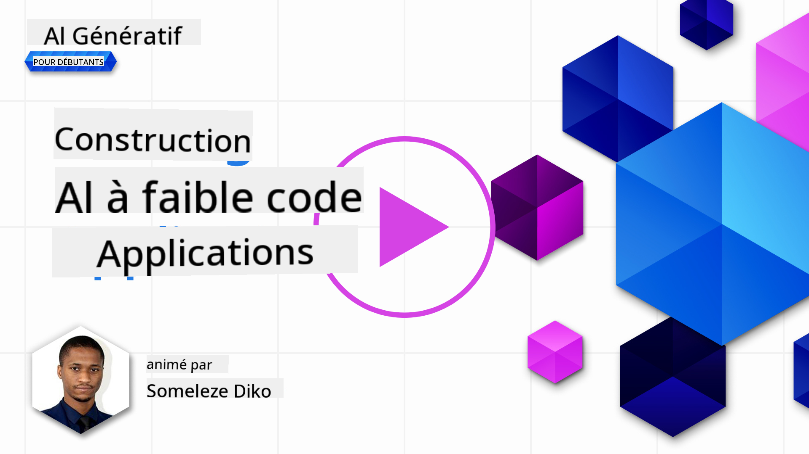](https://aka.ms/gen-ai-lesson10-gh?WT.mc_id=academic-105485-koreyst)

> _(Cliquez sur l'image ci-dessus pour voir la vidéo de cette leçon)_

## Introduction

Maintenant que nous avons appris à construire des applications de génération d'images, parlons du faible code. L'IA générative peut être utilisée dans divers domaines, y compris le faible code, mais qu'est-ce que le faible code et comment pouvons-nous y ajouter de l'IA ?

La construction d'applications et de solutions est devenue plus facile pour les développeurs traditionnels et les non-développeurs grâce aux plateformes de développement à faible code. Ces plateformes permettent de construire des applications et des solutions avec peu ou pas de code. Cela se fait en fournissant un environnement de développement visuel qui vous permet de glisser-déposer des composants pour construire des applications et des solutions. Cela vous permet de créer des applications et des solutions plus rapidement et avec moins de ressources. Dans cette leçon, nous allons approfondir l'utilisation du faible code et comment améliorer le développement à faible code avec l'IA en utilisant Power Platform.

Power Platform offre aux organisations la possibilité de donner à leurs équipes les moyens de créer leurs propres solutions grâce à un environnement intuitif à faible code ou sans code. Cet environnement aide à simplifier le processus de création de solutions. Avec Power Platform, les solutions peuvent être construites en jours ou semaines plutôt qu'en mois ou années. Power Platform se compose de cinq produits clés : Power Apps, Power Automate, Power BI, Power Pages et Copilot Studio.

Cette leçon couvre :

- Introduction à l'IA générative dans Power Platform
- Introduction à Copilot et comment l'utiliser
- Utiliser l'IA générative pour créer des applications et des flux dans Power Platform
- Comprendre les modèles IA dans Power Platform avec AI Builder

## Objectifs d'apprentissage

À la fin de cette leçon, vous serez capable de :

- Comprendre comment Copilot fonctionne dans Power Platform.

- Construire une application de suivi des devoirs des étudiants pour notre startup éducative.

- Construire un flux de traitement des factures qui utilise l'IA pour extraire des informations des factures.

- Appliquer les meilleures pratiques lors de l'utilisation du modèle IA de création de texte avec GPT.

Les outils et technologies que vous utiliserez dans cette leçon sont :

- **Power Apps**, pour l'application de suivi des devoirs des étudiants, qui fournit un environnement de développement à faible code pour créer des applications permettant de suivre, gérer et interagir avec les données.

- **Dataverse**, pour stocker les données de l'application de suivi des devoirs des étudiants où Dataverse fournira une plateforme de données à faible code pour stocker les données de l'application.

- **Power Automate**, pour le flux de traitement des factures où vous aurez un environnement de développement à faible code pour créer des workflows afin d'automatiser le processus de traitement des factures.

- **AI Builder**, pour le modèle IA de traitement des factures où vous utiliserez des modèles IA préconstruits pour traiter les factures de notre startup.

## IA générative dans Power Platform

Améliorer le développement et l'application à faible code avec l'IA générative est un domaine clé de Power Platform. L'objectif est de permettre à chacun de créer des applications, sites, tableaux de bord alimentés par l'IA et d'automatiser les processus avec l'IA, _sans nécessiter d'expertise en science des données_. Cet objectif est atteint en intégrant l'IA générative dans l'expérience de développement à faible code dans Power Platform sous forme de Copilot et AI Builder.

### Comment cela fonctionne-t-il ?

Copilot est un assistant IA qui vous permet de créer des solutions Power Platform en décrivant vos besoins dans une série d'étapes conversationnelles utilisant le langage naturel. Vous pouvez par exemple demander à votre assistant IA de préciser quels champs votre application utilisera et il créera à la fois l'application et le modèle de données sous-jacent ou vous pourriez spécifier comment configurer un flux dans Power Automate.

Vous pouvez utiliser les fonctionnalités pilotées par Copilot comme une fonctionnalité dans vos écrans d'application pour permettre aux utilisateurs de découvrir des insights grâce à des interactions conversationnelles.

AI Builder est une capacité IA à faible code disponible dans Power Platform qui vous permet d'utiliser des modèles IA pour vous aider à automatiser des processus et prédire des résultats. Avec AI Builder, vous pouvez intégrer l'IA à vos applications et flux qui se connectent à vos données dans Dataverse ou dans diverses sources de données cloud, telles que SharePoint, OneDrive ou Azure.

Copilot est disponible dans tous les produits Power Platform : Power Apps, Power Automate, Power BI, Power Pages et Power Virtual Agents. AI Builder est disponible dans Power Apps et Power Automate. Dans cette leçon, nous nous concentrerons sur l'utilisation de Copilot et AI Builder dans Power Apps et Power Automate pour créer une solution pour notre startup éducative.

### Copilot dans Power Apps

Dans le cadre de Power Platform, Power Apps offre un environnement de développement à faible code pour créer des applications permettant de suivre, gérer et interagir avec des données. C'est une suite de services de développement d'applications avec une plateforme de données évolutive et la possibilité de se connecter à des services cloud et à des données sur site. Power Apps vous permet de créer des applications qui fonctionnent sur des navigateurs, tablettes et téléphones, et peuvent être partagées avec des collègues. Power Apps facilite l'entrée des utilisateurs dans le développement d'applications avec une interface simple, afin que chaque utilisateur professionnel ou développeur pro puisse créer des applications personnalisées. L'expérience de développement d'applications est également améliorée avec l'IA générative grâce à Copilot.

La fonctionnalité d'assistant IA Copilot dans Power Apps vous permet de décrire le type d'application dont vous avez besoin et les informations que vous souhaitez que votre application suive, collecte ou affiche. Copilot génère ensuite une application Canvas réactive basée sur votre description. Vous pouvez ensuite personnaliser l'application pour répondre à vos besoins. L'assistant AI Copilot génère également et suggère une table Dataverse avec les champs nécessaires pour stocker les données que vous souhaitez suivre et quelques données d'exemple. Nous examinerons ce qu'est Dataverse et comment vous pouvez l'utiliser dans Power Apps plus tard dans cette leçon. Vous pouvez ensuite personnaliser la table pour répondre à vos besoins en utilisant la fonctionnalité d'assistant AI Copilot à travers des étapes conversationnelles. Cette fonctionnalité est disponible directement depuis l'écran d'accueil de Power Apps.

### Copilot dans Power Automate

Dans le cadre de Power Platform, Power Automate permet aux utilisateurs de créer des workflows automatisés entre applications et services. Il aide à automatiser les processus commerciaux répétitifs tels que la communication, la collecte de données et les approbations de décisions. Son interface simple permet aux utilisateurs de toutes compétences techniques (des débutants aux développeurs chevronnés) d'automatiser les tâches de travail. L'expérience de développement de workflows est également améliorée avec l'IA générative grâce à Copilot.

La fonctionnalité d'assistant IA Copilot dans Power Automate vous permet de décrire le type de flux dont vous avez besoin et les actions que vous souhaitez que votre flux effectue. Copilot génère ensuite un flux basé sur votre description. Vous pouvez ensuite personnaliser le flux pour répondre à vos besoins. L'assistant AI Copilot génère également et suggère les actions nécessaires pour effectuer la tâche que vous souhaitez automatiser. Nous examinerons ce que sont les flux et comment vous pouvez les utiliser dans Power Automate plus tard dans cette leçon. Vous pouvez ensuite personnaliser les actions pour répondre à vos besoins en utilisant la fonctionnalité d'assistant AI Copilot à travers des étapes conversationnelles. Cette fonctionnalité est disponible directement depuis l'écran d'accueil de Power Automate.

## Devoir : Gérer les devoirs des étudiants et les factures pour notre startup, en utilisant Copilot

Notre startup propose des cours en ligne aux étudiants. La startup a connu une croissance rapide et a maintenant du mal à répondre à la demande pour ses cours. La startup vous a embauché en tant que développeur Power Platform pour les aider à créer une solution à faible code pour les aider à gérer leurs devoirs d'étudiants et leurs factures. Leur solution devrait leur permettre de suivre et de gérer les devoirs des étudiants via une application et d'automatiser le processus de traitement des factures via un workflow. On vous a demandé d'utiliser l'IA générative pour développer la solution.

Lorsque vous commencez à utiliser Copilot, vous pouvez utiliser la [bibliothèque de prompts Copilot Power Platform](https://github.com/pnp/powerplatform-prompts?WT.mc_id=academic-109639-somelezediko) pour commencer avec les invites. Cette bibliothèque contient une liste d'invites que vous pouvez utiliser pour créer des applications et des flux avec Copilot. Vous pouvez également utiliser les invites de la bibliothèque pour avoir une idée de comment décrire vos besoins à Copilot.

### Construire une application de suivi des devoirs des étudiants pour notre startup

Les éducateurs de notre startup ont eu du mal à suivre les devoirs des étudiants. Ils ont utilisé une feuille de calcul pour suivre les devoirs, mais cela est devenu difficile à gérer à mesure que le nombre d'étudiants a augmenté. Ils vous ont demandé de créer une application qui les aidera à suivre et gérer les devoirs des étudiants. L'application devrait leur permettre d'ajouter de nouveaux devoirs, de visualiser les devoirs, de mettre à jour les devoirs et de supprimer les devoirs. L'application devrait également permettre aux éducateurs et aux étudiants de voir les devoirs qui ont été notés et ceux qui ne l'ont pas été.

Vous allez construire l'application en utilisant Copilot dans Power Apps en suivant les étapes ci-dessous :

1. Accédez à l'écran d'accueil de [Power Apps](https://make.powerapps.com?WT.mc_id=academic-105485-koreyst).

1. Utilisez la zone de texte sur l'écran d'accueil pour décrire l'application que vous souhaitez créer. Par exemple, **_Je veux créer une application pour suivre et gérer les devoirs des étudiants_**. Cliquez sur le bouton **Envoyer** pour envoyer l'invite à l'IA Copilot.

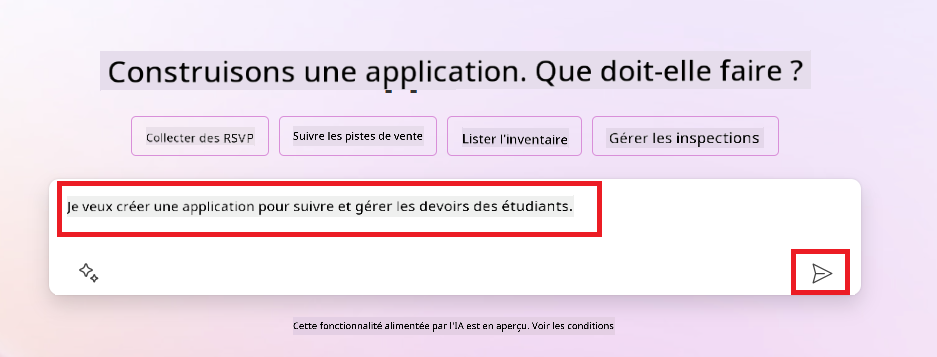

1. L'IA Copilot suggérera une table Dataverse avec les champs nécessaires pour stocker les données que vous souhaitez suivre et quelques données d'exemple. Vous pouvez ensuite personnaliser la table pour répondre à vos besoins en utilisant la fonctionnalité d'assistant AI Copilot à travers des étapes conversationnelles.

   > **Important** : Dataverse est la plateforme de données sous-jacente de Power Platform. C'est une plateforme de données à faible code pour stocker les données de l'application. C'est un service entièrement géré qui stocke de manière sécurisée les données dans le Cloud Microsoft et est provisionné dans votre environnement Power Platform. Il est doté de capacités de gouvernance des données intégrées, telles que la classification des données, la traçabilité des données, le contrôle d'accès granulaire, et plus encore. Vous pouvez en savoir plus sur Dataverse [ici](https://docs.microsoft.com/powerapps/maker/data-platform/data-platform-intro?WT.mc_id=academic-109639-somelezediko).

   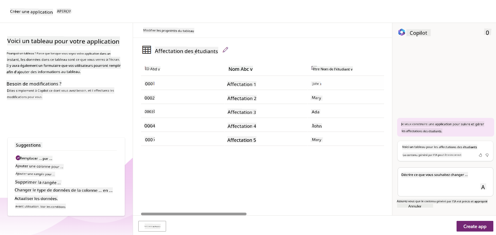

1. Les éducateurs souhaitent envoyer des e-mails aux étudiants qui ont soumis leurs devoirs pour les tenir informés de l'avancement de leurs devoirs. Vous pouvez utiliser Copilot pour ajouter un nouveau champ à la table pour stocker l'e-mail de l'étudiant. Par exemple, vous pouvez utiliser l'invite suivante pour ajouter un nouveau champ à la table : **_Je veux ajouter une colonne pour stocker l'e-mail de l'étudiant_**. Cliquez sur le bouton **Envoyer** pour envoyer l'invite à l'IA Copilot.

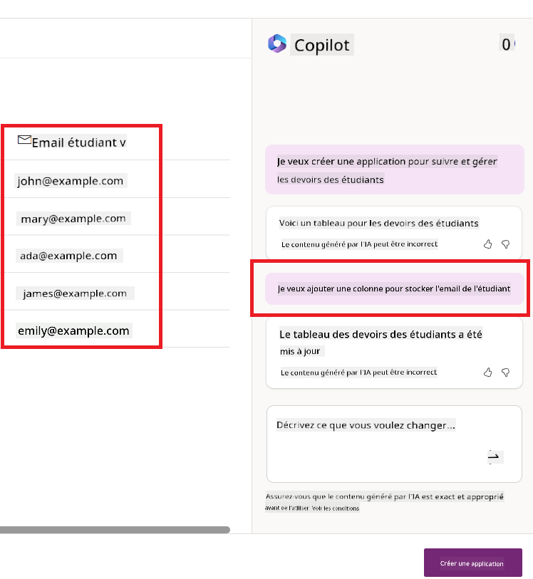

1. L'IA Copilot générera un nouveau champ et vous pourrez ensuite personnaliser le champ pour répondre à vos besoins.

1. Une fois que vous avez terminé avec la table, cliquez sur le bouton **Créer une application** pour créer l'application.

1. L'IA Copilot générera une application Canvas réactive basée sur votre description. Vous pouvez ensuite personnaliser l'application pour répondre à vos besoins.

1. Pour que les éducateurs puissent envoyer des e-mails aux étudiants, vous pouvez utiliser Copilot pour ajouter un nouvel écran à l'application. Par exemple, vous pouvez utiliser l'invite suivante pour ajouter un nouvel écran à l'application : **_Je veux ajouter un écran pour envoyer des e-mails aux étudiants_**. Cliquez sur le bouton **Envoyer** pour envoyer l'invite à l'IA Copilot.

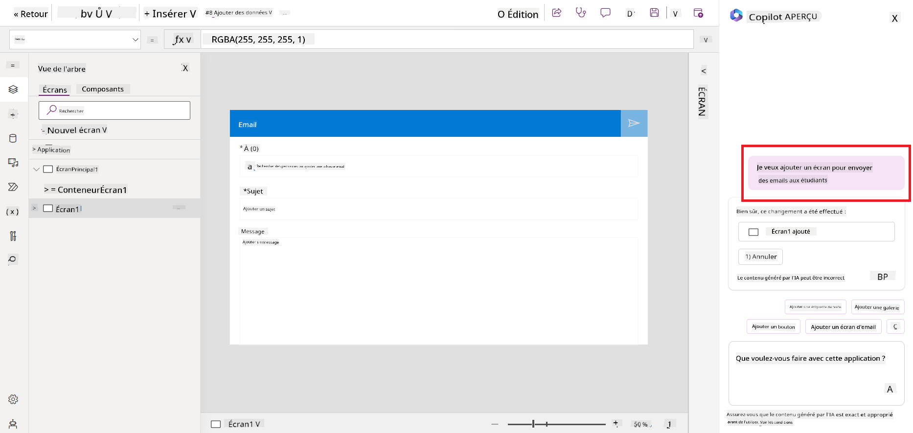

1. L'IA Copilot générera un nouvel écran et vous pourrez ensuite personnaliser l'écran pour répondre à vos besoins.

1. Une fois que vous avez terminé avec l'application, cliquez sur le bouton **Enregistrer** pour enregistrer l'application.

1. Pour partager l'application avec les éducateurs, cliquez sur le bouton **Partager** puis cliquez à nouveau sur le bouton **Partager**. Vous pouvez ensuite partager l'application avec les éducateurs en saisissant leurs adresses e-mail.

> **Votre devoir** : L'application que vous venez de créer est un bon début mais peut être améliorée. Avec la fonctionnalité d'e-mail, les éducateurs ne peuvent envoyer des e-mails aux étudiants que manuellement en devant saisir leurs e-mails. Pouvez-vous utiliser Copilot pour créer une automatisation qui permettra aux éducateurs d'envoyer automatiquement des e-mails aux étudiants lorsqu'ils soumettent leurs devoirs ? Votre indice est qu'avec la bonne invite, vous pouvez utiliser Copilot dans Power Automate pour créer cela.

### Construire une table d'informations sur les factures pour notre startup

L'équipe financière de notre startup a eu du mal à suivre les factures. Ils ont utilisé une feuille de calcul pour suivre les factures, mais cela est devenu difficile à gérer à mesure que le nombre de factures a augmenté. Ils vous ont demandé de créer une table qui les aidera à stocker, suivre et gérer les informations des factures qu'ils reçoivent. La table devrait être utilisée pour créer une automatisation qui extraira toutes les informations de la facture et les stockera dans la table. La table devrait également permettre à l'équipe financière de voir les factures qui ont été payées et celles qui ne l'ont pas été.

Power Platform dispose d'une plateforme de données sous-jacente appelée Dataverse qui vous permet de stocker les données de vos applications et solutions. Dataverse fournit une plateforme de données à faible code pour stocker les données de l'application. C'est un service entièrement géré qui stocke de manière sécurisée les données dans le Cloud Microsoft et est provisionné dans votre environnement Power Platform. Il est doté de capacités de gouvernance des données intégrées, telles que la classification des données, la traçabilité des données, le contrôle d'accès granulaire, et plus encore. Vous pouvez en savoir plus [sur Dataverse ici](https://docs.microsoft.com/powerapps/maker/data-platform/data-platform-intro?WT.mc_id=academic-109639-somelezediko).

Pourquoi devrions-nous utiliser Dataverse pour notre startup ? Les tables standard et personnalisées au sein de Dataverse offrent une option de stockage sécurisée et basée sur le cloud pour vos données. Les tables vous permettent de stocker différents types de données, de la même manière que vous pourriez utiliser plusieurs feuilles de calcul dans un seul classeur Excel. Vous pouvez utiliser les tables pour stocker des données spécifiques à votre organisation ou à vos besoins commerciaux. Certains des avantages que notre startup obtiendra en utilisant Dataverse incluent, mais ne sont pas limités à :

- **Facile à gérer** : Tant les métadonnées que les données sont stockées dans le cloud, vous n'avez donc pas à vous soucier des détails de leur stockage ou gestion. Vous pouvez vous concentrer sur la création de vos applications et solutions.

- **Sécurisé** : Dataverse offre une option de stockage sécurisée et basée sur le cloud pour vos données. Vous pouvez contrôler qui a accès aux données dans vos tables et comment ils peuvent y accéder en utilisant la sécurité basée sur les rôles.

- **Métadonnées riches** : Les types de données et les relations sont utilisés directement dans Power Apps.

- **Logique et validation** : Vous pouvez utiliser des règles métier, des champs calculés et des règles de validation pour appliquer la logique métier et maintenir l'exactitude des données.

Maintenant que vous savez ce qu'est Dataverse et pourquoi vous devriez l'utiliser, examinons comment vous pouvez utiliser Copilot pour créer une table dans Dataverse pour répondre aux besoins de notre équipe financière.

> **Remarque** : Vous utiliserez cette table dans la section suivante pour créer une automatisation qui extraira toutes les informations de la facture et les stockera dans la table.
Pour créer une table dans Dataverse en utilisant Copilot, suivez les étapes ci-dessous : 1. Accédez à l'écran d'accueil de [Power Apps](https://make.powerapps.com?WT.mc_id=academic-105485-koreyst). 2. Dans la barre de navigation de gauche, sélectionnez **Tables** puis cliquez sur **Décrire la nouvelle table**.  1. Sur l'écran **Décrire la nouvelle table**, utilisez la zone de texte pour décrire la table que vous souhaitez créer. Par exemple, **_Je veux créer une table pour stocker les informations des factures_**. Cliquez sur le bouton **Envoyer** pour envoyer l'invite à l'IA Copilot. 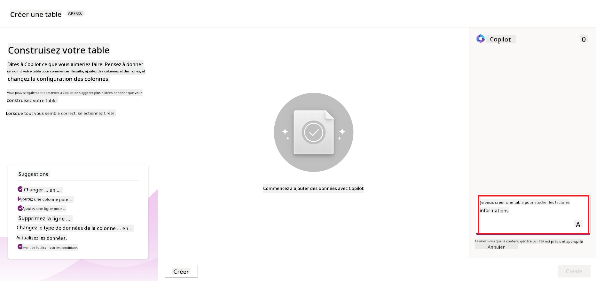 1. L'IA Copilot suggérera une table Dataverse avec les champs nécessaires pour stocker les données que vous souhaitez suivre et quelques données d'exemple. Vous pouvez ensuite personnaliser la table pour répondre à vos besoins en utilisant la fonctionnalité d'assistant AI Copilot à travers des étapes conversationnelles. 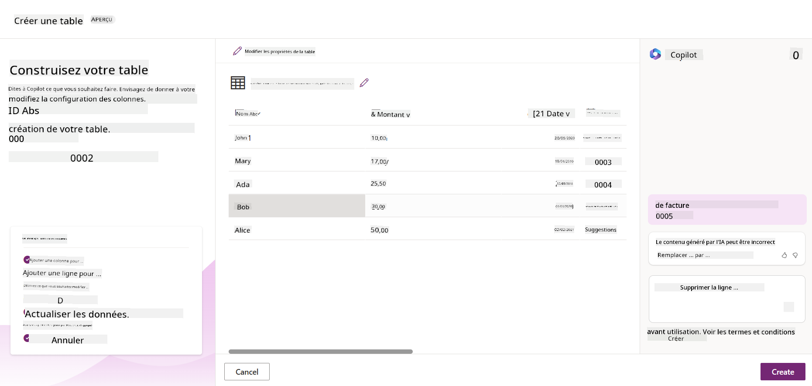 1. L'équipe financière souhaite envoyer un e-mail au fournisseur pour les informer du statut actuel de leur facture. Vous pouvez utiliser Copilot pour ajouter un nouveau champ à la table pour stocker l'e-mail du fournisseur. Par exemple, vous pouvez utiliser l'invite suivante pour ajouter un nouveau champ à la table : **_Je veux ajouter une colonne pour stocker l'e-mail du fournisseur_**. Cliquez sur le
un texte. - **Analyse de Sentiments** : Ce modèle détecte le sentiment positif, négatif, neutre ou mixte dans un texte. - **Lecteur de Cartes de Visite** : Ce modèle extrait des informations des cartes de visite. - **Reconnaissance de Texte** : Ce modèle extrait du texte à partir d'images. - **Détection d'Objets** : Ce modèle détecte et extrait des objets à partir d'images. - **Traitement de Documents** : Ce modèle extrait des informations à partir de formulaires. - **Traitement de Factures** : Ce modèle extrait des informations des factures. Avec les modèles IA personnalisés, vous pouvez intégrer votre propre modèle dans AI Builder pour qu'il fonctionne comme n'importe quel modèle personnalisé AI Builder, vous permettant de former le modèle avec vos propres données. Vous pouvez utiliser ces modèles pour automatiser des processus et prédire des résultats dans Power Apps et Power Automate. Lorsque vous utilisez votre propre modèle, certaines limitations s'appliquent. Lisez-en plus sur ces [limitations](https://learn.microsoft.com/ai-builder/byo-model#limitations?WT.mc_id=academic-105485-koreyst). 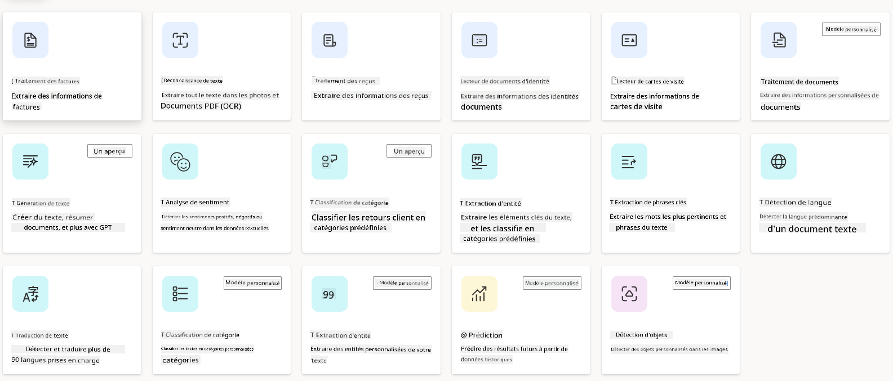 ## Tâche #2 - Construire un Flux de Traitement de Factures pour Notre Startup L'équipe financière a du mal à traiter les factures. Ils utilisent un tableur pour suivre les factures, mais cela est devenu difficile à gérer avec l'augmentation du nombre de factures. Ils vous ont demandé de créer un flux de travail qui les aidera à traiter les factures en utilisant l'IA. Le flux de travail devrait leur permettre d'extraire des informations des factures et de stocker les informations dans une table Dataverse. Le flux de travail devrait également leur permettre d'envoyer un email à l'équipe financière avec les informations extraites. Maintenant que vous savez ce qu'est AI Builder et pourquoi vous devriez l'utiliser, examinons comment vous pouvez utiliser le modèle AI de Traitement de Factures dans AI Builder, que nous avons abordé précédemment, pour construire un flux de travail qui aidera l'équipe financière à traiter les factures. Pour construire un flux de travail qui aidera l'équipe financière à traiter les factures en utilisant le modèle AI de Traitement de Factures dans AI Builder, suivez les étapes ci-dessous : 1. Accédez à l'écran d'accueil de [Power Automate](https://make.powerautomate.com?WT.mc_id=academic-105485-koreyst). 2. Utilisez la zone de texte sur l'écran d'accueil pour décrire le flux de travail que vous souhaitez construire. Par exemple, **_Traiter une facture lorsqu'elle arrive dans ma boîte mail_**. Cliquez sur le bouton **Envoyer** pour envoyer l'invite à l'AI Copilot. 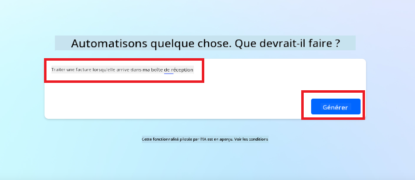 3. L'AI Copilot vous suggérera les actions nécessaires pour effectuer la tâche que vous souhaitez automatiser. Vous pouvez cliquer sur le bouton **Suivant** pour passer aux étapes suivantes. 4. À l'étape suivante, Power Automate vous demandera de configurer les connexions requises pour le flux. Une fois terminé, cliquez sur le bouton **Créer un flux** pour créer le flux. 5. L'AI Copilot générera un flux et vous pourrez ensuite personnaliser le flux pour répondre à vos besoins. 6. Mettez à jour le déclencheur du flux et définissez le **Dossier** sur le dossier où les factures seront stockées. Par exemple, vous pouvez définir le dossier sur **Boîte de réception**. Cliquez sur **Afficher les options avancées** et définissez **Uniquement avec pièces jointes** sur **Oui**. Cela garantira que le flux ne s'exécute que lorsqu'un email avec une pièce jointe est reçu dans le dossier. 7. Supprimez les actions suivantes du flux : **HTML vers texte**, **Composer**, **Composer 2**, **Composer 3** et **Composer 4** car vous ne les utiliserez pas. 8. Supprimez l'action **Condition** du flux car vous ne l'utiliserez pas. Cela devrait ressembler à la capture d'écran suivante : 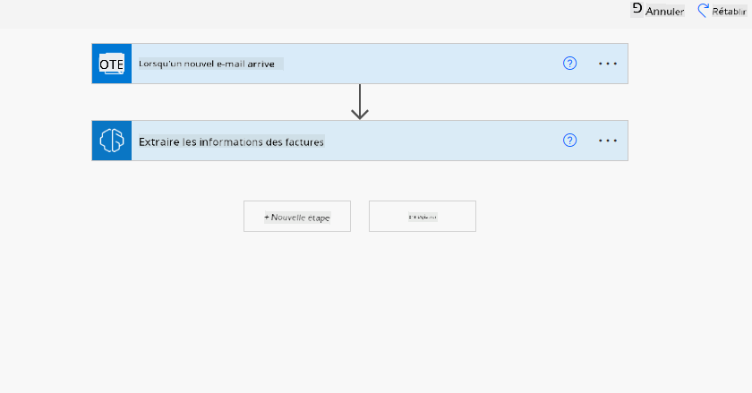 9. Cliquez sur le bouton **Ajouter une action** et recherchez **Dataverse**. Sélectionnez l'action **Ajouter une nouvelle ligne**. 10. Sur l'action **Extraire les informations des factures**, mettez à jour le **Fichier de facture** pour pointer vers le **Contenu de la pièce jointe** de l'email. Cela garantira que le flux extrait des informations de la pièce jointe de la facture. 11. Sélectionnez la **Table** que vous avez créée précédemment. Par exemple, vous pouvez sélectionner la table **Informations de Facture**. Choisissez le contenu dynamique de l'action précédente pour remplir les champs suivants : - ID - Montant - Date - Nom - Statut - Définissez le **Statut** sur **En attente**. - Email du fournisseur - Utilisez le contenu dynamique **De** du déclencheur **Lorsqu'un nouvel email arrive**. 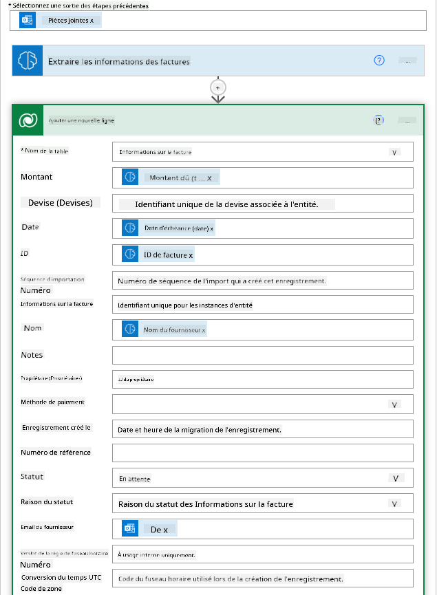 12. Une fois que vous avez terminé le flux, cliquez sur le bouton **Sauvegarder** pour enregistrer le flux. Vous pouvez ensuite tester le flux en envoyant un email avec une facture au dossier que vous avez spécifié dans le déclencheur. > **Votre devoir** : Le flux que vous venez de construire est un bon début, maintenant vous devez réfléchir à comment vous pouvez construire une automatisation qui permettra à notre équipe financière d'envoyer un email au fournisseur pour les mettre à jour sur le statut actuel de leur facture. Votre indice : le flux doit s'exécuter lorsque le statut de la facture change.

## Utiliser un Modèle AI de Génération de Texte dans Power Automate

Le modèle AI Créer du Texte avec GPT dans AI Builder vous permet de générer du texte basé sur une invite et est alimenté par le service Microsoft Azure OpenAI. Avec cette capacité, vous pouvez intégrer la technologie GPT (Generative Pre-Trained Transformer) dans vos applications et flux pour construire une variété de flux automatisés et d'applications perspicaces.

Les modèles GPT subissent une formation intensive sur de vastes quantités de données, leur permettant de produire du texte qui ressemble de près à la langue humaine lorsqu'une invite leur est fournie. Lorsqu'ils sont intégrés à l'automatisation des flux de travail, les modèles AI comme GPT peuvent être exploités pour rationaliser et automatiser un large éventail de tâches.

Par exemple, vous pouvez construire des flux pour générer automatiquement du texte pour une variété de cas d'utilisation, tels que : brouillons d'emails, descriptions de produits, et plus encore. Vous pouvez également utiliser le modèle pour générer du texte pour une variété d'applications, telles que des chatbots et des applications de service client qui permettent aux agents de service client de répondre efficacement et rapidement aux demandes des clients.

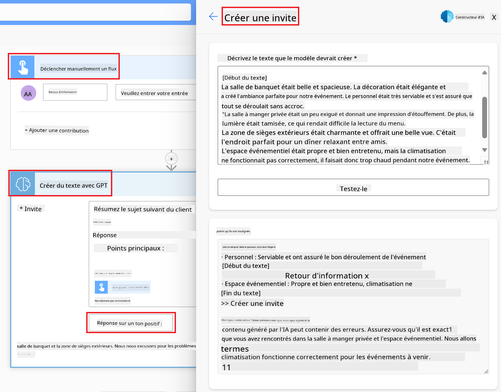

Pour apprendre à utiliser ce modèle AI dans Power Automate, parcourez le module [Ajouter de l'intelligence avec AI Builder et GPT](https://learn.microsoft.com/training/modules/ai-builder-text-generation/?WT.mc_id=academic-109639-somelezediko).

## Bon Travail ! Continuez Votre Apprentissage

Après avoir terminé cette leçon, consultez notre [collection d'apprentissage sur l'IA générative](https://aka.ms/genai-collection?WT.mc_id=academic-105485-koreyst) pour continuer à approfondir vos connaissances sur l'IA générative !

Rendez-vous à la leçon 11 où nous examinerons comment [intégrer l'IA générative avec l'appel de fonction](../11-integrating-with-function-calling/README.md?WT.mc_id=academic-105485-koreyst) !

**Avertissement** :  
Ce document a été traduit à l'aide du service de traduction automatique [Co-op Translator](https://github.com/Azure/co-op-translator). Bien que nous nous efforcions d'assurer l'exactitude, veuillez noter que les traductions automatisées peuvent contenir des erreurs ou des inexactitudes. Le document original dans sa langue d'origine doit être considéré comme la source faisant autorité. Pour des informations critiques, il est recommandé de faire appel à une traduction professionnelle humaine. Nous ne sommes pas responsables des malentendus ou des interprétations erronées résultant de l'utilisation de cette traduction.