<!--
CO_OP_TRANSLATOR_METADATA:
{
  "original_hash": "e2f686f2eb794941761252ac5e8e090b",
  "translation_date": "2025-05-19T14:26:45+00:00",
  "source_file": "02-exploring-and-comparing-different-llms/README.md",
  "language_code": "hr"
}
-->
# Istraživanje i usporedba različitih LLM-ova

[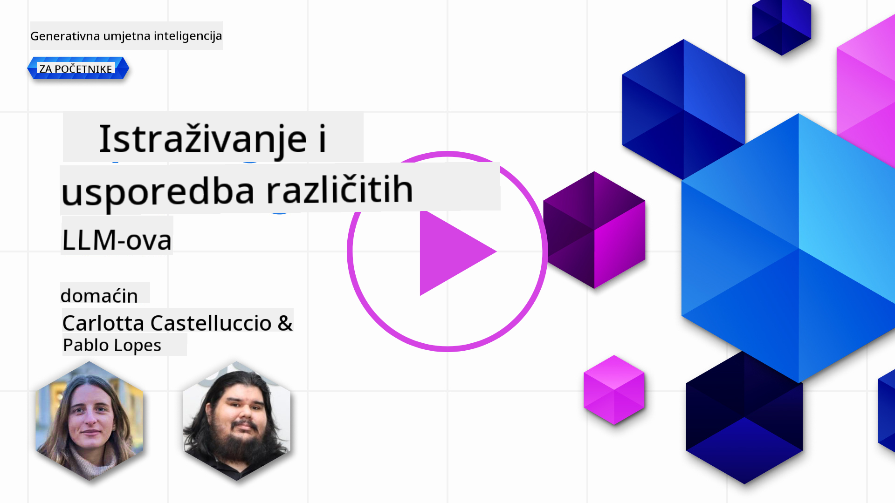](https://aka.ms/gen-ai-lesson2-gh?WT.mc_id=academic-105485-koreyst)

> _Kliknite na sliku iznad za pregled videa ove lekcije_

U prethodnoj lekciji vidjeli smo kako Generativna AI mijenja tehnološki krajolik, kako Veliki Jezični Modeli (LLM-ovi) rade i kako ih tvrtka - poput našeg startupa - može primijeniti na svoje slučajeve korištenja i rasti! U ovom poglavlju želimo usporediti i kontrastirati različite vrste velikih jezičnih modela (LLM-ova) kako bismo razumjeli njihove prednosti i nedostatke.

Sljedeći korak na putovanju našeg startupa je istraživanje trenutnog krajolika LLM-ova i razumijevanje koji su prikladni za naš slučaj korištenja.

## Uvod

Ova lekcija će pokriti:

- Različite vrste LLM-ova u trenutnom krajoliku.
- Testiranje, iteriranje i usporedbu različitih modela za vaš slučaj korištenja u Azureu.
- Kako implementirati LLM.

## Ciljevi učenja

Nakon završetka ove lekcije, moći ćete:

- Odabrati pravi model za vaš slučaj korištenja.
- Razumjeti kako testirati, iterirati i poboljšati performanse vašeg modela.
- Znati kako tvrtke implementiraju modele.

## Razumjeti različite vrste LLM-ova

LLM-ovi mogu imati više kategorizacija na temelju njihove arhitekture, podataka za obuku i slučaja korištenja. Razumijevanje ovih razlika pomoći će našem startupu da odabere pravi model za scenarij i razumije kako testirati, iterirati i poboljšati performanse.

Postoji mnogo različitih vrsta LLM modela, vaš izbor modela ovisi o tome što namjeravate koristiti, vašim podacima, koliko ste spremni platiti i više.

Ovisno o tome namjeravate li koristiti modele za generiranje teksta, zvuka, videa, slike i slično, možete se odlučiti za različitu vrstu modela.

- **Prepoznavanje zvuka i govora**. Za ovu svrhu, modeli tipa Whisper su odličan izbor jer su univerzalni i usmjereni na prepoznavanje govora. Obučeni su na raznolikim audio podacima i mogu obavljati višejezično prepoznavanje govora. Saznajte više o [Whisper tip modelima ovdje](https://platform.openai.com/docs/models/whisper?WT.mc_id=academic-105485-koreyst).

- **Generiranje slika**. Za generiranje slika, DALL-E i Midjourney su dva vrlo poznata izbora. DALL-E nudi Azure OpenAI. [Pročitajte više o DALL-E ovdje](https://platform.openai.com/docs/models/dall-e?WT.mc_id=academic-105485-koreyst) i također u Poglavlju 9 ovog kurikuluma.

- **Generiranje teksta**. Većina modela je obučena za generiranje teksta i imate veliki izbor od GPT-3.5 do GPT-4. Dolaze s različitim troškovima, pri čemu je GPT-4 najskuplji. Vrijedi istražiti [Azure OpenAI playground](https://oai.azure.com/portal/playground?WT.mc_id=academic-105485-koreyst) kako biste procijenili koji modeli najbolje odgovaraju vašim potrebama u smislu sposobnosti i troškova.

- **Višestruka modalnost**. Ako želite obraditi više vrsta podataka u ulazu i izlazu, možda biste htjeli istražiti modele poput [gpt-4 turbo s vizijom ili gpt-4o](https://learn.microsoft.com/azure/ai-services/openai/concepts/models#gpt-4-and-gpt-4-turbo-models?WT.mc_id=academic-105485-koreyst) - najnovija izdanja OpenAI modela - koji su sposobni kombinirati obradu prirodnog jezika s vizualnim razumijevanjem, omogućujući interakcije putem multimodalnih sučelja.

Odabir modela znači da dobivate neke osnovne sposobnosti, koje možda neće biti dovoljne. Često imate specifične podatke tvrtke koje nekako trebate prenijeti LLM-u. Postoji nekoliko različitih izbora kako to pristupiti, više o tome u nadolazećim sekcijama.

### Temeljni modeli naspram LLM-ova

Izraz Temeljni Model [skovali su istraživači sa Stanforda](https://arxiv.org/abs/2108.07258?WT.mc_id=academic-105485-koreyst) i definirali kao AI model koji slijedi neke kriterije, kao što su:

- **Obučeni su korištenjem nesuperviziranog učenja ili samonadziranog učenja**, što znači da su obučeni na nenadziranim multimodalnim podacima i ne zahtijevaju ljudsku anotaciju ili označavanje podataka za svoj proces obuke.
- **Vrlo su veliki modeli**, bazirani na vrlo dubokim neuronskim mrežama obučeni na milijardama parametara.
- **Normalno su namijenjeni da služe kao 'temelj' za druge modele**, što znači da se mogu koristiti kao početna točka za druge modele koji se mogu izgraditi na vrhu, što se može postići finim podešavanjem.

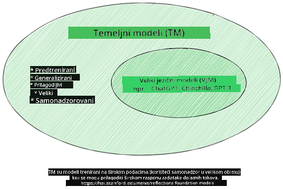

Izvor slike: [Essential Guide to Foundation Models and Large Language Models | by Babar M Bhatti | Medium
](https://thebabar.medium.com/essential-guide-to-foundation-models-and-large-language-models-27dab58f7404)

Kako bismo dodatno razjasnili ovu razliku, uzmimo ChatGPT kao primjer. Za izgradnju prve verzije ChatGPT-a, model nazvan GPT-3.5 služio je kao temeljni model. To znači da je OpenAI koristio neke specifične podatke o razgovoru za stvaranje podešene verzije GPT-3.5 koja je bila specijalizirana za dobro obavljanje u konverzacijskim scenarijima, kao što su chatboti.

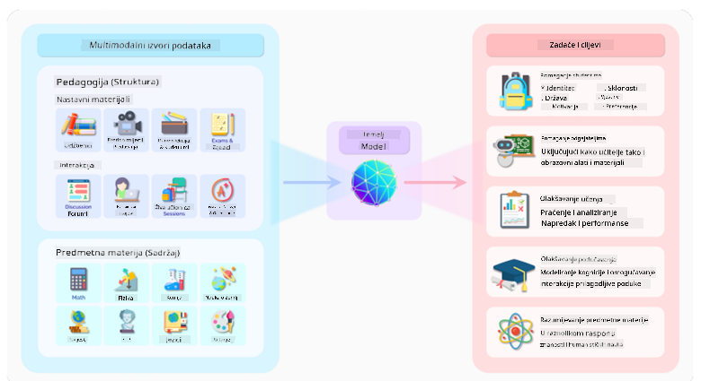

Izvor slike: [2108.07258.pdf (arxiv.org)](https://arxiv.org/pdf/2108.07258.pdf?WT.mc_id=academic-105485-koreyst)

### Open Source naspram Vlasnički modeli

Još jedan način kategoriziranja LLM-ova je jesu li open source ili vlasnički.

Open-source modeli su modeli koji su dostupni javnosti i mogu ih koristiti bilo tko. Često ih čini dostupnim tvrtka koja ih je stvorila ili istraživačka zajednica. Ovi modeli mogu se pregledati, modificirati i prilagoditi za različite slučajeve korištenja u LLM-ovima. Međutim, nisu uvijek optimizirani za proizvodnu upotrebu i možda nisu tako performansni kao vlasnički modeli. Osim toga, financiranje open-source modela može biti ograničeno i možda neće biti dugoročno održavani ili ažurirani s najnovijim istraživanjima. Primjeri popularnih open-source modela uključuju [Alpaca](https://crfm.stanford.edu/2023/03/13/alpaca.html?WT.mc_id=academic-105485-koreyst), [Bloom](https://huggingface.co/bigscience/bloom) i [LLaMA](https://llama.meta.com).

Vlasnički modeli su modeli koji su u vlasništvu tvrtke i nisu dostupni javnosti. Ovi modeli su često optimizirani za proizvodnu upotrebu. Međutim, nije dopušteno da se pregledaju, modificiraju ili prilagode za različite slučajeve korištenja. Osim toga, nisu uvijek dostupni besplatno i možda zahtijevaju pretplatu ili plaćanje za korištenje. Također, korisnici nemaju kontrolu nad podacima koji se koriste za obuku modela, što znači da trebaju vjerovati vlasniku modela da će osigurati obvezu prema privatnosti podataka i odgovornoj upotrebi AI-a. Primjeri popularnih vlasničkih modela uključuju [OpenAI modele](https://platform.openai.com/docs/models/overview?WT.mc_id=academic-105485-koreyst), [Google Bard](https://sapling.ai/llm/bard?WT.mc_id=academic-105485-koreyst) ili [Claude 2](https://www.anthropic.com/index/claude-2?WT.mc_id=academic-105485-koreyst).

### Ugrađivanje naspram Generiranje slika naspram Generiranje teksta i koda

LLM-ovi se također mogu kategorizirati prema izlazu koji generiraju.

Ugrađivanja su skup modela koji mogu pretvoriti tekst u numerički oblik, nazvan ugrađivanje, što je numerički prikaz ulaznog teksta. Ugrađivanja olakšavaju strojevima razumijevanje odnosa između riječi ili rečenica i mogu se koristiti kao ulazi za druge modele, kao što su modeli klasifikacije ili modeli grupiranja koji imaju bolje performanse na numeričkim podacima. Ugrađivanje modela često se koriste za prijenosno učenje, gdje se model gradi za zamjenski zadatak za koji postoji obilje podataka, a zatim se težine modela (ugrađivanja) ponovno koriste za druge zadatke nizvodno. Primjer ove kategorije je [OpenAI ugrađivanja](https://platform.openai.com/docs/models/embeddings?WT.mc_id=academic-105485-koreyst).

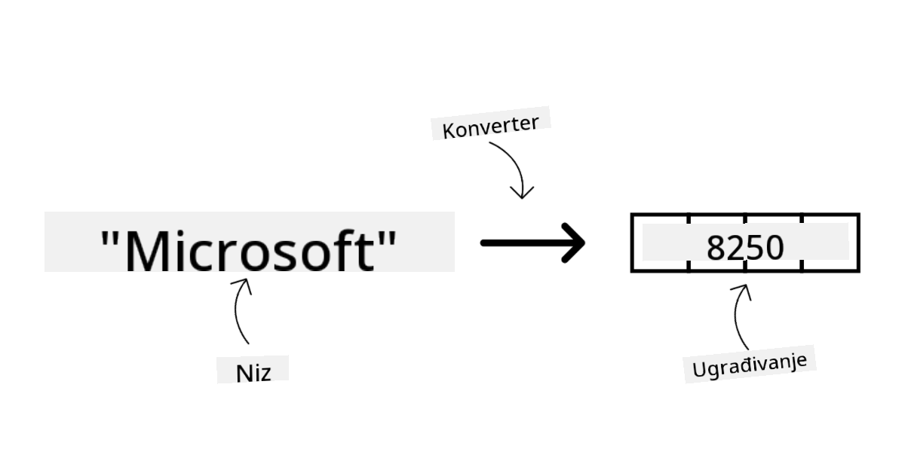

Modeli generiranja slika su modeli koji generiraju slike. Ovi modeli često se koriste za uređivanje slika, sintezu slika i prevođenje slika. Modeli generiranja slika često se obučavaju na velikim skupovima podataka o slikama, kao što je [LAION-5B](https://laion.ai/blog/laion-5b/?WT.mc_id=academic-105485-koreyst), i mogu se koristiti za generiranje novih slika ili za uređivanje postojećih slika tehnikama poput inpaintinga, super-rezolucije i kolorizacije. Primjeri uključuju [DALL-E-3](https://openai.com/dall-e-3?WT.mc_id=academic-105485-koreyst) i [Stable Diffusion modeli](https://github.com/Stability-AI/StableDiffusion?WT.mc_id=academic-105485-koreyst).

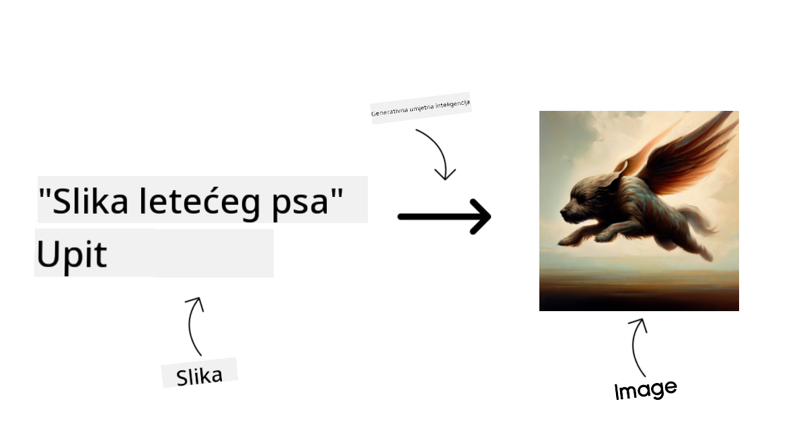

Modeli generiranja teksta i koda su modeli koji generiraju tekst ili kod. Ovi modeli često se koriste za sažimanje teksta, prevođenje i odgovaranje na pitanja. Modeli generiranja teksta često se obučavaju na velikim skupovima podataka o tekstu, kao što je [BookCorpus](https://www.cv-foundation.org/openaccess/content_iccv_2015/html/Zhu_Aligning_Books_and_ICCV_2015_paper.html?WT.mc_id=academic-105485-koreyst), i mogu se koristiti za generiranje novog teksta ili za odgovaranje na pitanja. Modeli generiranja koda, poput [CodeParrot](https://huggingface.co/codeparrot?WT.mc_id=academic-105485-koreyst), često se obučavaju na velikim skupovima podataka o kodu, kao što je GitHub, i mogu se koristiti za generiranje novog koda ili za ispravljanje grešaka u postojećem kodu.

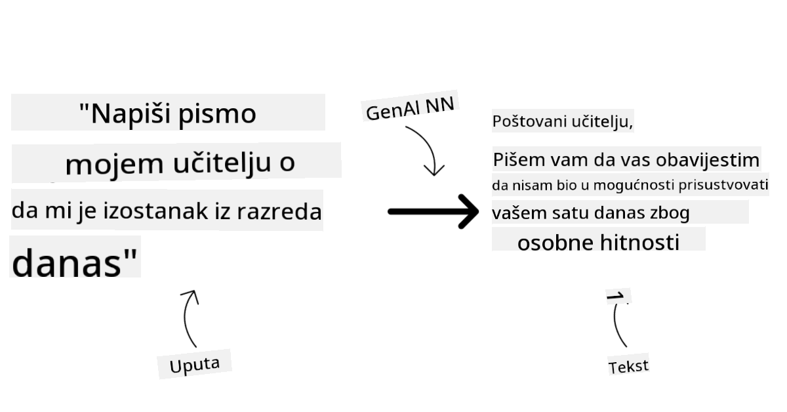

### Encoder-Decoder naspram Samo Decoder

Da bismo razgovarali o različitim vrstama arhitektura LLM-ova, koristimo analogiju.

Zamislite da vam je menadžer dao zadatak pisanja kviza za studente. Imate dva kolege; jedan nadzire stvaranje sadržaja, a drugi nadzire pregledavanje.

Stvaratelj sadržaja je poput modela samo Decoder, može pogledati temu i vidjeti što ste već napisali, a zatim može napisati kurs na temelju toga. Vrlo su dobri u pisanju zanimljivog i informativnog sadržaja, ali nisu vrlo dobri u razumijevanju teme i ciljeva učenja. Neki primjeri modela Decoder su GPT obitelj modela, kao što je GPT-3.

Recenzent je poput modela samo Encoder, gleda na napisani kurs i odgovore, primjećujući odnos između njih i razumijevanje konteksta, ali nije dobar u generiranju sadržaja. Primjer modela samo Encoder bio bi BERT.

Zamislite da možemo imati nekoga tko bi mogao stvoriti i pregledati kviz, ovo je Encoder-Decoder model. Neki primjeri bili bi BART i T5.

### Usluga naspram Model

Sada, razgovarajmo o razlici između usluge i modela. Usluga je proizvod koji nudi pružatelj usluga u oblaku i često je kombinacija modela, podataka i drugih komponenti. Model je osnovna komponenta usluge i često je temeljni model, kao što je LLM.

Usluge su često optimizirane za proizvodnu upotrebu i često ih je lakše koristiti od modela, putem grafičkog korisničkog sučelja. Međutim, usluge nisu uvijek dostupne besplatno i možda zahtijevaju pretplatu ili plaćanje za korištenje, u zamjenu za korištenje opreme i resursa vlasnika usluge, optimizaciju troškova i lako skaliranje. Primjer usluge je [Azure OpenAI Service](https://learn.microsoft.com/azure/ai-services/openai/overview?WT.mc_id=academic-105485-koreyst), koji nudi plan plaćanja prema korištenju, što znači da se korisnicima naplaćuje proporcionalno koliko koriste uslugu. Također, Azure OpenAI Service nudi sigurnost na razini poduzeća i okvir odgovorne AI na vrhu sposobnosti modela.

Modeli su samo Neuronska Mreža, s parametrima, težinama i ostalim. Omogućuju tvrtkama da se pokreću lokalno, međutim, trebale bi kupiti opremu, izgraditi strukturu za skaliranje i kupiti licencu ili koristiti open-source model. Model poput LLaMA je dostupan za korištenje, zahtijevajući računalnu snagu za pokretanje modela.

## Kako testirati i iterirati s različitim modelima za razumijevanje performansi na Azureu

Nakon što je naš tim istražio trenutni krajolik LLM-ova i identificirao neke dobre kandidate za njihove scenarije, sljedeći korak je testiranje na njihovim podacima i radnom opterećenju. Ovo je iterativni proces, provodi se putem eksperimenata i mjerenja.
Većina modela koje smo spomenuli u prethodnim paragrafima (OpenAI modeli, open source modeli poput Llama2 i Hugging Face transformatori) dostupni su u [Katalogu modela](https://learn.microsoft.com/azure/ai-studio/how-to/model-catalog-overview?WT.mc_id=academic-105485-koreyst) u [Azure AI Studio](https://ai.azure.com/?WT.mc_id=academic-105485-koreyst).

[Azure AI Studio](https://learn.microsoft.com/azure/ai-studio/what-is-ai-studio?WT.mc_id=academic-105485-koreyst) je Cloud Platforma dizajnirana za developere za izgradnju generativnih AI aplikacija i upravljanje cijelim razvojnim životnim ciklusom - od eksperimentiranja do evaluacije - kombiniranjem svih Azure AI usluga u jedinstvenom centru s praktičnim GUI-jem. Katalog modela u Azure AI Studio omogućuje korisniku da:

- Pronađe Temeljni Model od interesa u katalogu - bilo vlasnički ili open source, filtriranjem prema zadatku, licenci ili nazivu. Kako bi se poboljšala pretraživost, modeli su organizirani u kolekcije, poput Azure OpenAI kolekcije, Hugging Face kolekcije i više.

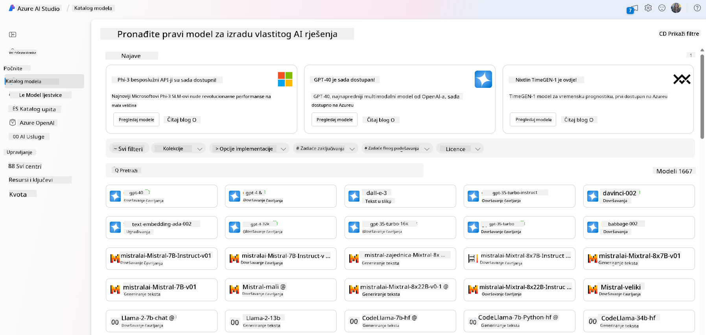

- Pregleda karticu modela, uključujući detaljan opis namijenjene upotrebe i podataka za obuku, primjere koda i rezultate evaluacije u internom evaluacijskom biblioteci.

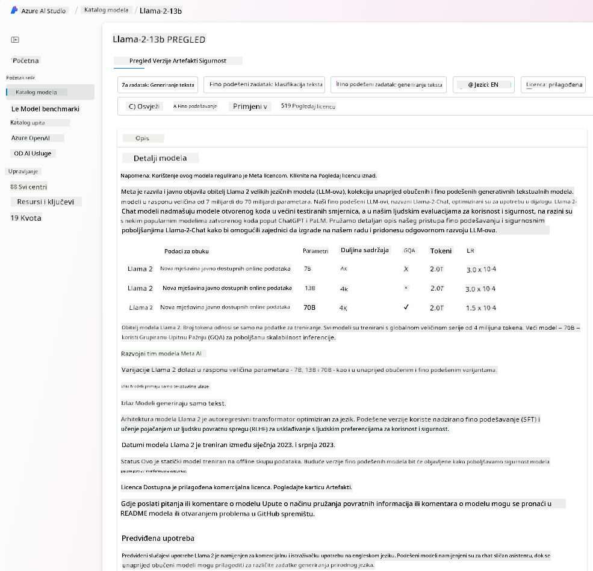
- Usporedite mjerila među modelima i skupovima podataka dostupnim u industriji kako biste procijenili koji najbolje odgovara poslovnom scenariju, putem [Model Benchmarks](https://learn.microsoft.com/azure/ai-studio/how-to/model-benchmarks?WT.mc_id=academic-105485-koreyst) ploče.

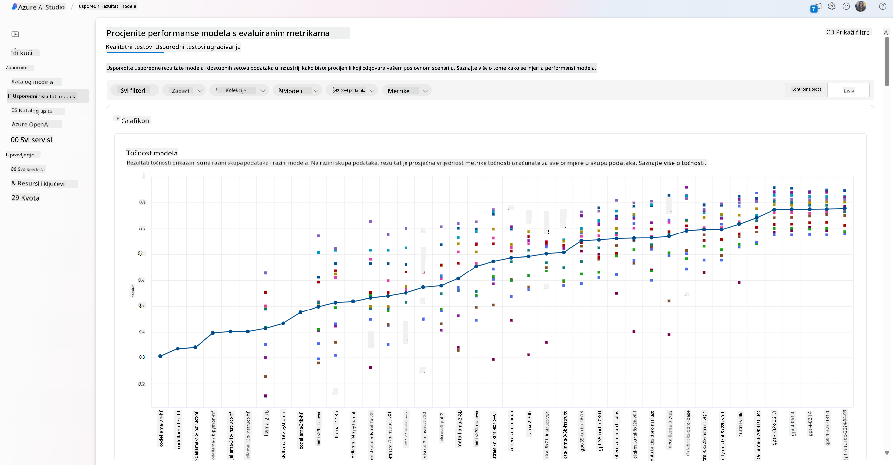

- Precizno prilagodite model na prilagođenim podacima za obuku kako biste poboljšali izvedbu modela u određenom radnom opterećenju, koristeći mogućnosti eksperimentiranja i praćenja Azure AI Studija.

- Implementirajte originalni unaprijed obučeni model ili precizno prilagođenu verziju na udaljeni kraj za inferenciju u stvarnom vremenu - upravljano računanje - ili bez poslužitelja api krajnju točku - [plaćanje prema korištenju](https://learn.microsoft.com/azure/ai-studio/how-to/model-catalog-overview#model-deployment-managed-compute-and-serverless-api-pay-as-you-go?WT.mc_id=academic-105485-koreyst) - kako bi ga aplikacije mogle koristiti.

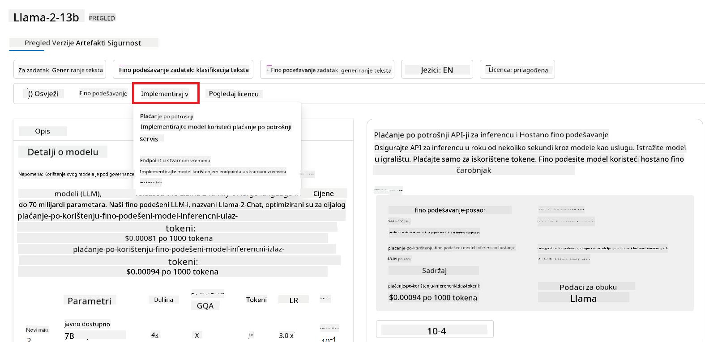

> [!NOTE]
> Trenutno nisu svi modeli u katalogu dostupni za precizno prilagođavanje i/ili implementaciju plaćanja prema korištenju. Provjerite karticu modela za pojedinosti o mogućnostima i ograničenjima modela.

## Poboljšanje rezultata LLM-a

Istražili smo s našim startup timom različite vrste LLM-a i Cloud Platformu (Azure Machine Learning) koja nam omogućuje usporedbu različitih modela, njihovu procjenu na testnim podacima, poboljšanje performansi i implementaciju na inferencijskim krajnjim točkama.

Ali kada bi trebali razmotriti precizno prilagođavanje modela umjesto korištenja unaprijed obučenog? Postoje li drugi pristupi za poboljšanje performansi modela u specifičnim radnim opterećenjima?

Postoji nekoliko pristupa koje poslovanje može koristiti kako bi postiglo željene rezultate od LLM-a. Možete odabrati različite vrste modela s različitim stupnjevima obuke prilikom implementacije LLM-a u proizvodnju, s različitim razinama složenosti, troškova i kvalitete. Evo nekoliko različitih pristupa:

- **Inženjering upita s kontekstom**. Ideja je pružiti dovoljno konteksta prilikom upita kako biste osigurali da dobijete potrebne odgovore.

- **Generiranje obogaćeno preuzimanjem, RAG**. Vaši podaci mogu postojati u bazi podataka ili web krajnjoj točki, na primjer, kako biste osigurali da su ti podaci, ili njihov podskup, uključeni u vrijeme upita, možete dohvatiti relevantne podatke i učiniti ih dijelom korisničkog upita.

- **Precizno prilagođeni model**. Ovdje ste dodatno obučili model na vlastitim podacima što je dovelo do toga da model bude precizniji i odgovara vašim potrebama, ali to može biti skupo.

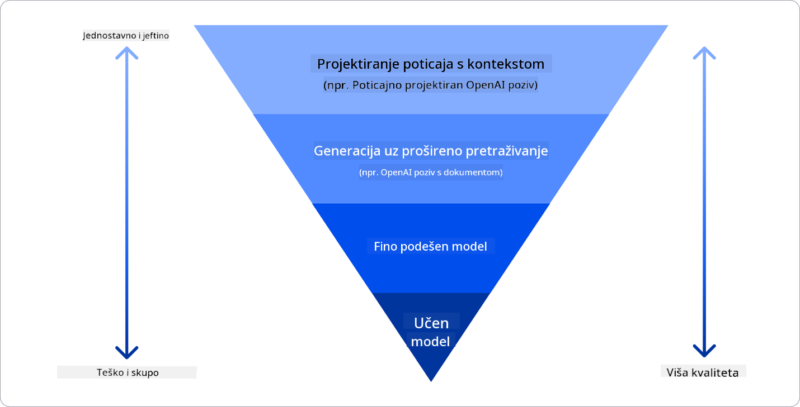

Izvor slike: [Četiri načina na koje poduzeća implementiraju LLM-e | Fiddler AI Blog](https://www.fiddler.ai/blog/four-ways-that-enterprises-deploy-llms?WT.mc_id=academic-105485-koreyst)

### Inženjering upita s kontekstom

Unaprijed obučeni LLM-ovi vrlo dobro funkcioniraju na generaliziranim zadacima prirodnog jezika, čak i kada ih se poziva kratkim upitom, poput rečenice za dovršavanje ili pitanja – takozvano "zero-shot" učenje.

Međutim, što više korisnik može oblikovati svoj upit, s detaljnim zahtjevom i primjerima – Kontekstom – to će odgovor biti precizniji i bliži korisnikovim očekivanjima. U ovom slučaju, govorimo o "one-shot" učenju ako upit uključuje samo jedan primjer i "few-shot učenju" ako uključuje više primjera. Inženjering upita s kontekstom je najisplativiji pristup za početak.

### Generiranje obogaćeno preuzimanjem (RAG)

LLM-ovi imaju ograničenje da mogu koristiti samo podatke koji su korišteni tijekom njihove obuke za generiranje odgovora. To znači da ne znaju ništa o činjenicama koje su se dogodile nakon njihovog procesa obuke i ne mogu pristupiti ne-javnim informacijama (poput podataka tvrtke). Ovo se može prevladati kroz RAG, tehniku koja obogaćuje upit vanjskim podacima u obliku dijelova dokumenata, uzimajući u obzir ograničenja duljine upita. To je podržano alatima za vektorske baze podataka (poput [Azure Vector Search](https://learn.microsoft.com/azure/search/vector-search-overview?WT.mc_id=academic-105485-koreyst)) koji dohvaćaju korisne dijelove iz raznih unaprijed definiranih izvora podataka i dodaju ih u kontekst upita.

Ova tehnika je vrlo korisna kada poduzeće nema dovoljno podataka, dovoljno vremena ili resursa za precizno prilagođavanje LLM-a, ali i dalje želi poboljšati performanse u specifičnom radnom opterećenju i smanjiti rizike od izmišljotina, tj. mistifikacije stvarnosti ili štetnog sadržaja.

### Precizno prilagođeni model

Precizno prilagođavanje je proces koji koristi prijenosno učenje kako bi 'prilagodio' model za zadatak nizvodno ili riješio specifičan problem. Za razliku od učenja na nekoliko primjera i RAG-a, rezultira generiranjem novog modela s ažuriranim težinama i pristranostima. Zahtijeva skup primjera za obuku koji se sastoje od jednog ulaza (upita) i njegovog povezanog izlaza (dovršetka). Ovo bi bio preferirani pristup ako:

- **Korištenje precizno prilagođenih modela**. Poduzeće bi željelo koristiti precizno prilagođene manje sposobne modele (poput modela za ugrađivanje) umjesto modela visokih performansi, što rezultira isplativijim i bržim rješenjem.

- **Razmatranje latencije**. Latencija je važna za specifičan slučaj uporabe, tako da nije moguće koristiti vrlo duge upite ili broj primjera koji bi se trebali naučiti iz modela ne odgovara ograničenju duljine upita.

- **Održavanje ažurnosti**. Poduzeće ima puno visokokvalitetnih podataka i oznaka istine i resurse potrebne za održavanje tih podataka ažurnima tijekom vremena.

### Obučeni model

Obučavanje LLM-a od nule je bez sumnje najteži i najsloženiji pristup koji treba usvojiti, zahtijevajući ogromne količine podataka, vješte resurse i odgovarajuću računalnu snagu. Ova opcija bi se trebala razmotriti samo u scenariju gdje poduzeće ima slučaj uporabe specifičan za domenu i veliku količinu podataka usmjerenih na domenu.

## Provjera znanja

Koji bi mogao biti dobar pristup za poboljšanje rezultata dovršetka LLM-a?

1. Inženjering upita s kontekstom
1. RAG
1. Precizno prilagođeni model

A:3, ako imate vremena i resursa te visokokvalitetne podatke, precizno prilagođavanje je bolja opcija za održavanje ažurnosti. Međutim, ako tražite poboljšanja i nedostaje vam vremena, vrijedi prvo razmotriti RAG.

## 🚀 Izazov

Pročitajte više o tome kako možete [koristiti RAG](https://learn.microsoft.com/azure/search/retrieval-augmented-generation-overview?WT.mc_id=academic-105485-koreyst) za svoje poslovanje.

## Odličan posao, nastavite s učenjem

Nakon što završite ovu lekciju, pogledajte našu [Kolekciju za učenje generativne AI](https://aka.ms/genai-collection?WT.mc_id=academic-105485-koreyst) kako biste nastavili usavršavati svoje znanje o generativnoj AI!

Prijeđite na Lekciju 3 gdje ćemo pogledati kako [odgovorno graditi s generativnom AI](../03-using-generative-ai-responsibly/README.md?WT.mc_id=academic-105485-koreyst)!

**Odricanje od odgovornosti**:  
Ovaj dokument je preveden korištenjem AI usluge prevođenja [Co-op Translator](https://github.com/Azure/co-op-translator). Iako težimo preciznosti, molimo vas da budete svjesni da automatizirani prijevodi mogu sadržavati greške ili netočnosti. Izvorni dokument na izvornom jeziku treba smatrati mjerodavnim izvorom. Za kritične informacije preporučuje se profesionalni ljudski prijevod. Ne odgovaramo za nesporazume ili pogrešna tumačenja koja proizlaze iz korištenja ovog prijevoda.