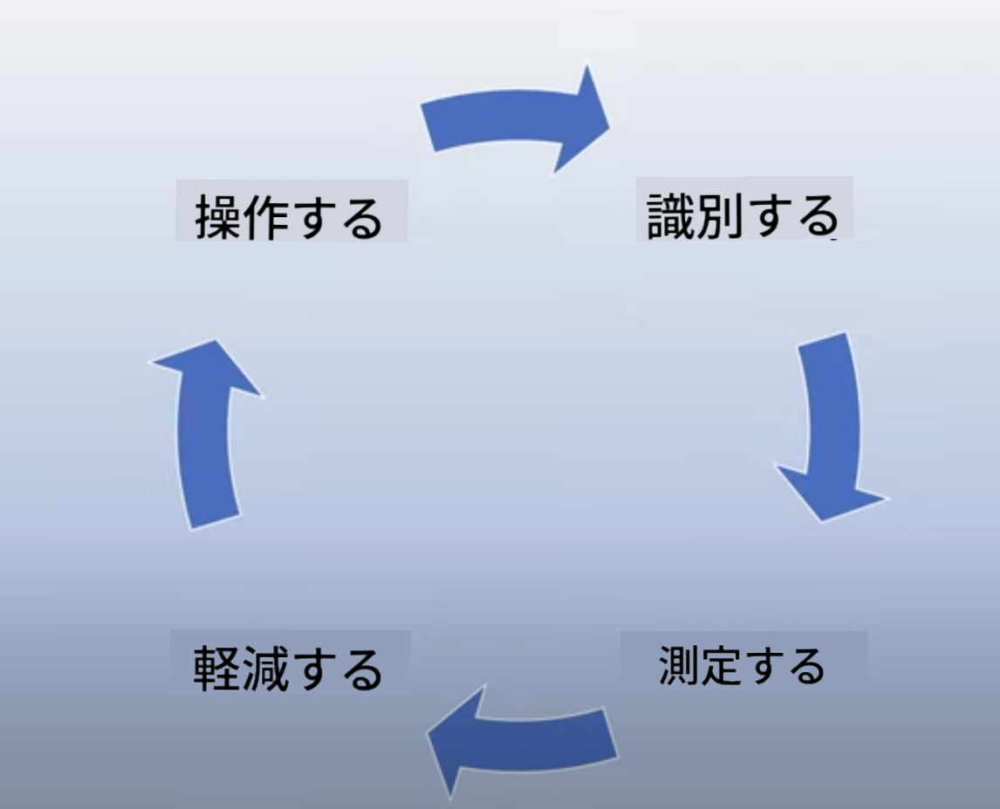

<!--
CO_OP_TRANSLATOR_METADATA:
{
  "original_hash": "13084c6321a2092841b9a081b29497ba",
  "translation_date": "2025-05-19T09:27:44+00:00",
  "source_file": "03-using-generative-ai-responsibly/README.md",
  "language_code": "ja"
}
-->
# ジェネレーティブAIの責任ある使用

> _このレッスンのビデオを見るには上の画像をクリックしてください_

AI、特にジェネレーティブAIに魅了されるのは簡単ですが、責任を持って使用する方法を考慮する必要があります。出力が公平で害がないことを保証する方法などを考慮する必要があります。この章では、考慮すべきこと、そしてAIの使用を改善するための積極的なステップを提供することを目的としています。

## はじめに

このレッスンでは以下をカバーします：

- ジェネレーティブAIアプリケーションを構築する際に、なぜ責任あるAIを優先すべきなのか。
- 責任あるAIの基本原則と、それらがジェネレーティブAIとどのように関連しているか。
- これらの責任あるAIの原則を戦略とツールを通じて実践する方法。

## 学習目標

このレッスンを完了した後、あなたは以下を理解します：

- ジェネレーティブAIアプリケーションを構築する際の責任あるAIの重要性。
- ジェネレーティブAIアプリケーションを構築する際に、責任あるAIの基本原則を考え、適用する時期。
- 責任あるAIの概念を実践するために利用可能なツールと戦略。

## 責任あるAIの原則

ジェネレーティブAIの興奮はこれまで以上に高まっています。この興奮は、多くの新しい開発者、注目、資金をこの分野に引き寄せました。これはジェネレーティブAIを使用して製品や企業を構築しようとしている人々にとって非常にポジティブなことですが、責任を持って進むことも重要です。

このコースを通じて、私たちはスタートアップとAI教育製品の構築に焦点を当てています。私たちは責任あるAIの原則である：公平性、包摂性、信頼性/安全性、セキュリティとプライバシー、透明性と説明責任を使用します。これらの原則を用いて、ジェネレーティブAIの使用が私たちの製品にどのように関連しているかを探ります。

## なぜ責任あるAIを優先すべきなのか

製品を構築する際に、ユーザーの最善の利益を考慮した人間中心のアプローチを取ることが最良の結果をもたらします。

ジェネレーティブAIのユニークさは、ユーザーに役立つ回答、情報、ガイダンス、コンテンツを生成する力です。これは多くの手動ステップなしで行うことができ、非常に印象的な結果をもたらすことができます。適切な計画と戦略がなければ、ユーザー、製品、そして社会全体にとって有害な結果をもたらすこともあります。

これらの潜在的な有害な結果の一部（すべてではありません）を見てみましょう：

### 幻覚

幻覚は、LLMが完全に意味不明な内容を生成するか、他の情報源に基づいて事実として誤っていることを知っている内容を生成する場合を説明するために使用される用語です。

例えば、私たちのスタートアップが学生がモデルに歴史的な質問をすることを可能にする機能を構築したとします。学生が質問 `Who was the sole survivor of Titanic?` をする。

モデルは以下のような応答を生成します：

> _(出典: [Flying bisons](https://flyingbisons.com?WT.mc_id=academic-105485-koreyst))_

これは非常に自信に満ちた詳細な回答です。しかし残念ながら、これは間違っています。わずかな調査でも、タイタニックの災害には複数の生存者がいたことが分かります。このトピックを研究し始めたばかりの学生にとって、この回答は十分に説得力があり、疑問を持たずに事実として扱われる可能性があります。これにより、AIシステムが信頼性を欠き、スタートアップの評判に悪影響を及ぼす可能性があります。

任意のLLMの各反復で、幻覚を最小限に抑える性能の改善が見られています。この改善があっても、アプリケーションの開発者やユーザーとして、これらの制限を認識しておく必要があります。

### 有害なコンテンツ

以前のセクションで、LLMが誤ったまたは意味不明な応答を生成する場合について説明しました。もう一つ注意すべきリスクは、モデルが有害なコンテンツを生成する場合です。

有害なコンテンツは以下のように定義されます：

- 自傷や特定のグループへの害を促す指示を提供する。
- 憎悪や軽蔑的なコンテンツ。
- いかなる種類の攻撃や暴力行為の計画を指導する。
- 違法なコンテンツを見つける方法や違法行為を行う方法を指示する。
- 性的に露骨なコンテンツを表示する。

私たちのスタートアップでは、学生がこの種のコンテンツを見ることがないように、適切なツールと戦略を整える必要があります。

### 公平性の欠如

公平性は、「AIシステムが偏見や差別を排除し、すべての人を公平かつ平等に扱うことを保証すること」と定義されます。ジェネレーティブAIの世界では、モデルの出力によって疎外されたグループの排他的な世界観が強化されないようにしたいと考えています。

これらのタイプの出力は、ユーザーにとってポジティブな製品体験を構築することを妨げるだけでなく、社会的な害をさらに引き起こします。アプリケーションの開発者として、ジェネレーティブAIを使用してソリューションを構築する際には、常に幅広く多様なユーザー層を考慮するべきです。

## ジェネレーティブAIを責任を持って使用する方法

責任あるジェネレーティブAIの重要性を認識した今、AIソリューションを責任を持って構築するために取るべき4つのステップを見てみましょう：

### 潜在的な害を測定する

ソフトウェアテストでは、ユーザーがアプリケーションで行う予想される動作をテストします。同様に、ユーザーが最も使用する可能性が高い多様なプロンプトをテストすることは、潜在的な害を測定する良い方法です。

私たちのスタートアップが教育製品を構築しているので、教育関連のプロンプトのリストを準備することが良いでしょう。これには特定の科目、歴史的事実、学生生活に関するプロンプトを含むことができます。

### 潜在的な害を緩和する

モデルとその応答によって引き起こされる潜在的な害を防ぐ、または制限する方法を見つける時期です。これを4つの異なる層で考えることができます：

- **モデル**。適切なユースケースに適したモデルを選ぶこと。GPT-4のような大規模で複雑なモデルは、より小さく特定のユースケースに適用された場合、有害なコンテンツのリスクを増加させる可能性があります。トレーニングデータを使用して微調整することも、有害なコンテンツのリスクを減少させます。

- **安全システム**。安全システムは、モデルを提供するプラットフォーム上で害を軽減するためのツールと設定のセットです。これの例として、Azure OpenAIサービスのコンテンツフィルタリングシステムがあります。システムはまた、脱獄攻撃やボットからのリクエストなどの望ましくない活動を検出するべきです。

- **メタプロンプト**。メタプロンプトとグラウンディングは、特定の行動や情報に基づいてモデルを指示したり制限したりする方法です。これは、モデルの特定の制限を定義するためにシステム入力を使用することです。さらに、システムの範囲やドメインにより関連する出力を提供することです。

また、信頼できる情報源の選択からのみ情報を引き出すために、情報検索強化生成（RAG）のような技術を使用することもできます。このコースの後のレッスンでは、[検索アプリケーションの構築](../08-building-search-applications/README.md?WT.mc_id=academic-105485-koreyst)について学びます。

- **ユーザーエクスペリエンス**。最終層は、ユーザーが何らかの形でアプリケーションのインターフェースを通じてモデルと直接対話する場所です。この方法で、UI/UXを設計してユーザーがモデルに送信できる入力の種類を制限したり、ユーザーに表示されるテキストや画像を制限することができます。AIアプリケーションを展開する際には、ジェネレーティブAIアプリケーションができることとできないことについて透明性を持つ必要もあります。

AIアプリケーションのためのUX設計に関する[レッスン](../12-designing-ux-for-ai-applications/README.md?WT.mc_id=academic-105485-koreyst)もあります。

- **モデルを評価する**。LLMと協力することは困難な場合があります。なぜなら、モデルがトレーニングされたデータを常に制御できるわけではないからです。それでも、モデルの性能と出力を常に評価する必要があります。モデルの正確性、類似性、根拠性、および出力の関連性を測定することは重要です。これにより、ステークホルダーやユーザーに透明性と信頼を提供することができます。

### 責任あるジェネレーティブAIソリューションを運用する

AIアプリケーションに関する運用の実践を構築することが最終段階です。これには、法務やセキュリティなどのスタートアップの他の部分と提携して、すべての規制ポリシーに準拠していることを確認することが含まれます。発売前に、配信、インシデントの処理、ロールバックに関する計画を構築して、ユーザーに害を与えないようにすることも重要です。

## ツール

責任あるAIソリューションを開発する作業は多く感じるかもしれませんが、それは努力する価値のある作業です。ジェネレーティブAIの分野が成長するにつれて、開発者が効率的に責任をワークフローに統合するためのツールが成熟します。例えば、[Azure AI Content Safety](https://learn.microsoft.com/azure/ai-services/content-safety/overview?WT.mc_id=academic-105485-koreyst)は、APIリクエストを通じて有害なコンテンツや画像を検出するのに役立ちます。

## 知識チェック

責任あるAI使用を確保するために気をつけるべきことは何ですか？

1. 答えが正しいこと。
1. 有害な使用、AIが犯罪目的に使用されないこと。
1. AIが偏見や差別を排除すること。

A: 2と3が正しいです。責任あるAIは、有害な影響や偏見を軽減する方法を考慮するのに役立ちます。

## 🚀 チャレンジ

[Azure AI Content Safety](https://learn.microsoft.com/azure/ai-services/content-safety/overview?WT.mc_id=academic-105485-koreyst)について調べて、あなたの使用に採用できるものを見つけてみましょう。

## 素晴らしい仕事、学習を続けましょう

このレッスンを完了した後、[ジェネレーティブAI学習コレクション](https://aka.ms/genai-collection?WT.mc_id=academic-105485-koreyst)をチェックして、ジェネレーティブAIの知識をさらに向上させましょう！

レッスン4に進み、[プロンプトエンジニアリングの基本](../04-prompt-engineering-fundamentals/README.md?WT.mc_id=academic-105485-koreyst)を見てみましょう！

**免責事項**：
この文書はAI翻訳サービス[Co-op Translator](https://github.com/Azure/co-op-translator)を使用して翻訳されています。正確性を追求していますが、自動翻訳には誤りや不正確さが含まれる可能性があることにご注意ください。元の文書の母国語版が信頼できる情報源と見なされるべきです。重要な情報については、専門の人間による翻訳をお勧めします。この翻訳の使用に起因する誤解や誤った解釈について、当社は責任を負いません。