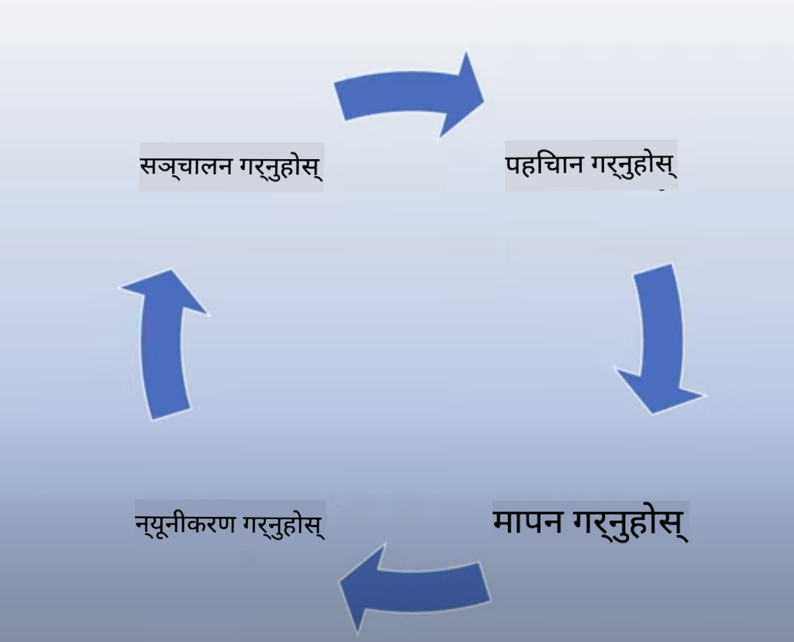
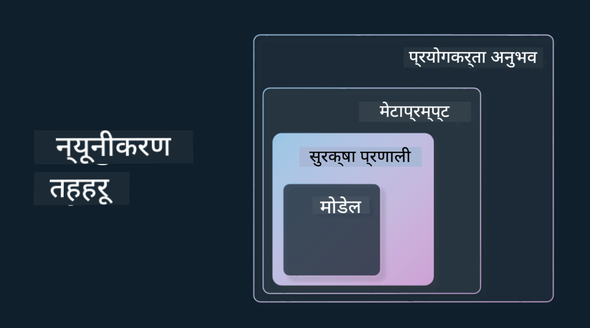

<!--
CO_OP_TRANSLATOR_METADATA:
{
  "original_hash": "13084c6321a2092841b9a081b29497ba",
  "translation_date": "2025-05-19T14:35:10+00:00",
  "source_file": "03-using-generative-ai-responsibly/README.md",
  "language_code": "ne"
}
-->
# जिम्मेवार रूपमा जेनेरेटिभ AI को प्रयोग

> _यो पाठको भिडियो हेर्न माथिको चित्रमा क्लिक गर्नुहोस्_

AI र विशेष गरी जेनेरेटिभ AI मा मोहित हुनु सजिलो छ, तर तपाईंले यसलाई जिम्मेवार रूपमा कसरी प्रयोग गर्ने भन्ने कुरामा विचार गर्न आवश्यक छ। तपाईंले यसका उत्पादनहरू निष्पक्ष, हानिकारक नभएको सुनिश्चित गर्न जस्ता कुराहरू विचार गर्नुपर्छ। यो अध्यायले तपाईंलाई उल्लेखित सन्दर्भ, के विचार गर्ने, र तपाईंको AI प्रयोगलाई सुधार गर्न सक्रिय कदम कसरी चाल्ने भनेर प्रदान गर्ने लक्ष्य राख्छ।

## परिचय

यो पाठमा समावेश हुनेछ:

- जेनेरेटिभ AI अनुप्रयोगहरू बनाउँदा जिम्मेवार AI लाई प्राथमिकता किन दिनुपर्छ।
- जिम्मेवार AI का मुख्य सिद्धान्तहरू र तिनीहरू जेनेरेटिभ AI सँग कसरी सम्बन्धित छन्।
- यी जिम्मेवार AI सिद्धान्तहरूलाई रणनीति र उपकरणको माध्यमबाट कसरी व्यवहारमा उतार्ने।

## सिकाइका लक्ष्यहरू

यो पाठ पूरा गरेपछि तपाईंलाई थाहा हुनेछ:

- जेनेरेटिभ AI अनुप्रयोगहरू बनाउँदा जिम्मेवार AI को महत्त्व।
- जेनेरेटिभ AI अनुप्रयोगहरू बनाउँदा जिम्मेवार AI का मुख्य सिद्धान्तहरू कहिले विचार गर्ने र लागू गर्ने।
- जिम्मेवार AI को अवधारणालाई व्यवहारमा उतार्नका लागि तपाईंसँग के उपकरणहरू र रणनीतिहरू उपलब्ध छन्।

## जिम्मेवार AI सिद्धान्तहरू

जेनेरेटिभ AI को उत्साह कहिल्यै उच्च भएको छैन। यस उत्साहले यस क्षेत्रमा धेरै नयाँ विकासकर्ताहरू, ध्यान, र लगानी ल्याएको छ। जबकि यो जेनेरेटिभ AI प्रयोग गरेर उत्पादनहरू र कम्पनीहरू बनाउन चाहने जो कोहीको लागि धेरै सकारात्मक छ, यो पनि महत्त्वपूर्ण छ कि हामी जिम्मेवार रूपमा अगाडि बढ्छौं।

यस पाठ्यक्रमभरि, हामी हाम्रो स्टार्टअप र हाम्रो AI शिक्षा उत्पादन निर्माणमा ध्यान केन्द्रित गर्दैछौं। हामी जिम्मेवार AI का सिद्धान्तहरू प्रयोग गर्नेछौं: निष्पक्षता, समावेशिता, विश्वसनीयता/सुरक्षा, सुरक्षा र गोपनीयता, पारदर्शिता र उत्तरदायित्व। यी सिद्धान्तहरूसँगै, हामी हाम्रा उत्पादनहरूमा जेनेरेटिभ AI को प्रयोगसँग कसरी सम्बन्धित छन् भनेर अन्वेषण गर्नेछौं।

## जिम्मेवार AI लाई प्राथमिकता किन दिनु पर्छ

उत्पादन बनाउँदा, तपाईंको प्रयोगकर्ताको सर्वोत्तम चासो ध्यानमा राखेर मानव-केंद्रित दृष्टिकोण अपनाउँदा उत्तम परिणामहरू प्राप्त हुन्छ।

जेनेरेटिभ AI को विशेषता यसको शक्ति हो जसले प्रयोगकर्ताहरूलाई उपयोगी उत्तरहरू, जानकारी, मार्गदर्शन, र सामग्री सिर्जना गर्न सक्छ। यो धेरै म्यानुअल चरणहरू बिना नै गर्न सकिन्छ जसले धेरै प्रभावशाली परिणामहरू ल्याउन सक्छ। उचित योजना र रणनीतिहरू बिना, यसले तपाईंको प्रयोगकर्ताहरू, तपाईंको उत्पादन, र समाजलाई हानिकारक परिणामहरू ल्याउन सक्छ।

हामी यी सम्भावित हानिकारक परिणामहरू मध्ये केही (तर सबै होइन) हेरौं:

### भ्रम

भ्रम एक शब्द हो जसले LLM ले पूर्ण रूपमा अर्थहीन सामग्री उत्पादन गर्दा वा अन्य स्रोतहरूको जानकारीको आधारमा हामीलाई थाहा छ कि तथ्यगत रूपमा गलत छ भनेर वर्णन गर्न प्रयोग गरिन्छ।

हामीले हाम्रो स्टार्टअपको लागि एउटा सुविधा निर्माण गर्यौं जसले विद्यार्थीहरूलाई मोडललाई ऐतिहासिक प्रश्नहरू सोध्न अनुमति दिन्छ। एक विद्यार्थीले प्रश्न सोध्छ `Who was the sole survivor of Titanic?`

मोडलले तलको जस्तो उत्तर उत्पादन गर्छ:

> _(स्रोत: [Flying bisons](https://flyingbisons.com?WT.mc_id=academic-105485-koreyst))_

यो एकदमै आत्मविश्वासी र विस्तृत उत्तर हो। दुर्भाग्यवश, यो गलत छ। थोरै मात्र अनुसन्धानले पनि थाहा हुन्छ कि टाइटानिक दुर्घटनामा एक भन्दा बढी जीवित व्यक्ति थिए। यस विषयमा अनुसन्धान गर्न सुरु गरिरहेको विद्यार्थीको लागि, यो उत्तर यथार्थको रूपमा प्रश्न नगरिने र व्यवहार गरिने जति सम्मको लागि प्रभावकारी हुन सक्छ। यसका परिणामले AI प्रणालीलाई अविश्वसनीय बनाउन सक्छ र हाम्रो स्टार्टअपको प्रतिष्ठामा नकारात्मक प्रभाव पार्न सक्छ।

कुनै पनि दिइएको LLM को प्रत्येक पुनरावृत्तिसँग, हामीले भ्रमलाई कम गर्ने वरिपरि प्रदर्शन सुधारहरू देखेका छौं। यस सुधारको बावजुद, हामी अनुप्रयोग निर्माता र प्रयोगकर्ताहरूको रूपमा अझै पनि यी सीमाहरूको बारेमा सचेत रहन आवश्यक छ।

### हानिकारक सामग्री

हामीले अघिल्लो खण्डमा LLM ले गलत वा अर्थहीन प्रतिक्रियाहरू उत्पादन गर्दा कभर गर्यौं। अर्को जोखिम हामीलाई सचेत हुन आवश्यक छ जब मोडलले हानिकारक सामग्रीको साथ प्रतिक्रिया दिन्छ।

हानिकारक सामग्रीलाई निम्नानुसार परिभाषित गर्न सकिन्छ:

- आत्महत्या वा निश्चित समूहहरूलाई हानि पुर्याउने निर्देशन वा प्रोत्साहन प्रदान गर्ने।
- घृणास्पद वा अपमानजनक सामग्री।
- कुनै पनि प्रकारको आक्रमण वा हिंसात्मक कार्यहरूको योजना मार्गदर्शन गर्ने।
- अवैध सामग्री फेला पार्ने वा अवैध कार्यहरू गर्ने निर्देशनहरू प्रदान गर्ने।
- यौन स्पष्ट सामग्री प्रदर्शन गर्ने।

हाम्रो स्टार्टअपको लागि, हामी चाहन्छौं कि हामीसँग विद्यार्थीहरूले देख्नबाट यो प्रकारको सामग्रीलाई रोक्न सही उपकरण र रणनीतिहरू छन्।

### निष्पक्षताको कमी

निष्पक्षतालाई "AI प्रणालीलाई पूर्वाग्रह र भेदभावबाट मुक्त राख्दै सबैलाई निष्पक्ष र समान व्यवहार गर्ने सुनिश्चित गर्ने" भनेर परिभाषित गरिएको छ। जेनेरेटिभ AI को संसारमा, हामी सुनिश्चित गर्न चाहन्छौं कि मोडलको उत्पादनले हाशिएमा परेका समूहहरूको बहिष्करणात्मक विश्वदृष्टिकोणलाई बलियो बनाउँदैन।

यी प्रकारका उत्पादनहरू न केवल हाम्रो प्रयोगकर्ताहरूको लागि सकारात्मक उत्पादन अनुभवहरू निर्माण गर्न हानिकारक छन्, तर तिनीहरूले थप सामाजिक हानि पनि पुर्याउँछन्। अनुप्रयोग निर्माताहरूको रूपमा, हामीले जेनेरेटिभ AI सँग समाधानहरू निर्माण गर्दा सधैं एक फराकिलो र विविध प्रयोगकर्ता आधारलाई ध्यानमा राख्नुपर्छ।

## जिम्मेवार रूपमा जेनेरेटिभ AI कसरी प्रयोग गर्ने

अब हामीले जिम्मेवार जेनेरेटिभ AI को महत्त्व पहिचान गरिसकेका छौं, हामी हाम्रा AI समाधानहरू जिम्मेवार रूपमा निर्माण गर्न सक्ने ४ चरणहरू हेरौं:

### सम्भावित हानिहरू मापन गर्नुहोस्

सफ्टवेयर परीक्षणमा, हामी एप्लिकेसनमा प्रयोगकर्ताको अपेक्षित कार्यहरू परीक्षण गर्छौं। त्यस्तै, प्रयोगकर्ताहरूले सबैभन्दा सम्भावित रूपमा प्रयोग गर्ने विविध प्रम्प्टहरूको परीक्षण गर्नु राम्रो तरिका हो सम्भावित हानिलाई मापन गर्न।

हाम्रो स्टार्टअपले शिक्षा उत्पादन निर्माण गर्दैछ, त्यसैले शिक्षा सम्बन्धी प्रम्प्टहरूको सूची तयार गर्नु राम्रो हुनेछ। यो कुनै निश्चित विषय, ऐतिहासिक तथ्यहरू, र विद्यार्थी जीवनको बारेमा प्रम्प्टहरू समेट्न सक्नेछ।

### सम्भावित हानिहरू कम गर्नुहोस्

अब हामी मोडल र यसको प्रतिक्रियाहरूले उत्पन्न गरेको सम्भावित हानिलाई रोक्न वा सीमित गर्न सक्ने तरिकाहरू फेला पार्ने समय हो। हामी यसलाई ४ विभिन्न तहहरूमा हेर्न सक्छौं:

- **मोडल**। सही प्रयोगको लागि सही मोडल चयन गर्नुहोस्। GPT-4 जस्ता ठूला र जटिल मोडलहरूले साना र विशिष्ट प्रयोगका लागि लागू गर्दा हानिकारक सामग्रीको जोखिम बढाउन सक्छ। तपाईंको तालिम डाटाको प्रयोगले पनि हानिकारक सामग्रीको जोखिम घटाउँछ।

- **सुरक्षा प्रणाली**। सुरक्षा प्रणाली भनेको प्लेटफर्ममा मोडलको सेवा दिने उपकरण र कन्फिगरेसनहरूको सेट हो जसले हानिलाई कम गर्न मद्दत गर्दछ। यसको उदाहरण हो Azure OpenAI सेवामा सामग्री फिल्टरिङ प्रणाली। प्रणालीहरूले जेलब्रेक आक्रमण र बोटहरूबाट अनुरोधहरू जस्तै अवाञ्छित गतिविधि पत्ता लगाउनुपर्छ।

- **मेटाप्रम्ट**। मेटाप्रम्ट र ग्राउन्डिङ भनेको निश्चित व्यवहार र जानकारीको आधारमा मोडललाई निर्देशित वा सीमित गर्न सक्ने तरिकाहरू हुन्। यो मोडलको निश्चित सीमा परिभाषित गर्न प्रणाली इनपुटहरूको प्रयोग हुन सक्छ। यसका साथै, प्रणालीको दायरा वा डोमेनसँग बढी प्रासंगिक उत्पादनहरू प्रदान गर्ने।

यो विश्वासनीय स्रोतहरूको चयनबाट मात्र जानकारी तान्न मोडललाई राख्नको लागि रिट्रिभल अगमेन्टेड जेनेरेसन (RAG) जस्ता प्रविधिहरू प्रयोग गर्न पनि हुन सक्छ। यस पाठ्यक्रमको अर्को पाठमा [खोज अनुप्रयोगहरू निर्माण गर्ने](../08-building-search-applications/README.md?WT.mc_id=academic-105485-koreyst) पाठ छ।

- **प्रयोगकर्ता अनुभव**। अन्तिम तह जहाँ प्रयोगकर्ताले हाम्रो अनुप्रयोगको इन्टरफेसको माध्यमबाट मोडलसँग प्रत्यक्ष अन्तरक्रिया गर्छ। यसरी हामी UI/UX डिजाइन गरेर प्रयोगकर्तालाई मोडलमा पठाउन सक्ने इनपुटहरूको प्रकार र प्रयोगकर्तालाई देखाइने पाठ वा छविहरू सीमित गर्न सक्छौं। AI अनुप्रयोगलाई तैनाथ गर्दा, हाम्रो जेनेरेटिभ AI अनुप्रयोगले के गर्न सक्छ र के गर्न सक्दैन भन्ने बारे पारदर्शी हुनु पनि आवश्यक छ।

हामीसँग [AI अनुप्रयोगहरूको लागि UX डिजाइन](../12-designing-ux-for-ai-applications/README.md?WT.mc_id=academic-105485-koreyst) को लागि समर्पित सम्पूर्ण पाठ छ।

- **मोडलको मूल्यांकन गर्नुहोस्**। LLMs सँग काम गर्नु चुनौतीपूर्ण हुन सक्छ किनकि हामीसँग मोडललाई तालिम दिइएको डाटामा सधैं नियन्त्रण हुँदैन। जेसुकै भए पनि, हामीले सधैं मोडलको प्रदर्शन र उत्पादनको मूल्यांकन गर्नुपर्छ। मोडलको शुद्धता, समानता, ग्राउन्डेडनेस, र उत्पादनको प्रासंगिकता मापन गर्नु अझै महत्त्वपूर्ण छ। यसले हितधारक र प्रयोगकर्ताहरूलाई पारदर्शिता र विश्वास प्रदान गर्न मद्दत गर्दछ।

### जिम्मेवार जेनेरेटिभ AI समाधान सञ्चालन गर्नुहोस्

तपाईंको AI अनुप्रयोगहरूको वरिपरि एक सञ्चालन अभ्यास निर्माण गर्नु अन्तिम चरण हो। यसमा सबै नियामक नीतिहरूसँग अनुपालन गर्न सुनिश्चित गर्न हाम्रो स्टार्टअपका अन्य भागहरू जस्तै कानूनी र सुरक्षा संग साझेदारी समावेश छ। सुरु गर्नु अघि, हामीले डेलिभरी, घटनाहरूको ह्यान्डलिङ, र हाम्रा प्रयोगकर्ताहरूलाई हानिबाट बचाउन रोलब्याकको वरिपरि योजनाहरू निर्माण गर्न चाहन्छौं।

## उपकरणहरू

जिम्मेवार AI समाधानहरू विकास गर्ने कार्य धेरै जस्तो देखिन सक्छ, यो प्रयासको लागि राम्रो काम हो। जेनेरेटिभ AI को क्षेत्र बढ्दै जाँदा, डेवलपरहरूले आफ्नो वर्कफ्लोमा जिम्मेवारीलाई प्रभावकारी रूपमा एकीकृत गर्न मद्दत गर्न अधिक उपकरणहरू परिपक्व हुनेछ। उदाहरणको लागि, [Azure AI सामग्री सुरक्षा](https://learn.microsoft.com/azure/ai-services/content-safety/overview?WT.mc_id=academic-105485-koreyst) ले हानिकारक सामग्री र छविहरूलाई API अनुरोध मार्फत पत्ता लगाउन मद्दत गर्न सक्छ।

## ज्ञान जाँच

जिम्मेवार AI प्रयोग सुनिश्चित गर्न तपाईंले के कुराहरूको ख्याल राख्न आवश्यक छ?

1. कि उत्तर सही छ।
2. हानिकारक प्रयोग, AI लाई आपराधिक उद्देश्यका लागि प्रयोग नगरियोस् भन्ने।
3. AI लाई पूर्वाग्रह र भेदभावबाट मुक्त राख्न सुनिश्चित गर्नु।

A: 2 र 3 सही छन्। जिम्मेवार AI ले तपाईंलाई हानिकारक प्रभाव र पूर्वाग्रहहरू कसरी कम गर्ने भनेर विचार गर्न मद्दत गर्छ।

## 🚀 चुनौती

[Azure AI सामग्री सुरक्षा](https://learn.microsoft.com/azure/ai-services/content-safety/overview?WT.mc_id=academic-105485-koreyst) मा अध्ययन गर्नुहोस् र तपाईंको प्रयोगको लागि के अपनाउन सक्नुहुन्छ हेर्नुहोस्।

## राम्रो काम, तपाईंको सिकाइ जारी राख्नुहोस्

यो पाठ पूरा गरेपछि, हाम्रो [जेनेरेटिभ AI सिकाइ संग्रह](https://aka.ms/genai-collection?WT.mc_id=academic-105485-koreyst) हेर्नुहोस् र आफ्नो जेनेरेटिभ AI ज्ञानलाई स्तरवृद्धि गर्नुहोस्!

पाठ ४ मा जानुहोस् जहाँ हामी [प्रम्प्ट इन्जिनियरिङका आधारभूत तत्वहरू](../04-prompt-engineering-fundamentals/README.md?WT.mc_id=academic-105485-koreyst) हेर्नेछौं!

**अस्वीकरण**:  
यो दस्तावेज AI अनुवाद सेवा [Co-op Translator](https://github.com/Azure/co-op-translator) प्रयोग गरी अनुवाद गरिएको हो। हामी शुद्धताको लागि प्रयास गर्छौं, तर कृपया सचेत रहनुहोस् कि स्वचालित अनुवादमा त्रुटिहरू वा अशुद्धताहरू हुन सक्छन्। यसको मौलिक भाषामा रहेको मूल दस्तावेजलाई आधिकारिक स्रोत मानिनु पर्छ। महत्वपूर्ण जानकारीको लागि, पेशेवर मानव अनुवाद सिफारिस गरिन्छ। यस अनुवादको प्रयोगबाट उत्पन्न हुने कुनै पनि गलतफहमी वा गलत व्याख्याको लागि हामी उत्तरदायी हुनेछैनौं।