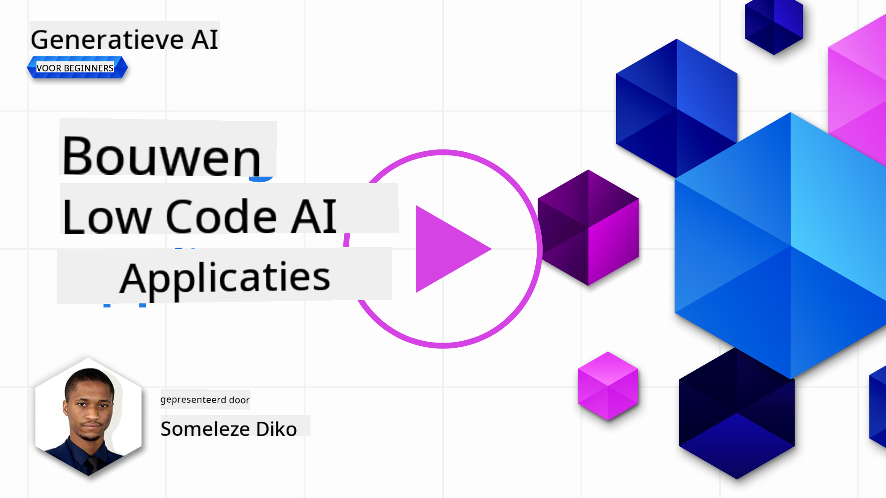
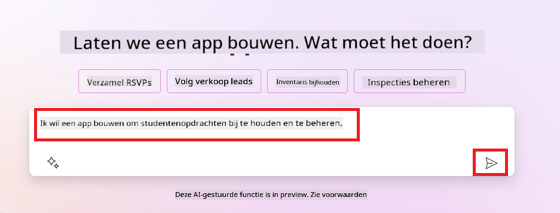
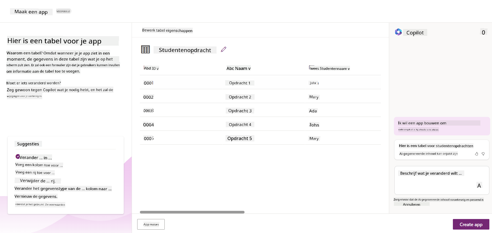
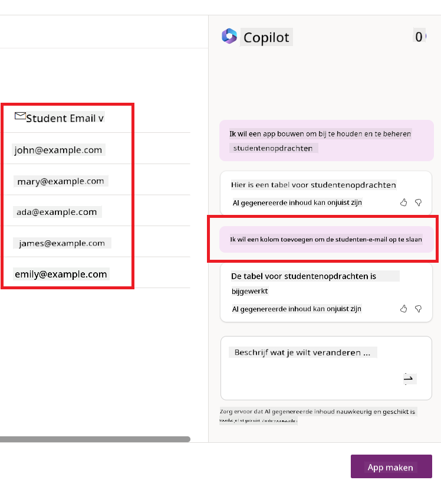
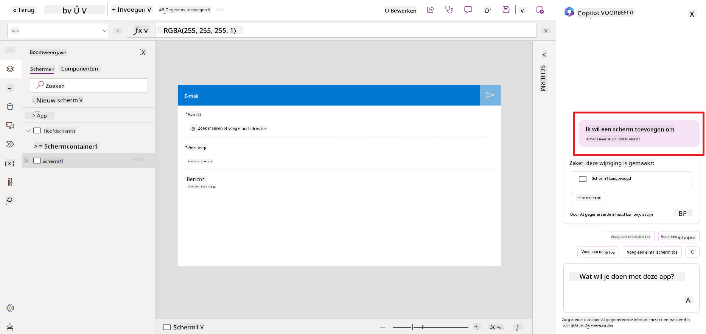
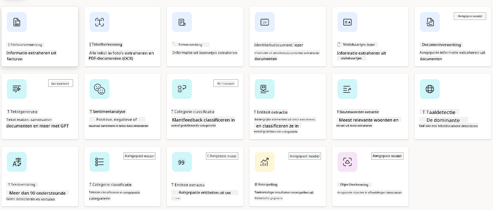
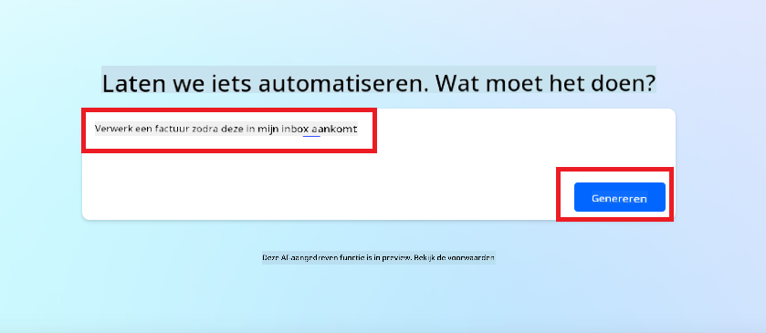
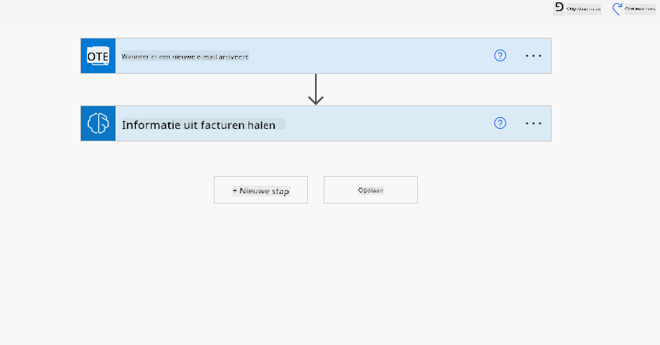
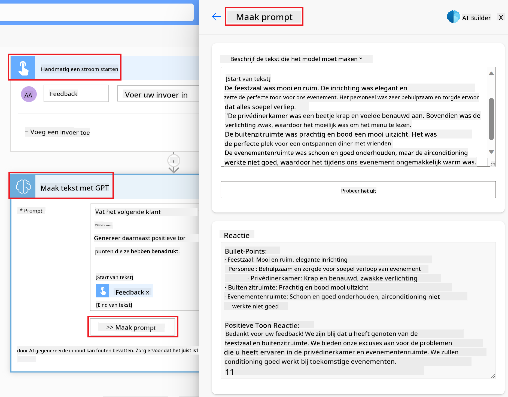

<!--
CO_OP_TRANSLATOR_METADATA:
{
  "original_hash": "f5ff3b6204a695a117d6f452403c95f7",
  "translation_date": "2025-05-19T20:38:32+00:00",
  "source_file": "10-building-low-code-ai-applications/README.md",
  "language_code": "nl"
}
-->
# Low Code AI-toepassingen bouwen

> _(Klik op de afbeelding hierboven om de video van deze les te bekijken)_

## Inleiding

Nu we hebben geleerd hoe we toepassingen voor het genereren van afbeeldingen kunnen bouwen, laten we het hebben over low code. Generatieve AI kan worden gebruikt voor verschillende gebieden, waaronder low code, maar wat is low code en hoe kunnen we AI eraan toevoegen?

Het bouwen van apps en oplossingen is gemakkelijker geworden voor zowel traditionele ontwikkelaars als niet-ontwikkelaars door het gebruik van Low Code Development Platforms. Low Code Development Platforms stellen je in staat om apps en oplossingen te bouwen met weinig tot geen code. Dit wordt bereikt door een visuele ontwikkelomgeving te bieden waarmee je componenten kunt slepen en neerzetten om apps en oplossingen te bouwen. Dit stelt je in staat om sneller apps en oplossingen te bouwen met minder middelen. In deze les duiken we diep in hoe je Low Code kunt gebruiken en hoe je low code-ontwikkeling kunt verbeteren met AI via Power Platform.

Het Power Platform biedt organisaties de mogelijkheid om hun teams in staat te stellen hun eigen oplossingen te bouwen via een intuïtieve low-code of no-code omgeving. Deze omgeving helpt het proces van het bouwen van oplossingen te vereenvoudigen. Met Power Platform kunnen oplossingen in dagen of weken worden gebouwd in plaats van maanden of jaren. Power Platform bestaat uit vijf belangrijke producten: Power Apps, Power Automate, Power BI, Power Pages en Copilot Studio.

Deze les behandelt:

- Inleiding tot Generatieve AI in Power Platform
- Inleiding tot Copilot en hoe het te gebruiken
- Het gebruik van Generatieve AI om apps en stromen te bouwen in Power Platform
- Het begrijpen van de AI-modellen in Power Platform met AI Builder

## Leerdoelen

Aan het einde van deze les kun je:

- Begrijpen hoe Copilot werkt in Power Platform.

- Een app voor het bijhouden van studentopdrachten bouwen voor onze onderwijsstartup.

- Een factuurverwerkingsstroom bouwen die AI gebruikt om informatie uit facturen te halen.

- Best practices toepassen bij het gebruik van het Create Text met GPT AI Model.

De tools en technologieën die je in deze les zult gebruiken zijn:

- **Power Apps**, voor de Student Assignment Tracker-app, die een low-code ontwikkelomgeving biedt voor het bouwen van apps om gegevens bij te houden, te beheren en ermee te communiceren.

- **Dataverse**, voor het opslaan van de gegevens voor de Student Assignment Tracker-app, waarbij Dataverse een low-code dataplatform biedt voor het opslaan van de gegevens van de app.

- **Power Automate**, voor de factuurverwerkingsstroom waar je een low-code ontwikkelomgeving hebt voor het bouwen van workflows om het factuurverwerkingsproces te automatiseren.

- **AI Builder**, voor het factuurverwerkings-AI-model waarbij je vooraf gebouwde AI-modellen gebruikt om de facturen voor onze startup te verwerken.

## Generatieve AI in Power Platform

Het verbeteren van low-code ontwikkeling en toepassing met generatieve AI is een belangrijk aandachtspunt voor Power Platform. Het doel is om iedereen in staat te stellen AI-aangedreven apps, sites, dashboards te bouwen en processen te automatiseren met AI, _zonder dat er data science-expertise vereist is_. Dit doel wordt bereikt door generatieve AI te integreren in de low-code ontwikkelervaring in Power Platform in de vorm van Copilot en AI Builder.

### Hoe werkt dit?

Copilot is een AI-assistent die je in staat stelt Power Platform-oplossingen te bouwen door je vereisten te beschrijven in een reeks conversatiestappen met behulp van natuurlijke taal. Je kunt bijvoorbeeld je AI-assistent instrueren om aan te geven welke velden je app zal gebruiken en het zal zowel de app als het onderliggende datamodel maken, of je kunt specificeren hoe je een stroom in Power Automate moet opzetten.

Je kunt Copilot-gestuurde functionaliteiten gebruiken als een functie in je app-schermen om gebruikers in staat te stellen inzichten te ontdekken via conversatie-interacties.

AI Builder is een low-code AI-mogelijkheid beschikbaar in Power Platform die je in staat stelt AI-modellen te gebruiken om processen te automatiseren en uitkomsten te voorspellen. Met AI Builder kun je AI naar je apps en stromen brengen die verbinding maken met je gegevens in Dataverse of in verschillende cloudgegevensbronnen, zoals SharePoint, OneDrive of Azure.

Copilot is beschikbaar in alle Power Platform-producten: Power Apps, Power Automate, Power BI, Power Pages en Power Virtual Agents. AI Builder is beschikbaar in Power Apps en Power Automate. In deze les zullen we ons concentreren op hoe je Copilot en AI Builder kunt gebruiken in Power Apps en Power Automate om een oplossing voor onze onderwijsstartup te bouwen.

### Copilot in Power Apps

Als onderdeel van het Power Platform biedt Power Apps een low-code ontwikkelomgeving voor het bouwen van apps om gegevens bij te houden, te beheren en ermee te communiceren. Het is een suite van app-ontwikkeldiensten met een schaalbaar dataplatform en de mogelijkheid om verbinding te maken met clouddiensten en lokale gegevens. Power Apps stelt je in staat om apps te bouwen die draaien op browsers, tablets en telefoons, en kunnen worden gedeeld met collega's. Power Apps maakt gebruikers wegwijs in app-ontwikkeling met een eenvoudige interface, zodat elke zakelijke gebruiker of professionele ontwikkelaar aangepaste apps kan bouwen. De app-ontwikkelervaring wordt ook verbeterd met Generatieve AI via Copilot.

De copilot AI-assistentfunctie in Power Apps stelt je in staat om te beschrijven welk soort app je nodig hebt en welke informatie je app moet bijhouden, verzamelen of tonen. Copilot genereert vervolgens een responsieve Canvas-app op basis van je beschrijving. Je kunt de app vervolgens aanpassen aan je behoeften. De AI Copilot genereert en stelt ook een Dataverse-tabel voor met de velden die je nodig hebt om de gegevens die je wilt bijhouden op te slaan en enkele voorbeeldgegevens. We zullen later in deze les bekijken wat Dataverse is en hoe je het in Power Apps kunt gebruiken. Je kunt de tabel vervolgens aanpassen aan je behoeften met behulp van de AI Copilot-assistentfunctie via conversatiestappen. Deze functie is direct beschikbaar vanaf het startscherm van Power Apps.

### Copilot in Power Automate

Als onderdeel van het Power Platform stelt Power Automate gebruikers in staat geautomatiseerde workflows tussen applicaties en diensten te creëren. Het helpt repetitieve bedrijfsprocessen te automatiseren, zoals communicatie, gegevensverzameling en besluitgoedkeuringen. De eenvoudige interface stelt gebruikers met elke technische competentie (van beginners tot ervaren ontwikkelaars) in staat om werkprocessen te automatiseren. De workflow-ontwikkelervaring wordt ook verbeterd met Generatieve AI via Copilot.

De copilot AI-assistentfunctie in Power Automate stelt je in staat om te beschrijven welk soort stroom je nodig hebt en welke acties je wilt dat je stroom uitvoert. Copilot genereert vervolgens een stroom op basis van je beschrijving. Je kunt de stroom vervolgens aanpassen aan je behoeften. De AI Copilot genereert en stelt ook de acties voor die je nodig hebt om de taak die je wilt automatiseren uit te voeren. We zullen later in deze les bekijken wat stromen zijn en hoe je ze kunt gebruiken in Power Automate. Je kunt de acties vervolgens aanpassen aan je behoeften met behulp van de AI Copilot-assistentfunctie via conversatiestappen. Deze functie is direct beschikbaar vanaf het startscherm van Power Automate.

## Opdracht: Beheer studentopdrachten en facturen voor onze startup, met behulp van Copilot

Onze startup biedt online cursussen aan studenten. De startup is snel gegroeid en heeft nu moeite om de vraag naar zijn cursussen bij te houden. De startup heeft jou ingehuurd als Power Platform-ontwikkelaar om hen te helpen een low-code oplossing te bouwen om hen te helpen hun studentopdrachten en facturen te beheren. Hun oplossing moet hen in staat stellen studentopdrachten bij te houden en te beheren via een app en het factuurverwerkingsproces te automatiseren via een workflow. Je bent gevraagd om Generatieve AI te gebruiken om de oplossing te ontwikkelen.

Als je begint met het gebruik van Copilot, kun je de [Power Platform Copilot Prompt Library](https://github.com/pnp/powerplatform-prompts?WT.mc_id=academic-109639-somelezediko) gebruiken om aan de slag te gaan met de prompts. Deze bibliotheek bevat een lijst met prompts die je kunt gebruiken om apps en stromen te bouwen met Copilot. Je kunt de prompts in de bibliotheek ook gebruiken om een idee te krijgen van hoe je je vereisten aan Copilot kunt beschrijven.

### Bouw een Student Assignment Tracker-app voor onze startup

De docenten bij onze startup hebben moeite gehad om studentopdrachten bij te houden. Ze hebben een spreadsheet gebruikt om de opdrachten bij te houden, maar dit is moeilijk te beheren geworden naarmate het aantal studenten is toegenomen. Ze hebben je gevraagd om een app te bouwen die hen helpt studentopdrachten bij te houden en te beheren. De app moet hen in staat stellen nieuwe opdrachten toe te voegen, opdrachten te bekijken, opdrachten bij te werken en opdrachten te verwijderen. De app moet ook docenten en studenten in staat stellen om de opdrachten te bekijken die zijn beoordeeld en die nog niet zijn beoordeeld.

Je zult de app bouwen met behulp van Copilot in Power Apps volgens de onderstaande stappen:

1. Navigeer naar het [Power Apps](https://make.powerapps.com?WT.mc_id=academic-105485-koreyst) startscherm.

1. Gebruik het tekstgebied op het startscherm om de app die je wilt bouwen te beschrijven. Bijvoorbeeld, **_Ik wil een app bouwen om studentopdrachten bij te houden en te beheren_**. Klik op de **Verzenden** knop om de prompt naar de AI Copilot te sturen.

1. De AI Copilot zal een Dataverse-tabel voorstellen met de velden die je nodig hebt om de gegevens die je wilt bijhouden op te slaan en enkele voorbeeldgegevens. Je kunt de tabel vervolgens aanpassen aan je behoeften met behulp van de AI Copilot-assistentfunctie via conversatiestappen.

   > **Belangrijk**: Dataverse is het onderliggende dataplatform voor Power Platform. Het is een low-code dataplatform voor het opslaan van de gegevens van de app. Het is een volledig beheerde service die gegevens veilig opslaat in de Microsoft Cloud en wordt ingericht binnen je Power Platform-omgeving. Het wordt geleverd met ingebouwde datagovernance-mogelijkheden, zoals gegevensclassificatie, gegevenslijnage, fijnmazige toegangscontrole en meer. Je kunt hier meer leren over Dataverse [hier](https://docs.microsoft.com/powerapps/maker/data-platform/data-platform-intro?WT.mc_id=academic-109639-somelezediko).

   

1. Docenten willen e-mails sturen naar de studenten die hun opdrachten hebben ingeleverd om hen op de hoogte te houden van de voortgang van hun opdrachten. Je kunt Copilot gebruiken om een nieuw veld aan de tabel toe te voegen om de student-e-mail op te slaan. Bijvoorbeeld, je kunt de volgende prompt gebruiken om een nieuw veld aan de tabel toe te voegen: **_Ik wil een kolom toevoegen om student-e-mail op te slaan_**. Klik op de **Verzenden** knop om de prompt naar de AI Copilot te sturen.

1. De AI Copilot zal een nieuw veld genereren en je kunt het veld vervolgens aanpassen aan je behoeften.

1. Zodra je klaar bent met de tabel, klik je op de **App maken** knop om de app te maken.

1. De AI Copilot zal een responsieve Canvas-app genereren op basis van je beschrijving. Je kunt de app vervolgens aanpassen aan je behoeften.

1. Voor docenten om e-mails naar studenten te sturen, kun je Copilot gebruiken om een nieuw scherm aan de app toe te voegen. Bijvoorbeeld, je kunt de volgende prompt gebruiken om een nieuw scherm aan de app toe te voegen: **_Ik wil een scherm toevoegen om e-mails naar studenten te sturen_**. Klik op de **Verzenden** knop om de prompt naar de AI Copilot te sturen.

1. De AI Copilot zal een nieuw scherm genereren en je kunt het scherm vervolgens aanpassen aan je behoeften.

1. Zodra je klaar bent met de app, klik je op de **Opslaan** knop om de app op te slaan.

1. Om de app met de docenten te delen, klik je op de **Delen** knop en klik je vervolgens nogmaals op de **Delen** knop. Je kunt de app vervolgens delen met de docenten door hun e-mailadressen in te voeren.

> **Je huiswerk**: De app die je zojuist hebt gebouwd is een goed begin, maar kan worden verbeterd. Met de e-mailfunctie kunnen docenten alleen handmatig e-mails naar studenten sturen door hun e-mails te typen. Kun je Copilot gebruiken om een automatisering te bouwen waarmee docenten automatisch e-mails naar studenten kunnen sturen wanneer ze hun opdrachten inleveren? Je hint is dat je met de juiste prompt Copilot in Power Automate kunt gebruiken om dit te bouwen.

### Bouw een factuurinformatietabel voor onze startup

Het financiële team van onze startup heeft moeite gehad om facturen bij te houden. Ze hebben een spreadsheet gebruikt om de facturen bij te houden, maar dit is moeilijk te beheren geworden naarmate het aantal facturen is toegenomen. Ze hebben je gevraagd om een tabel te bouwen die hen helpt de informatie van de ontvangen facturen op te slaan, bij te houden en te beheren. De tabel moet worden gebruikt om een automatisering te bouwen die alle factuurinformatie extraheert en in de tabel opslaat. De tabel moet het financiële team ook in staat stellen om de facturen te bekijken die zijn betaald en die nog niet zijn betaald.

Het Power Platform heeft een onderliggend dataplatform genaamd Dataverse dat je in staat stelt de gegevens voor je apps en oplossingen op te slaan. Dataverse biedt een low-code dataplatform voor het opslaan van de gegevens van de app. Het is een volledig beheerde service die gegevens veilig opslaat in de Microsoft Cloud en wordt ingericht binnen je Power Platform-omgeving. Het wordt geleverd met ingebouwde datagovernance-mogelijkheden, zoals gegevensclassificatie, gegevenslijnage, fijnmazige toegangscontrole en meer. Je kunt hier meer leren [over Dataverse hier](https://docs.microsoft.com/powerapps/maker/data-platform/data-platform-intro?WT.mc_id=academic-109639-somelezediko).

Waarom zouden we Dataverse voor onze startup gebruiken? De standaard en aangepaste tabellen binnen Dataverse bieden een veilige en cloudgebaseerde opslagoptie voor je gegevens. Tabellen laten je verschillende soorten gegevens opslaan, vergelijkbaar met hoe je meerdere werkbladen in een enkel Excel-werkboek zou gebruiken. Je kunt tabellen gebruiken om gegevens op te slaan die specifiek zijn voor je organisatie of zakelijke behoeften. Enkele van de voordelen die onze startup zal halen uit het gebruik van Dataverse zijn onder andere, maar niet beperkt tot:

- **Gemakkelijk te beheren**: Zowel de metadata als de gegevens worden in de cloud opgeslagen, dus je hoeft je geen zorgen te maken over de details van hoe ze worden opgeslagen of beheerd. Je kunt je richten op het bouwen van je apps en oplossingen.

- **Veilig**: Dataverse biedt een veilige en cloudgebaseerde opslagoptie voor je gegevens. Je kunt bepalen wie toegang heeft tot de gegevens in je tabellen en hoe ze toegang kunnen krijgen met behulp van op rollen gebaseerde beveiliging.

- **Rijke metadata**: Gegevenstypen en relaties worden direct binnen Power Apps gebruikt

- **Logica en validatie**: Je kunt bedrijfsregels, berekende velden en validatieregels gebruiken om bedrijfslogica af te dwingen en gegevensnauwkeurigheid te behouden.

Nu je weet wat Dataverse is en waarom je het zou moeten gebruiken, laten we eens kijken hoe je Copilot kunt gebruiken om een tabel in Dataverse te maken die voldoet aan de eisen van ons financiële team.

> **Opmerking**: Je zult deze tabel in de volgende sectie gebruiken om een automatisering te bouwen die alle factuurinformatie extraheert en in de tabel opslaat.
Om een tabel in Dataverse te maken met behulp van Copilot, volg je de onderstaande stappen: 1. Navigeer naar het [Power Apps](https://make.powerapps.com?WT.mc_id=academic-105485-koreyst) startscherm. 2. Selecteer in de linker navigatiebalk **Tabellen** en klik vervolgens op **Beschrijf de nieuwe tabel**.  1. Op het **Beschrijf de nieuwe tabel** scherm, gebruik je het tekstgebied om de tabel die je wilt maken te beschrijven. Bijvoorbeeld, **_Ik wil een tabel maken om factuurinformatie op te slaan_**. Klik op de **Verzenden** knop om de prompt naar de AI Copilot te sturen.  1. De AI Copilot zal een Dataverse-tabel voorstellen met de velden die je nodig hebt om de gegevens die je wilt bijhouden op te slaan en enkele voorbeeldgegevens. Je kunt de tabel vervolgens aanpassen aan je behoeften met behulp van de AI Copilot-assistentfunctie via conversatiestappen.  1. Het financiële team wil een e-mail naar de leverancier sturen om hen bij te werken met de huidige status van hun factuur. Je kunt Copilot gebruiken om een nieuw veld aan de tabel toe te voegen om de leverancier-e-mail op te slaan. Bijvoorbeeld, je kunt de volgende prompt gebruiken om een nieuw veld aan de tabel toe te voegen: **_Ik wil een kolom toevoegen om leverancier-e-mail op te slaan_**. Klik op de **Verzenden** knop om de prompt naar de AI Copilot te sturen. 1. De AI Copilot zal een nieuw veld genereren en je kunt het veld vervolgens aanpassen aan je behoeften. 1. Zodra je klaar bent met de tabel, klik je op de **Maken** knop om de tabel te maken.

## AI-modellen in Power Platform met AI Builder

AI Builder is een low-code AI-mogelijkheid beschikbaar in Power Platform die je in staat stelt AI-modellen te gebruiken om processen te automatiseren en uitkomsten te voorspellen. Met AI Builder kun je AI naar je apps en stromen brengen die verbinding maken met je gegevens in Dat
een tekst. - **Sentimentanalyse**: Dit model detecteert positieve, negatieve, neutrale of gemengde gevoelens in tekst. - **Visitekaartjeslezer**: Dit model haalt informatie uit visitekaartjes. - **Tekstherkenning**: Dit model haalt tekst uit afbeeldingen. - **Objectdetectie**: Dit model detecteert en haalt objecten uit afbeeldingen. - **Documentverwerking**: Dit model haalt informatie uit formulieren. - **Factuurverwerking**: Dit model haalt informatie uit facturen. Met Custom AI Models kun je je eigen model in AI Builder brengen, zodat het kan functioneren als elk AI Builder custom model, waardoor je het model kunt trainen met je eigen data. Je kunt deze modellen gebruiken om processen te automatiseren en resultaten te voorspellen in zowel Power Apps als Power Automate. Bij het gebruik van je eigen model zijn er beperkingen van toepassing. Lees meer over deze [beperkingen](https://learn.microsoft.com/ai-builder/byo-model#limitations?WT.mc_id=academic-105485-koreyst). 

## Opdracht #2 - Bouw een factuurverwerkingsflow voor onze startup

Het financeteam heeft moeite met het verwerken van facturen. Ze hebben een spreadsheet gebruikt om de facturen bij te houden, maar dit is moeilijk te beheren geworden nu het aantal facturen is toegenomen. Ze hebben je gevraagd om een workflow te bouwen die hen helpt bij het verwerken van facturen met behulp van AI. De workflow moet hen in staat stellen om informatie uit facturen te halen en deze informatie op te slaan in een Dataverse-tabel. De workflow moet hen ook in staat stellen om een e-mail te sturen naar het financeteam met de geëxtraheerde informatie.

Nu je weet wat AI Builder is en waarom je het zou moeten gebruiken, laten we eens kijken hoe je het Factuurverwerkings-AI-model in AI Builder kunt gebruiken, dat we eerder hebben behandeld, om een workflow te bouwen die het financeteam helpt bij het verwerken van facturen.

Volg de onderstaande stappen om een workflow te bouwen die het financeteam helpt bij het verwerken van facturen met behulp van het Factuurverwerkings-AI-model in AI Builder:

1. Navigeer naar het [Power Automate](https://make.powerautomate.com?WT.mc_id=academic-105485-koreyst) startscherm.
2. Gebruik het tekstgebied op het startscherm om de workflow te beschrijven die je wilt bouwen. Bijvoorbeeld, **_Verwerk een factuur wanneer deze in mijn mailbox aankomt_**. Klik op de **Verzenden** knop om de prompt naar de AI Copilot te sturen. 
3. De AI Copilot zal de acties voorstellen die je moet uitvoeren om de taak die je wilt automatiseren te voltooien. Je kunt op de **Volgende** knop klikken om de volgende stappen door te nemen.
4. In de volgende stap zal Power Automate je vragen om de benodigde verbindingen voor de flow op te zetten. Zodra je klaar bent, klik op de **Flow maken** knop om de flow te creëren.
5. De AI Copilot zal een flow genereren en je kunt vervolgens de flow aanpassen aan je behoeften.
6. Werk de trigger van de flow bij en stel de **Map** in op de map waar de facturen worden opgeslagen. Bijvoorbeeld, je kunt de map instellen op **Inbox**. Klik op **Geavanceerde opties weergeven** en stel **Alleen met bijlagen** in op **Ja**. Dit zorgt ervoor dat de flow alleen wordt uitgevoerd wanneer een e-mail met een bijlage in de map wordt ontvangen.
7. Verwijder de volgende acties uit de flow: **HTML naar tekst**, **Samenstellen**, **Samenstellen 2**, **Samenstellen 3** en **Samenstellen 4** omdat je deze niet zult gebruiken.
8. Verwijder de **Voorwaarde** actie uit de flow omdat je deze niet zult gebruiken. Het zou eruit moeten zien als de volgende schermafbeelding: 
9. Klik op de **Voeg een actie toe** knop en zoek naar **Dataverse**. Selecteer de **Voeg een nieuwe rij toe** actie.
10. Bij de **Informatie uit facturen halen** actie, werk het **Factuurbestand** bij om naar de **Bijlage-inhoud** van de e-mail te verwijzen. Dit zorgt ervoor dat de flow informatie uit de factuurbijlage haalt.
11. Selecteer de **Tabel** die je eerder hebt aangemaakt. Bijvoorbeeld, je kunt de **Factuurinformatie** tabel selecteren. Kies de dynamische inhoud van de vorige actie om de volgende velden te vullen:
    - ID
    - Bedrag
    - Datum
    - Naam
    - Status
    - Stel de **Status** in op **In behandeling**.
    - Leverancier e-mail
    - Gebruik de **Van** dynamische inhoud van de **Wanneer een nieuwe e-mail arriveert** trigger. 
12. Zodra je klaar bent met de flow, klik op de **Opslaan** knop om de flow op te slaan. Je kunt vervolgens de flow testen door een e-mail met een factuur te sturen naar de map die je hebt gespecificeerd in de trigger.

> **Je huiswerk**: De flow die je net hebt gebouwd is een goed begin, nu moet je nadenken over hoe je een automatisering kunt bouwen die ons financeteam in staat stelt om een e-mail naar de leverancier te sturen om hen te informeren over de huidige status van hun factuur. Je hint: de flow moet worden uitgevoerd wanneer de status van de factuur verandert.

## Gebruik een Tekstgeneratie-AI-model in Power Automate

Het Tekst creëren met GPT AI-model in AI Builder stelt je in staat om tekst te genereren op basis van een prompt en wordt aangedreven door de Microsoft Azure OpenAI Service. Met deze mogelijkheid kun je GPT (Generative Pre-Trained Transformer) technologie integreren in je apps en flows om een verscheidenheid aan geautomatiseerde flows en inzichtelijke applicaties te bouwen.

GPT-modellen ondergaan uitgebreide training op grote hoeveelheden data, waardoor ze tekst kunnen produceren die sterk lijkt op menselijke taal wanneer ze een prompt krijgen. Wanneer geïntegreerd met workflowautomatisering, kunnen AI-modellen zoals GPT worden benut om een breed scala aan taken te stroomlijnen en te automatiseren.

Bijvoorbeeld, je kunt flows bouwen om automatisch tekst te genereren voor verschillende gebruiksscenario's, zoals: concepten van e-mails, productbeschrijvingen en meer. Je kunt het model ook gebruiken om tekst te genereren voor verschillende apps, zoals chatbots en klantenservice-apps die klantenservice medewerkers in staat stellen effectief en efficiënt te reageren op klantvragen.

Om te leren hoe je dit AI-model in Power Automate kunt gebruiken, doorloop de [Intelligentie toevoegen met AI Builder en GPT](https://learn.microsoft.com/training/modules/ai-builder-text-generation/?WT.mc_id=academic-109639-somelezediko) module.

## Goed gedaan! Ga door met je leerproces

Na het voltooien van deze les, bekijk onze [Generatieve AI leercollectie](https://aka.ms/genai-collection?WT.mc_id=academic-105485-koreyst) om je kennis van Generatieve AI verder te verbeteren!

Ga naar Les 11 waar we zullen kijken naar hoe we [Generatieve AI kunnen integreren met functieaanroepen](../11-integrating-with-function-calling/README.md?WT.mc_id=academic-105485-koreyst)!

**Disclaimer**:  
Dit document is vertaald met behulp van de AI-vertalingsdienst [Co-op Translator](https://github.com/Azure/co-op-translator). Hoewel we streven naar nauwkeurigheid, dient u zich ervan bewust te zijn dat geautomatiseerde vertalingen fouten of onnauwkeurigheden kunnen bevatten. Het originele document in zijn oorspronkelijke taal moet worden beschouwd als de gezaghebbende bron. Voor kritieke informatie wordt professionele menselijke vertaling aanbevolen. Wij zijn niet aansprakelijk voor eventuele misverstanden of verkeerde interpretaties die voortvloeien uit het gebruik van deze vertaling.