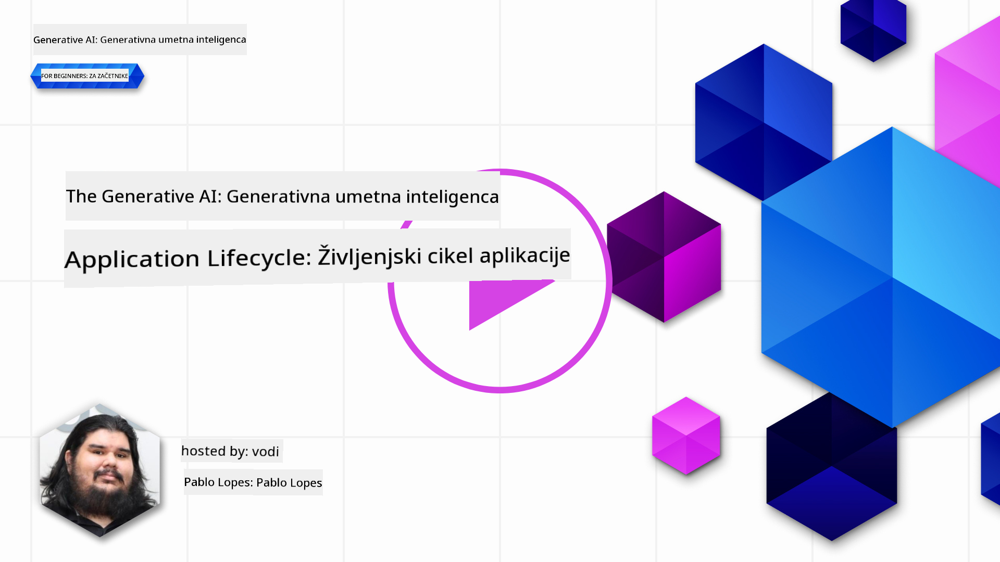

<!--
CO_OP_TRANSLATOR_METADATA:
{
  "original_hash": "27a5347a5022d5ef0a72ab029b03526a",
  "translation_date": "2025-05-20T00:58:02+00:00",
  "source_file": "14-the-generative-ai-application-lifecycle/README.md",
  "language_code": "sl"
}
-->

# Življenjski cikel generativne AI aplikacije

Pomembno vprašanje za vse AI aplikacije je relevantnost AI funkcij, saj je AI hitro razvijajoče se področje. Da zagotovite, da vaša aplikacija ostane relevantna, zanesljiva in robustna, jo morate nenehno spremljati, ocenjevati in izboljševati. Tukaj pride v poštev življenjski cikel generativne AI.

Življenjski cikel generativne AI je okvir, ki vas vodi skozi faze razvoja, uvajanja in vzdrževanja generativne AI aplikacije. Pomaga vam določiti vaše cilje, meriti uspešnost, prepoznati izzive in izvajati rešitve. Prav tako vam pomaga uskladiti vašo aplikacijo z etičnimi in pravnimi standardi vašega področja in deležnikov. Z upoštevanjem življenjskega cikla generativne AI lahko zagotovite, da vaša aplikacija vedno prinaša vrednost in zadovoljuje uporabnike.

## Uvod

V tem poglavju boste:

- Razumeli premik paradigme iz MLOps v LLMOps
- Življenjski cikel LLM
- Orodja za življenjski cikel
- Metričnost in ocenjevanje življenjskega cikla

## Razumeti premik paradigme iz MLOps v LLMOps

LLM-ji so novo orodje v arzenalu umetne inteligence, ki so izjemno močna pri nalogah analize in generiranja za aplikacije, vendar ta moč prinaša nekatere posledice pri optimizaciji AI in klasičnih nalog strojnega učenja.

Zato potrebujemo novo paradigmo za prilagoditev tega orodja na dinamičen način, z ustreznimi spodbudami. Starejše AI aplikacije lahko kategoriziramo kot "ML aplikacije", novejše AI aplikacije pa kot "GenAI aplikacije" ali zgolj "AI aplikacije", kar odraža prevladujočo tehnologijo in tehnike, uporabljene v tistem času. To spremeni našo naracijo na več načinov, poglejte naslednjo primerjavo.

Opazite, da se v LLMOps bolj osredotočamo na razvijalce aplikacij, z uporabo integracij kot ključne točke, uporabo "Modeli kot storitev" in razmišljanjem o naslednjih točkah za metrike.

- Kakovost: Kakovost odgovora
- Škodljivost: Odgovorna AI
- Poštenost: Utemeljenost odgovora (Ali ima smisel? Je pravilen?)
- Stroški: Proračun rešitve
- Latenca: Povprečni čas za odgovor na token

## Življenjski cikel LLM

Najprej, da razumemo življenjski cikel in spremembe, si oglejmo naslednjo infografiko.

Kot lahko opazite, se to razlikuje od običajnih življenjskih ciklov iz MLOps. LLM-ji imajo veliko novih zahtev, kot so Prompting, različne tehnike za izboljšanje kakovosti (Fine-Tuning, RAG, Meta-Prompts), različna ocena in odgovornost z odgovorno AI, nazadnje pa nove ocenjevalne metrike (Kakovost, Škodljivost, Poštenost, Stroški in Latenca).

Na primer, poglejte, kako idejamo. Uporaba inženiringa pozivov za eksperimentiranje z različnimi LLM-ji za raziskovanje možnosti za preverjanje, ali bi lahko bila njihova hipoteza pravilna.

Opazite, da to ni linearno, ampak integrirani zanki, iterativno in s celovitim ciklom.

Kako bi lahko raziskali te korake? Poglejmo podrobnosti, kako bi lahko zgradili življenjski cikel.

To se morda zdi nekoliko zapleteno, osredotočimo se najprej na tri velike korake.

1. Ideiranje/Raziskovanje: Raziskovanje, tukaj lahko raziskujemo glede na naše poslovne potrebe. Prototipiranje, ustvarjanje [PromptFlow](https://microsoft.github.io/promptflow/index.html?WT.mc_id=academic-105485-koreyst) in preverjanje, ali je dovolj učinkovit za našo hipotezo.
2. Gradnja/Dopolnjevanje: Izvajanje, zdaj začnemo ocenjevati za večje nabore podatkov, izvajati tehnike, kot sta Fine-tuning in RAG, da preverimo robustnost naše rešitve. Če ni, ponovno izvajanje, dodajanje novih korakov v našem toku ali prestrukturiranje podatkov lahko pomaga. Po testiranju našega toka in naše skale, če deluje in preverimo naše metrike, je pripravljen na naslednji korak.
3. Operacionalizacija: Integracija, zdaj dodajanje sistemov za spremljanje in opozarjanje v naš sistem, uvajanje in integracija aplikacije v našo aplikacijo.

Nato imamo celovit cikel upravljanja, ki se osredotoča na varnost, skladnost in upravljanje.

Čestitke, zdaj imate svojo AI aplikacijo pripravljeno za delovanje. Za praktične izkušnje si oglejte [Contoso Chat Demo.](https://nitya.github.io/contoso-chat/?WT.mc_id=academic-105485-koreys)

Zdaj, katera orodja bi lahko uporabili?

## Orodja za življenjski cikel

Za orodja Microsoft ponuja [Azure AI Platform](https://azure.microsoft.com/solutions/ai/?WT.mc_id=academic-105485-koreys) in [PromptFlow](https://microsoft.github.io/promptflow/index.html?WT.mc_id=academic-105485-koreyst), ki olajšata in omogočata enostavno izvajanje vašega cikla in pripravljenost na uporabo.

[Azure AI Platform](https://azure.microsoft.com/solutions/ai/?WT.mc_id=academic-105485-koreys) vam omogoča uporabo [AI Studio](https://ai.azure.com/?WT.mc_id=academic-105485-koreys). AI Studio je spletni portal, ki vam omogoča raziskovanje modelov, vzorcev in orodij. Upravljanje vaših virov, razvojnih tokov UI in možnosti SDK/CLI za razvoj, usmerjen v kodo.

Azure AI vam omogoča uporabo več virov za upravljanje vaših operacij, storitev, projektov, iskanja vektorjev in potreb podatkovnih baz.

Zgradite, od dokaza koncepta (POC) do velikih aplikacij s PromptFlow:

- Načrtujte in gradite aplikacije iz VS Code, z vizualnimi in funkcionalnimi orodji
- Testirajte in prilagodite svoje aplikacije za kakovostno AI z lahkoto.
- Uporabite Azure AI Studio za integracijo in iteracijo s cloudom, potisnite in uvedite za hitro integracijo.

## Odlično! Nadaljujte z učenjem!

Neverjetno, zdaj se naučite več o tem, kako strukturiramo aplikacijo za uporabo konceptov s [Contoso Chat App](https://nitya.github.io/contoso-chat/?WT.mc_id=academic-105485-koreyst), da preverite, kako Cloud Advocacy doda te koncepte v demonstracijah. Za več vsebine preverite naš [Ignite breakout session!](https://www.youtube.com/watch?v=DdOylyrTOWg)

Zdaj preverite Lekcijo 15, da razumete, kako [Retrieval Augmented Generation in Vektorske podatkovne baze](../15-rag-and-vector-databases/README.md?WT.mc_id=academic-105485-koreyst) vplivajo na generativno AI in ustvarjajo bolj privlačne aplikacije!

**Omejitev odgovornosti**:  
Ta dokument je bil preveden z uporabo storitve za strojno prevajanje [Co-op Translator](https://github.com/Azure/co-op-translator). Čeprav si prizadevamo za natančnost, vas opozarjamo, da lahko avtomatizirani prevodi vsebujejo napake ali netočnosti. Izvirni dokument v njegovem izvirnem jeziku je treba obravnavati kot avtoritativni vir. Za kritične informacije je priporočljivo profesionalno človeško prevajanje. Ne prevzemamo odgovornosti za morebitna nesporazumevanja ali napačne razlage, ki izhajajo iz uporabe tega prevoda.