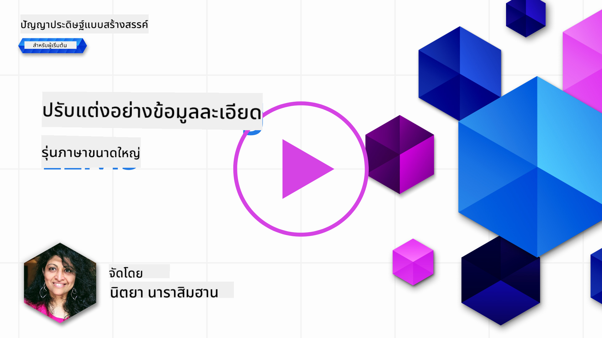
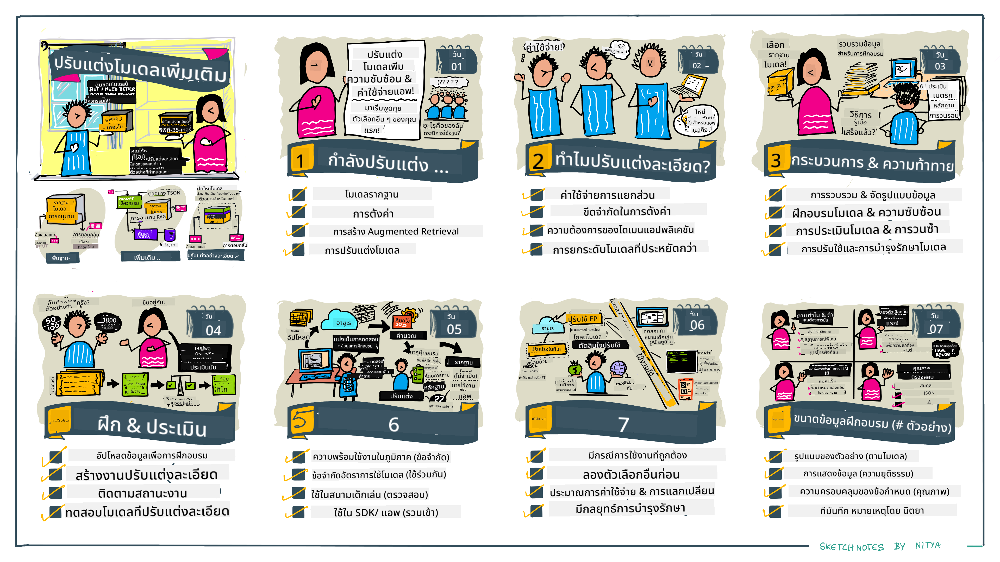

<!--
CO_OP_TRANSLATOR_METADATA:
{
  "original_hash": "68664f7e754a892ae1d8d5e2b7bd2081",
  "translation_date": "2025-05-20T07:48:54+00:00",
  "source_file": "18-fine-tuning/README.md",
  "language_code": "th"
}
-->

# การปรับแต่ง LLM ของคุณ

การใช้โมเดลภาษาขนาดใหญ่เพื่อสร้างแอปพลิเคชัน AI เชิงสร้างสรรค์นั้นมีความท้าทายใหม่ๆ หนึ่งในปัญหาหลักคือการรับประกันคุณภาพของคำตอบ (ความถูกต้องและความเกี่ยวข้อง) ในเนื้อหาที่โมเดลสร้างขึ้นตามคำขอของผู้ใช้ ในบทเรียนก่อนหน้านี้ เราได้พูดถึงเทคนิคต่างๆ เช่น prompt engineering และ retrieval-augmented generation ที่พยายามแก้ปัญหาโดย _ปรับเปลี่ยนข้อมูลใน prompt_ ให้กับโมเดลที่มีอยู่แล้ว

ในบทเรียนวันนี้ เราจะพูดถึงเทคนิคที่สามคือ **การปรับแต่ง** ซึ่งพยายามแก้ปัญหาโดย _การฝึกโมเดลใหม่_ ด้วยข้อมูลเพิ่มเติม มาเจาะลึกกันในรายละเอียด

## วัตถุประสงค์การเรียนรู้

บทเรียนนี้แนะนำแนวคิดของการปรับแต่งสำหรับโมเดลภาษาที่ได้รับการฝึกมาแล้ว สำรวจประโยชน์และความท้าทายของวิธีการนี้ และให้คำแนะนำว่าเมื่อใดและอย่างไรควรใช้การปรับแต่งเพื่อปรับปรุงประสิทธิภาพของโมเดล AI เชิงสร้างสรรค์ของคุณ

เมื่อจบบทเรียนนี้ คุณควรสามารถตอบคำถามต่อไปนี้ได้:

- การปรับแต่งสำหรับโมเดลภาษาคืออะไร?
- เมื่อใดและทำไมการปรับแต่งจึงมีประโยชน์?
- ฉันจะปรับแต่งโมเดลที่ได้รับการฝึกมาแล้วได้อย่างไร?
- ข้อจำกัดของการปรับแต่งคืออะไร?

พร้อมหรือยัง? มาเริ่มกันเลย

## คู่มือภาพประกอบ

ต้องการภาพรวมของสิ่งที่เราจะครอบคลุมก่อนที่เราจะเจาะลึกหรือไม่? ลองดูคู่มือภาพประกอบที่อธิบายการเรียนรู้สำหรับบทเรียนนี้ - ตั้งแต่การเรียนรู้แนวคิดหลักและแรงจูงใจในการปรับแต่ง ไปจนถึงการทำความเข้าใจกระบวนการและแนวปฏิบัติที่ดีที่สุดในการดำเนินงานการปรับแต่ง นี่เป็นหัวข้อที่น่าสำรวจ ดังนั้นอย่าลืมตรวจสอบหน้า [Resources](./RESOURCES.md?WT.mc_id=academic-105485-koreyst) สำหรับลิงก์เพิ่มเติมเพื่อสนับสนุนการเรียนรู้ด้วยตนเองของคุณ!

## การปรับแต่งสำหรับโมเดลภาษาคืออะไร?

โดยนิยามแล้ว โมเดลภาษาขนาดใหญ่ได้รับการ _ฝึก_ จากข้อความจำนวนมากที่มาจากแหล่งข้อมูลหลากหลายรวมถึงอินเทอร์เน็ต อย่างที่เราได้เรียนรู้ในบทเรียนก่อนหน้านี้ เราจำเป็นต้องใช้เทคนิคเช่น _prompt engineering_ และ _retrieval-augmented generation_ เพื่อปรับปรุงคุณภาพของคำตอบของโมเดลต่อคำถามของผู้ใช้ ("prompts")

เทคนิค prompt engineering ที่ได้รับความนิยมเกี่ยวข้องกับการให้โมเดลมีคำแนะนำเพิ่มเติมเกี่ยวกับสิ่งที่คาดหวังในคำตอบโดยการให้ _คำแนะนำ_ (คำแนะนำโดยชัดเจน) หรือ _ให้ตัวอย่างบางส่วน_ (คำแนะนำโดยนัย) นี่เรียกว่า _few-shot learning_ แต่มีข้อจำกัดสองประการ:

- ข้อจำกัดของ token ในโมเดลสามารถจำกัดจำนวนตัวอย่างที่คุณสามารถให้ได้ และจำกัดประสิทธิภาพ
- ค่าใช้จ่ายของ token ในโมเดลสามารถทำให้การเพิ่มตัวอย่างในทุก prompt แพง และจำกัดความยืดหยุ่น

การปรับแต่งเป็นวิธีการที่พบได้บ่อยในระบบการเรียนรู้ของเครื่อง ซึ่งเรานำโมเดลที่ได้รับการฝึกมาแล้วและฝึกใหม่ด้วยข้อมูลใหม่เพื่อปรับปรุงประสิทธิภาพในงานเฉพาะ ในบริบทของโมเดลภาษา เราสามารถปรับแต่งโมเดลที่ได้รับการฝึกมาแล้ว _ด้วยชุดตัวอย่างที่คัดสรรมาอย่างดีสำหรับงานหรือโดเมนการใช้งานเฉพาะ_ เพื่อสร้าง **โมเดลที่กำหนดเอง** ที่อาจแม่นยำและเกี่ยวข้องมากขึ้นสำหรับงานหรือโดเมนนั้นๆ ประโยชน์เสริมของการปรับแต่งคือสามารถลดจำนวนตัวอย่างที่จำเป็นสำหรับ few-shot learning - ลดการใช้ token และค่าใช้จ่ายที่เกี่ยวข้อง

## เมื่อใดและทำไมเราควรปรับแต่งโมเดล?

ในบริบท _นี้_ เมื่อเราพูดถึงการปรับแต่ง เราหมายถึงการปรับแต่งแบบ **supervised** ซึ่งการฝึกใหม่จะทำโดยการ **เพิ่มข้อมูลใหม่** ที่ไม่ได้เป็นส่วนหนึ่งของชุดข้อมูลการฝึกเดิม นี่แตกต่างจากวิธีการปรับแต่งแบบ unsupervised ที่โมเดลได้รับการฝึกใหม่บนข้อมูลเดิม แต่ด้วย hyperparameters ที่แตกต่างกัน

สิ่งสำคัญที่ต้องจำคือการปรับแต่งเป็นเทคนิคขั้นสูงที่ต้องการความเชี่ยวชาญระดับหนึ่งเพื่อให้ได้ผลลัพธ์ที่ต้องการ หากทำไม่ถูกต้อง อาจไม่ให้การปรับปรุงตามที่คาดหวัง และอาจลดประสิทธิภาพของโมเดลในโดเมนที่คุณมุ่งเป้า

ดังนั้น ก่อนที่คุณจะเรียนรู้ "วิธี" การปรับแต่งโมเดลภาษา คุณจำเป็นต้องรู้ "ทำไม" คุณควรเลือกเส้นทางนี้ และ "เมื่อใด" ควรเริ่มกระบวนการปรับแต่ง เริ่มต้นด้วยการถามตัวเองคำถามเหล่านี้:

- **กรณีการใช้งาน**: กรณีการใช้งานของคุณสำหรับการปรับแต่งคืออะไร? คุณต้องการปรับปรุงส่วนใดของโมเดลที่ได้รับการฝึกมาแล้ว?
- **ทางเลือกอื่น**: คุณได้ลองใช้ _เทคนิคอื่นๆ_ เพื่อให้ได้ผลลัพธ์ตามที่ต้องการหรือไม่? ใช้เทคนิคเหล่านั้นเพื่อสร้างเกณฑ์เปรียบเทียบ
  - การออกแบบ prompt: ลองใช้เทคนิคเช่น few-shot prompting พร้อมตัวอย่างของคำตอบที่เกี่ยวข้อง ประเมินคุณภาพของคำตอบ
  - การสร้างการเรียกค้นที่เสริม: ลองเพิ่ม prompt ด้วยผลการค้นหาที่ได้จากการค้นหาข้อมูลของคุณ ประเมินคุณภาพของคำตอบ
- **ค่าใช้จ่าย**: คุณได้ระบุค่าใช้จ่ายสำหรับการปรับแต่งหรือไม่?
  - ความสามารถในการปรับแต่ง - โมเดลที่ได้รับการฝึกมาแล้วสามารถปรับแต่งได้หรือไม่?
  - ความพยายาม - สำหรับการเตรียมข้อมูลการฝึก ประเมินและปรับปรุงโมเดล
  - การคำนวณ - สำหรับการรันงานการปรับแต่ง และการปรับใช้โมเดลที่ได้รับการปรับแต่ง
  - ข้อมูล - การเข้าถึงตัวอย่างคุณภาพเพียงพอสำหรับผลกระทบการปรับแต่ง
- **ประโยชน์**: คุณได้ยืนยันประโยชน์สำหรับการปรับแต่งหรือไม่?
  - คุณภาพ - โมเดลที่ได้รับการปรับแต่งทำงานดีกว่าเกณฑ์เปรียบเทียบหรือไม่?
  - ค่าใช้จ่าย - มันลดการใช้ token โดยการทำให้ prompt ง่ายขึ้นหรือไม่?
  - การขยายตัว - คุณสามารถนำโมเดลพื้นฐานไปใช้ในโดเมนใหม่ได้หรือไม่?

โดยการตอบคำถามเหล่านี้ คุณควรจะสามารถตัดสินใจได้ว่าการปรับแต่งเป็นวิธีที่เหมาะสมสำหรับกรณีการใช้งานของคุณหรือไม่ โดยทั่วไปแล้ว วิธีการนี้ใช้ได้เฉพาะเมื่อประโยชน์มากกว่าค่าใช้จ่าย เมื่อคุณตัดสินใจที่จะดำเนินการต่อ ก็ถึงเวลาที่จะคิดเกี่ยวกับ _วิธี_ ที่คุณสามารถปรับแต่งโมเดลที่ได้รับการฝึกมาแล้ว

ต้องการข้อมูลเพิ่มเติมเกี่ยวกับกระบวนการตัดสินใจหรือไม่? ชม [To fine-tune or not to fine-tune](https://www.youtube.com/watch?v=0Jo-z-MFxJs)

## เราจะปรับแต่งโมเดลที่ได้รับการฝึกมาแล้วได้อย่างไร?

ในการปรับแต่งโมเดลที่ได้รับการฝึกมาแล้ว คุณจำเป็นต้องมี:

- โมเดลที่ได้รับการฝึกมาแล้วสำหรับการปรับแต่ง
- ชุดข้อมูลสำหรับใช้ในการปรับแต่ง
- สภาพแวดล้อมการฝึกสำหรับรันงานการปรับแต่ง
- สภาพแวดล้อมการโฮสต์เพื่อปรับใช้โมเดลที่ได้รับการปรับแต่ง

## การปรับแต่งในทางปฏิบัติ

แหล่งข้อมูลต่อไปนี้ให้คำแนะนำทีละขั้นตอนเพื่อพาคุณผ่านตัวอย่างจริงโดยใช้โมเดลที่เลือกพร้อมชุดข้อมูลที่คัดสรรมาอย่างดี เพื่อทำตามคำแนะนำเหล่านี้ คุณจำเป็นต้องมีบัญชีในผู้ให้บริการที่ระบุ พร้อมการเข้าถึงโมเดลและชุดข้อมูลที่เกี่ยวข้อง

| ผู้ให้บริการ | คำแนะนำ                                                                                                                                                                          | คำอธิบาย                                                                                                                                                                                                                                                                                                                                                                                                                          |
| ------------ | -------------------------------------------------------------------------------------------------------------------------------------------------------------------------------- | ---------------------------------------------------------------------------------------------------------------------------------------------------------------------------------------------------------------------------------------------------------------------------------------------------------------------------------------------------------------------------------------------------------------------------------- |
| OpenAI       | [วิธีการปรับแต่งโมเดลแชท](https://github.com/openai/openai-cookbook/blob/main/examples/How_to_finetune_chat_models.ipynb?WT.mc_id=academic-105485-koreyst)                       | เรียนรู้การปรับแต่ง `gpt-35-turbo` สำหรับโดเมนเฉพาะ ("ผู้ช่วยทำอาหาร") โดยการเตรียมข้อมูลการฝึก รันงานการปรับแต่ง และใช้โมเดลที่ได้รับการปรับแต่งเพื่อการอนุมาน                                                                                                                                                                                                                                                               |
| Azure OpenAI | [คำแนะนำการปรับแต่ง GPT 3.5 Turbo](https://learn.microsoft.com/azure/ai-services/openai/tutorials/fine-tune?tabs=python-new%2Ccommand-line?WT.mc_id=academic-105485-koreyst) | เรียนรู้การปรับแต่ง `gpt-35-turbo-0613` บน Azure โดยการดำเนินการเพื่อสร้างและอัปโหลดข้อมูลการฝึก รันงานการปรับแต่ง ปรับใช้และใช้โมเดลใหม่                                                                                                                                                                                                                                               |
| Hugging Face | [การปรับแต่ง LLMs กับ Hugging Face](https://www.philschmid.de/fine-tune-llms-in-2024-with-trl?WT.mc_id=academic-105485-koreyst)                                                 | บทความบล็อกนี้พาคุณผ่านการปรับแต่ง _open LLM_ (เช่น `CodeLlama 7B`) โดยใช้ไลบรารี [transformers](https://huggingface.co/docs/transformers/index?WT.mc_id=academic-105485-koreyst) และ [Transformer Reinforcement Learning (TRL)](https://huggingface.co/docs/trl/index?WT.mc_id=academic-105485-koreyst]) พร้อมชุดข้อมูลเปิด [datasets](https://huggingface.co/docs/datasets/index?WT.mc_id=academic-105485-koreyst) บน Hugging Face |
|              |                                                                                                                                                                                  |                                                                                                                                                                                                                                                                                                                                                                                                                                    |
| 🤗 AutoTrain | [การปรับแต่ง LLMs กับ AutoTrain](https://github.com/huggingface/autotrain-advanced/?WT.mc_id=academic-105485-koreyst)                                                           | AutoTrain (หรือ AutoTrain Advanced) เป็นไลบรารี python ที่พัฒนาโดย Hugging Face ที่อนุญาตให้ปรับแต่งสำหรับงานต่างๆ รวมถึงการปรับแต่ง LLM AutoTrain เป็นโซลูชันที่ไม่ต้องเขียนโค้ดและการปรับแต่งสามารถทำได้ในคลาวด์ของคุณเอง บน Hugging Face Spaces หรือในเครื่องของคุณเอง มันรองรับทั้ง GUI บนเว็บ, CLI และการฝึกผ่านไฟล์ config yaml                                                               |
|              |                                                                                                                                                                                  |                                                                                                                                                                                                                                                                                                                                                                                                                                    |

## การบ้าน

เลือกหนึ่งในคำแนะนำด้านบนและทำตาม _เราอาจจำลองเวอร์ชันของคำแนะนำเหล่านี้ใน Jupyter Notebooks ใน repo นี้เพื่อการอ้างอิงเท่านั้น โปรดใช้แหล่งที่มาดั้งเดิมโดยตรงเพื่อรับเวอร์ชันล่าสุด_

## งานยอดเยี่ยม! ต่อการเรียนรู้ของคุณ

หลังจากจบบทเรียนนี้ ตรวจสอบ [Generative AI Learning collection](https://aka.ms/genai-collection?WT.mc_id=academic-105485-koreyst) ของเราเพื่อเพิ่มพูนความรู้ด้าน Generative AI ของคุณ!

ขอแสดงความยินดี!! คุณได้จบบทเรียนสุดท้ายจากซีรีส์ v2 สำหรับคอร์สนี้แล้ว! อย่าหยุดเรียนรู้และสร้างสรรค์ \*\*ตรวจสอบหน้า [RESOURCES](RESOURCES.md?WT.mc_id=academic-105485-koreyst) สำหรับรายการข้อเสนอเพิ่มเติมสำหรับหัวข้อนี้

บทเรียนในซีรีส์ v1 ของเรายังได้รับการอัปเดตด้วยการบ้านและแนวคิดเพิ่มเติม ดังนั้นใช้เวลาสักครู่เพื่อฟื้นฟูความรู้ของคุณ - และโปรด [แชร์คำถามและข้อเสนอแนะของคุณ](https://github.com/microsoft/generative-ai-for-beginners/issues?WT.mc_id=academic-105485-koreyst) เพื่อช่วยปรับปรุงบทเรียนเหล่านี้สำหรับชุมชน

**คำปฏิเสธความรับผิดชอบ**:  
เอกสารนี้ได้รับการแปลโดยใช้บริการแปลภาษา AI [Co-op Translator](https://github.com/Azure/co-op-translator) แม้ว่าเราจะพยายามให้การแปลมีความถูกต้อง โปรดทราบว่าการแปลอัตโนมัติอาจมีข้อผิดพลาดหรือความไม่ถูกต้อง เอกสารต้นฉบับในภาษาของตนเองควรถือเป็นแหล่งข้อมูลที่เชื่อถือได้ สำหรับข้อมูลที่สำคัญ แนะนำให้ใช้บริการแปลภาษามนุษย์ที่เป็นมืออาชีพ เราไม่รับผิดชอบต่อความเข้าใจผิดหรือการตีความผิดที่เกิดจากการใช้การแปลนี้