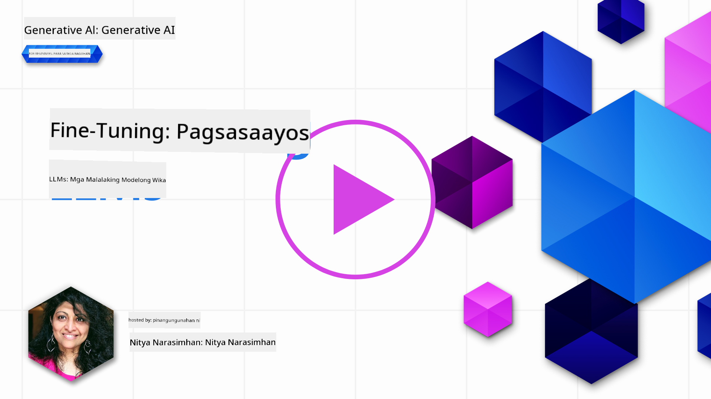
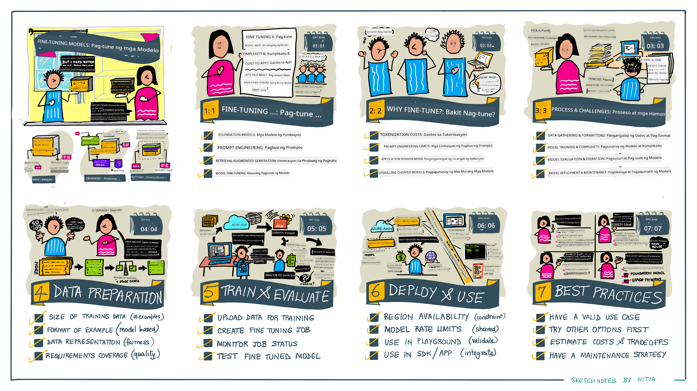

<!--
CO_OP_TRANSLATOR_METADATA:
{
  "original_hash": "68664f7e754a892ae1d8d5e2b7bd2081",
  "translation_date": "2025-05-20T07:54:56+00:00",
  "source_file": "18-fine-tuning/README.md",
  "language_code": "tl"
}
-->

# Fine-Tuning Your LLM

Ang paggamit ng malalaking language models para bumuo ng generative AI applications ay may mga bagong hamon. Isang pangunahing isyu ay ang pagtiyak ng kalidad ng tugon (katumpakan at kaugnayan) sa nilalaman na nabuo ng modelo para sa isang tiyak na kahilingan ng user. Sa mga nakaraang aralin, tinalakay natin ang mga teknik tulad ng prompt engineering at retrieval-augmented generation na sinusubukang lutasin ang problema sa pamamagitan ng _pagbabago ng prompt input_ sa umiiral na modelo.

Sa aralin ngayon, tatalakayin natin ang ikatlong teknik, **fine-tuning**, na sinusubukang tugunan ang hamon sa pamamagitan ng _muling pagsasanay sa mismong modelo_ gamit ang karagdagang data. Tingnan natin ang mga detalye.

## Layunin ng Pag-aaral

Ang araling ito ay nagpapakilala sa konsepto ng fine-tuning para sa pre-trained language models, sinusuri ang mga benepisyo at hamon ng pamamaraang ito, at nagbibigay ng gabay kung kailan at paano gamitin ang fine tuning para mapabuti ang pagganap ng iyong mga generative AI models.

Sa pagtatapos ng araling ito, dapat mong masagot ang mga sumusunod na tanong:

- Ano ang fine tuning para sa mga language models?
- Kailan, at bakit, kapaki-pakinabang ang fine tuning?
- Paano ko ma-fine-tune ang isang pre-trained model?
- Ano ang mga limitasyon ng fine-tuning?

Handa ka na ba? Simulan na natin.

## Gabay na May Larawan

Gusto mo bang makuha ang kabuuang larawan ng mga tatalakayin bago tayo sumisid? Tingnan ang gabay na ito na may larawan na naglalarawan ng landas ng pag-aaral para sa araling ito - mula sa pag-aaral ng mga pangunahing konsepto at motibasyon para sa fine-tuning, hanggang sa pag-unawa sa proseso at pinakamahusay na mga kasanayan para sa pagsasagawa ng fine-tuning na gawain. Ito ay isang kahanga-hangang paksa para sa pagsisiyasat, kaya huwag kalimutang tingnan ang [Resources](./RESOURCES.md?WT.mc_id=academic-105485-koreyst) page para sa karagdagang mga link na sumusuporta sa iyong sariling pag-aaral na paglalakbay!

## Ano ang fine-tuning para sa mga language models?

Sa pamamagitan ng kahulugan, ang malalaking language models ay _pre-trained_ sa malalaking dami ng teksto na nagmula sa iba't ibang mapagkukunan kabilang ang internet. Tulad ng natutunan natin sa mga nakaraang aralin, kailangan natin ng mga teknik tulad ng _prompt engineering_ at _retrieval-augmented generation_ upang mapabuti ang kalidad ng tugon ng modelo sa mga tanong ng user ("prompts").

Isang popular na teknik sa prompt-engineering ay ang pagbibigay sa modelo ng mas maraming gabay kung ano ang inaasahan sa tugon alinman sa pamamagitan ng pagbibigay ng _mga tagubilin_ (malinaw na gabay) o _pagbibigay ng ilang halimbawa_ (di-malinaw na gabay). Ito ay tinutukoy bilang _few-shot learning_ ngunit mayroon itong dalawang limitasyon:

- Ang mga limitasyon ng token ng modelo ay maaaring magpigil sa dami ng mga halimbawa na maibibigay mo, at limitahan ang pagiging epektibo.
- Ang mga gastos ng token ng modelo ay maaaring gawing mahal ang pagdaragdag ng mga halimbawa sa bawat prompt, at limitahan ang kakayahang umangkop.

Ang fine-tuning ay isang karaniwang kasanayan sa mga sistema ng machine learning kung saan kinukuha natin ang isang pre-trained model at muling sinasanay ito gamit ang bagong data upang mapabuti ang pagganap nito sa isang tiyak na gawain. Sa konteksto ng mga language models, maaari nating i-fine-tune ang pre-trained model _gamit ang isang maingat na hanay ng mga halimbawa para sa isang tiyak na gawain o domain ng aplikasyon_ upang lumikha ng isang **custom model** na maaaring mas tumpak at nauugnay para sa tiyak na gawain o domain. Isang karagdagang benepisyo ng fine-tuning ay maaari rin nitong bawasan ang bilang ng mga halimbawa na kailangan para sa few-shot learning - pagbabawas ng paggamit ng token at mga kaugnay na gastos.

## Kailan at bakit natin dapat i-fine-tune ang mga modelo?

Sa _kontekstong_ ito, kapag pinag-uusapan natin ang fine-tuning, tinutukoy natin ang **supervised** fine-tuning kung saan ang muling pagsasanay ay ginagawa sa pamamagitan ng **pagdaragdag ng bagong data** na hindi bahagi ng orihinal na dataset ng pagsasanay. Ito ay iba sa isang unsupervised fine-tuning na pamamaraan kung saan ang modelo ay muling sinasanay sa orihinal na data, ngunit may iba't ibang hyperparameters.

Ang pangunahing bagay na dapat tandaan ay ang fine-tuning ay isang advanced na teknik na nangangailangan ng tiyak na antas ng kadalubhasaan upang makuha ang ninanais na resulta. Kung nagawa nang mali, maaaring hindi nito maibigay ang inaasahang mga pagpapabuti, at maaari pang magpababa sa pagganap ng modelo para sa iyong target na domain.

Kaya, bago mo matutunan "paano" i-fine-tune ang mga language models, kailangan mong malaman "bakit" mo dapat tahakin ang rutang ito, at "kailan" sisimulan ang proseso ng fine-tuning. Magsimula sa pamamagitan ng pagtatanong sa iyong sarili ng mga tanong na ito:

- **Gamit**: Ano ang iyong _gamit_ para sa fine-tuning? Anong aspeto ng kasalukuyang pre-trained model ang nais mong pagbutihin?
- **Mga Alternatibo**: Nasubukan mo na ba ang _ibang mga teknik_ upang makamit ang ninanais na mga resulta? Gamitin ang mga ito upang lumikha ng baseline para sa paghahambing.
  - Prompt engineering: Subukan ang mga teknik tulad ng few-shot prompting gamit ang mga halimbawa ng nauugnay na mga tugon sa prompt. Suriin ang kalidad ng mga tugon.
  - Retrieval Augmented Generation: Subukan ang pagdaragdag ng mga prompt gamit ang mga resulta ng query na nakuha sa pamamagitan ng paghahanap sa iyong data. Suriin ang kalidad ng mga tugon.
- **Mga Gastos**: Nakilala mo na ba ang mga gastos para sa fine-tuning?
  - Tunability - available ba ang pre-trained model para sa fine-tuning?
  - Pagsisikap - para sa paghahanda ng data ng pagsasanay, pagsusuri at pagpapino ng modelo.
  - Compute - para sa pagpapatakbo ng mga trabaho ng fine-tuning, at pag-deploy ng fine-tuned model
  - Data - access sa sapat na kalidad na mga halimbawa para sa epekto ng fine-tuning
- **Mga Benepisyo**: Nakumpirma mo na ba ang mga benepisyo para sa fine-tuning?
  - Kalidad - lumampas ba ang fine-tuned model sa baseline?
  - Gastos - nababawasan ba nito ang paggamit ng token sa pamamagitan ng pagpapasimple ng mga prompt?
  - Kakayahang Palawakin - maaari mo bang magamit muli ang base model para sa mga bagong domain?

Sa pamamagitan ng pagsagot sa mga tanong na ito, dapat mong magpasya kung ang fine-tuning ay ang tamang pamamaraan para sa iyong gamit. Sa ideal, ang pamamaraan ay wasto lamang kung ang mga benepisyo ay higit sa mga gastos. Kapag nagpasya kang magpatuloy, oras na para isipin kung _paano_ mo ma-fine-tune ang pre-trained model.

Gusto mo bang makakuha ng higit pang mga pananaw sa proseso ng paggawa ng desisyon? Panoorin ang [To fine-tune or not to fine-tune](https://www.youtube.com/watch?v=0Jo-z-MFxJs)

## Paano natin ma-fine-tune ang isang pre-trained model?

Para ma-fine-tune ang isang pre-trained model, kailangan mong magkaroon ng:

- isang pre-trained model na i-fine-tune
- isang dataset na gagamitin para sa fine-tuning
- isang training environment para patakbuhin ang fine-tuning job
- isang hosting environment para i-deploy ang fine-tuned model

## Fine-Tuning In Action

Ang mga sumusunod na resources ay nagbibigay ng step-by-step tutorials upang gabayan ka sa isang tunay na halimbawa gamit ang isang napiling modelo na may maingat na dataset. Para magtrabaho sa mga tutorial na ito, kailangan mo ng account sa partikular na provider, kasama ang access sa kaugnay na modelo at datasets.

| Provider     | Tutorial                                                                                                                                                                       | Description                                                                                                                                                                                                                                                                                                                                                                                                                        |
| ------------ | ------------------------------------------------------------------------------------------------------------------------------------------------------------------------------ | ---------------------------------------------------------------------------------------------------------------------------------------------------------------------------------------------------------------------------------------------------------------------------------------------------------------------------------------------------------------------------------------------------------------------------------- |
| OpenAI       | [How to fine-tune chat models](https://github.com/openai/openai-cookbook/blob/main/examples/How_to_finetune_chat_models.ipynb?WT.mc_id=academic-105485-koreyst)                | Matutunan kung paano i-fine-tune ang isang `gpt-35-turbo` para sa isang tiyak na domain ("recipe assistant") sa pamamagitan ng paghahanda ng data ng pagsasanay, pagpapatakbo ng fine-tuning job, at paggamit ng fine-tuned model para sa inference.                                                                                                                                                                                                                                              |
| Azure OpenAI | [GPT 3.5 Turbo fine-tuning tutorial](https://learn.microsoft.com/azure/ai-services/openai/tutorials/fine-tune?tabs=python-new%2Ccommand-line?WT.mc_id=academic-105485-koreyst) | Matutunan kung paano i-fine-tune ang isang `gpt-35-turbo-0613` model **sa Azure** sa pamamagitan ng mga hakbang upang lumikha at i-upload ang data ng pagsasanay, patakbuhin ang fine-tuning job. I-deploy at gamitin ang bagong modelo.                                                                                                                                                                                                                                                                 |
| Hugging Face | [Fine-tuning LLMs with Hugging Face](https://www.philschmid.de/fine-tune-llms-in-2024-with-trl?WT.mc_id=academic-105485-koreyst)                                               | Ang blog post na ito ay naglalakad sa iyo sa fine-tuning ng isang _open LLM_ (hal: `CodeLlama 7B`) gamit ang [transformers](https://huggingface.co/docs/transformers/index?WT.mc_id=academic-105485-koreyst) library & [Transformer Reinforcement Learning (TRL)](https://huggingface.co/docs/trl/index?WT.mc_id=academic-105485-koreyst]) sa mga open [datasets](https://huggingface.co/docs/datasets/index?WT.mc_id=academic-105485-koreyst) sa Hugging Face. |
|              |                                                                                                                                                                                |                                                                                                                                                                                                                                                                                                                                                                                                                                    |
| 🤗 AutoTrain | [Fine-tuning LLMs with AutoTrain](https://github.com/huggingface/autotrain-advanced/?WT.mc_id=academic-105485-koreyst)                                                         | Ang AutoTrain (o AutoTrain Advanced) ay isang python library na binuo ng Hugging Face na nagpapahintulot sa finetuning para sa maraming iba't ibang mga gawain kabilang ang LLM finetuning. Ang AutoTrain ay isang no-code solution at ang finetuning ay maaaring gawin sa iyong sariling cloud, sa Hugging Face Spaces o lokal. Sinusuportahan nito ang parehong web-based GUI, CLI at pagsasanay sa pamamagitan ng yaml config files.                                                                               |
|              |                                                                                                                                                                                |                                                                                                                                                                                                                                                                                                                                                                                                                                    |

## Takdang Aralin

Piliin ang isa sa mga tutorial sa itaas at lakarin ang mga ito. _Maaari naming kopyahin ang bersyon ng mga tutorial na ito sa Jupyter Notebooks sa repo na ito para sa reference lamang. Mangyaring gamitin ang orihinal na mga mapagkukunan nang direkta upang makuha ang pinakabagong mga bersyon_.

## Magaling na Gawa! Ipagpatuloy ang Iyong Pag-aaral.

Pagkatapos makumpleto ang araling ito, tingnan ang aming [Generative AI Learning collection](https://aka.ms/genai-collection?WT.mc_id=academic-105485-koreyst) upang ipagpatuloy ang pagpapalawak ng iyong kaalaman sa Generative AI!

Congratulations!! Nakumpleto mo na ang huling aralin mula sa v2 series para sa kursong ito! Huwag tumigil sa pag-aaral at pagbuo. \*\*Tingnan ang [RESOURCES](RESOURCES.md?WT.mc_id=academic-105485-koreyst) page para sa listahan ng karagdagang mga mungkahi para lamang sa paksang ito.

Ang aming v1 series ng mga aralin ay na-update din sa mas maraming mga takdang aralin at konsepto. Kaya maglaan ng sandali upang i-refresh ang iyong kaalaman - at mangyaring [ibahagi ang iyong mga tanong at feedback](https://github.com/microsoft/generative-ai-for-beginners/issues?WT.mc_id=academic-105485-koreyst) upang matulungan kaming mapabuti ang mga araling ito para sa komunidad.

**Pagtatatuwa**:  
Ang dokumentong ito ay isinalin gamit ang AI translation service na [Co-op Translator](https://github.com/Azure/co-op-translator). Habang nagsusumikap kami para sa katumpakan, mangyaring tandaan na ang mga awtomatikong pagsasalin ay maaaring maglaman ng mga pagkakamali o hindi pagkakatumpak. Ang orihinal na dokumento sa kanyang katutubong wika ay dapat ituring na mapagkakatiwalaang pinagmulan. Para sa kritikal na impormasyon, inirerekomenda ang propesyonal na pagsasaling-wika ng tao. Hindi kami mananagot para sa anumang hindi pagkakaunawaan o maling interpretasyon na dulot ng paggamit ng pagsasaling ito.