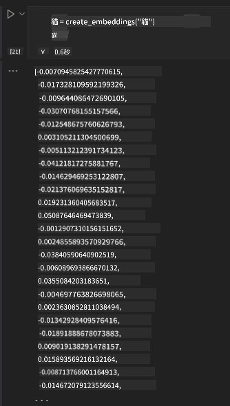

<!--
CO_OP_TRANSLATOR_METADATA:
{
  "original_hash": "e2861bbca91c0567ef32bc77fe054f9e",
  "translation_date": "2025-05-20T01:06:19+00:00",
  "source_file": "15-rag-and-vector-databases/README.md",
  "language_code": "tw"
}
-->
# 檢索增強生成 (RAG) 和向量資料庫

在搜尋應用課程中，我們簡要介紹了如何將自己的資料整合到大型語言模型 (LLM) 中。在這節課中，我們將深入探討在 LLM 應用中基於資料的概念，過程的機制，以及儲存資料的方法，包括嵌入和文本。

> **影片即將推出**

## 介紹

在這節課中，我們將涵蓋以下內容：

- RAG 的介紹，它是什麼以及為什麼在人工智慧 (AI) 中使用它。

- 理解什麼是向量資料庫並為我們的應用建立一個。

- 如何在應用中整合 RAG 的實際範例。

## 學習目標

完成本課後，您將能夠：

- 解釋 RAG 在資料檢索和處理中的重要性。

- 設置 RAG 應用並將資料基於 LLM

- 在 LLM 應用中有效整合 RAG 和向量資料庫。

## 我們的情境：用自己的資料增強 LLM

在這節課中，我們希望將自己的筆記添加到教育初創公司中，讓聊天機器人能夠獲得更多關於不同科目的資訊。使用我們的筆記，學習者將能夠更好地學習和理解不同的主題，讓他們更容易準備考試。為了創建我們的情境，我們將使用：

- `Azure OpenAI:` 我們將用來創建聊天機器人的 LLM

- `AI for beginners' lesson on Neural Networks`：這將是我們基於 LLM 的資料

- `Azure AI Search` 和 `Azure Cosmos DB:` 向量資料庫來儲存我們的資料並創建搜尋索引

使用者將能夠從他們的筆記中創建練習測驗、復習閃卡並將其總結為簡潔的概述。要開始，讓我們看看什麼是 RAG 以及它如何運作：

## 檢索增強生成 (RAG)

一個由 LLM 驅動的聊天機器人處理使用者提示以生成回應。它旨在與使用者在廣泛的主題上互動。然而，它的回應僅限於提供的上下文及其基礎訓練資料。例如，GPT-4 的知識截止日期是 2021 年 9 月，這意味著它缺乏對此後發生事件的了解。此外，用於訓練 LLM 的資料不包括機密資訊，如個人筆記或公司的產品手冊。

### RAGs (檢索增強生成) 如何運作

假設您想部署一個聊天機器人來從您的筆記中創建測驗，您將需要與知識庫的連接。這就是 RAG 發揮作用的地方。RAGs 的運作如下：

- **知識庫：** 在檢索之前，這些文件需要被攝取和預處理，通常將大型文件分解成較小的塊，轉換為文本嵌入並儲存在資料庫中。

- **使用者查詢：** 使用者提出問題

- **檢索：** 當使用者提出問題時，嵌入模型從我們的知識庫中檢索相關資訊，以提供更多上下文，並將其納入提示中。

- **增強生成：** LLM 根據檢索到的資料增強其回應。這使得生成的回應不僅基於預訓練資料，還基於添加的上下文中的相關資訊。檢索到的資料用於增強 LLM 的回應。然後 LLM 返回使用者問題的答案。

RAGs 的架構使用由兩部分組成的轉換器實現：編碼器和解碼器。例如，當使用者提出問題時，輸入文本被“編碼”成向量以捕捉單詞的含義，並且向量被“解碼”成我們的文件索引，並根據使用者查詢生成新文本。LLM 使用編碼器-解碼器模型來生成輸出。

根據提議的論文[檢索增強生成用於知識密集型 NLP（自然語言處理軟體）任務](https://arxiv.org/pdf/2005.11401.pdf?WT.mc_id=academic-105485-koreyst)實施 RAG 的兩種方法是：

- **_RAG-Sequence_** 使用檢索到的文件來預測使用者查詢的最佳答案

- **RAG-Token** 使用文件生成下一個標記，然後檢索它們以回答使用者的查詢

### 為什麼要使用 RAGs？

- **資訊豐富性：** 確保文本回應是最新和當前的。因此，通過訪問內部知識庫來提高在特定領域任務上的表現。

- 通過利用知識庫中的**可驗證資料**來減少捏造，以提供使用者查詢的上下文。

- 它是**成本效益高**的，因為它們比微調 LLM 更經濟。

## 創建知識庫

我們的應用基於我們的個人資料，即 AI 初學者課程中的神經網絡課程。

### 向量資料庫

向量資料庫與傳統資料庫不同，是一種專門設計來儲存、管理和搜尋嵌入向量的資料庫。它儲存文件的數字表示。將資料分解為數字嵌入，使我們的 AI 系統更容易理解和處理資料。

我們將嵌入儲存在向量資料庫中，因為 LLMs 對它們接受作為輸入的標記數量有限制。由於不能將整個嵌入傳遞給 LLM，我們需要將它們分解成塊，當使用者提出問題時，最像問題的嵌入將與提示一起返回。分塊還減少了傳遞通過 LLM 的標記數量的成本。

一些流行的向量資料庫包括 Azure Cosmos DB、Clarifyai、Pinecone、Chromadb、ScaNN、Qdrant 和 DeepLake。您可以使用 Azure CLI 創建 Azure Cosmos DB 模型，使用以下命令：

```bash
az login
az group create -n <resource-group-name> -l <location>
az cosmosdb create -n <cosmos-db-name> -r <resource-group-name>
az cosmosdb list-keys -n <cosmos-db-name> -g <resource-group-name>
```

### 從文本到嵌入

在儲存資料之前，我們需要將其轉換為向量嵌入，然後才能儲存在資料庫中。如果您正在處理大型文件或長文本，可以根據預期的查詢進行分塊。分塊可以在句子級別或段落級別進行。由於分塊從周圍的單詞中推導出含義，您可以向分塊添加一些其他上下文，例如，通過添加文件標題或在分塊前後包含一些文本。您可以按如下方式分塊資料：

```python
def split_text(text, max_length, min_length):
    words = text.split()
    chunks = []
    current_chunk = []

    for word in words:
        current_chunk.append(word)
        if len(' '.join(current_chunk)) < max_length and len(' '.join(current_chunk)) > min_length:
            chunks.append(' '.join(current_chunk))
            current_chunk = []

    # If the last chunk didn't reach the minimum length, add it anyway
    if current_chunk:
        chunks.append(' '.join(current_chunk))

    return chunks
```

一旦分塊，我們就可以使用不同的嵌入模型嵌入我們的文本。您可以使用的一些模型包括：word2vec、OpenAI 的 ada-002、Azure Computer Vision 等。選擇要使用的模型將取決於您使用的語言、編碼的內容類型（文本/圖片/音頻）、它可以編碼的輸入大小以及嵌入輸出的長度。

使用 OpenAI 的 `text-embedding-ada-002` 模型嵌入文本的範例是：


## 檢索和向量搜尋

當使用者提出問題時，檢索器使用查詢編碼器將其轉換為向量，然後在我們的文件搜尋索引中搜尋與輸入相關的文件中的相關向量。一旦完成，它將輸入向量和文件向量都轉換為文本並傳遞給 LLM。

### 檢索

檢索發生在系統嘗試快速從索引中找到滿足搜尋標準的文件時。檢索器的目標是獲取將用於提供上下文並基於您的資料建立 LLM 的文件。

有幾種方法可以在我們的資料庫中進行搜尋，例如：

- **關鍵字搜尋** - 用於文本搜尋

- **語義搜尋** - 使用單詞的語義含義

- **向量搜尋** - 使用嵌入模型將文件從文本轉換為向量表示。檢索將通過查詢其向量表示最接近使用者問題的文件來完成。

- **混合** - 結合關鍵字和向量搜尋。

檢索的挑戰在於當資料庫中沒有類似的回應時，系統將返回他們能夠獲得的最佳資訊，然而，您可以使用一些策略，例如設置最大相關距離或使用結合關鍵字和向量搜尋的混合搜尋。在這節課中，我們將使用混合搜尋，結合向量和關鍵字搜尋。我們將把資料儲存到一個包含分塊和嵌入的列的數據框中。

### 向量相似性

檢索器將在知識資料庫中搜尋相互接近的嵌入，最近鄰居，因為它們是相似的文本。在使用者提出查詢的情境中，它首先被嵌入，然後與相似的嵌入匹配。用於找到不同向量相似度的常用測量是基於兩個向量之間角度的餘弦相似性。

我們可以使用其他替代方法測量相似性，例如歐幾里得距離，它是向量端點之間的直線距離，和點積，它測量兩個向量對應元素的乘積之和。

### 搜尋索引

在進行檢索時，我們需要在進行搜尋之前為知識庫建立一個搜尋索引。索引將儲存我們的嵌入，並且即使在大型資料庫中也能快速檢索最相似的分塊。我們可以使用以下方式在本地建立索引：

```python
from sklearn.neighbors import NearestNeighbors

embeddings = flattened_df['embeddings'].to_list()

# Create the search index
nbrs = NearestNeighbors(n_neighbors=5, algorithm='ball_tree').fit(embeddings)

# To query the index, you can use the kneighbors method
distances, indices = nbrs.kneighbors(embeddings)
```

### 重新排序

一旦您查詢了資料庫，您可能需要根據最相關的排序結果。重新排序 LLM 利用機器學習通過從最相關的排序搜尋結果來提高相關性。使用 Azure AI 搜索，重新排序會自動為您完成，使用語義重新排序器。使用最近鄰居重新排序的範例：

```python
# Find the most similar documents
distances, indices = nbrs.kneighbors([query_vector])

index = []
# Print the most similar documents
for i in range(3):
    index = indices[0][i]
    for index in indices[0]:
        print(flattened_df['chunks'].iloc[index])
        print(flattened_df['path'].iloc[index])
        print(flattened_df['distances'].iloc[index])
    else:
        print(f"Index {index} not found in DataFrame")
```

## 把所有元素結合在一起

最後一步是將我們的 LLM 添加到組合中，以便能夠獲得基於我們資料的回應。我們可以按如下方式實施：

```python
user_input = "what is a perceptron?"

def chatbot(user_input):
    # Convert the question to a query vector
    query_vector = create_embeddings(user_input)

    # Find the most similar documents
    distances, indices = nbrs.kneighbors([query_vector])

    # add documents to query  to provide context
    history = []
    for index in indices[0]:
        history.append(flattened_df['chunks'].iloc[index])

    # combine the history and the user input
    history.append(user_input)

    # create a message object
    messages=[
        {"role": "system", "content": "You are an AI assistant that helps with AI questions."},
        {"role": "user", "content": history[-1]}
    ]

    # use chat completion to generate a response
    response = openai.chat.completions.create(
        model="gpt-4",
        temperature=0.7,
        max_tokens=800,
        messages=messages
    )

    return response.choices[0].message

chatbot(user_input)
```

## 評估我們的應用

### 評估指標

- 提供的回應質量，確保它聽起來自然、流暢且像人類

- 資料的基礎性：評估回應是否來自提供的文件

- 相關性：評估回應是否匹配並與提出的問題相關

- 流暢性 - 回應在語法上是否合理

## 使用 RAG (檢索增強生成) 和向量資料庫的使用案例

有許多不同的使用案例，其中函數調用可以改善您的應用，例如：

- 問答：將公司資料基於聊天，使員工能夠提問。

- 推薦系統：您可以創建一個匹配最相似值的系統，例如電影、餐廳等等。

- 聊天機器人服務：您可以儲存聊天歷史並根據使用者資料個性化對話。

- 基於向量嵌入的圖像搜尋，對於圖像識別和異常檢測很有用。

## 總結

我們已經涵蓋了 RAG 的基本領域，從將資料添加到應用，使用者查詢和輸出。為簡化 RAG 的創建，您可以使用 Semanti Kernel、Langchain 或 Autogen 等框架。

## 作業

要繼續學習檢索增強生成 (RAG)，您可以構建：

- 使用您選擇的框架為應用構建前端

- 利用框架，無論是 LangChain 還是 Semantic Kernel，並重新創建您的應用。

恭喜完成這節課 👏。

## 學習不止於此，繼續旅程

完成本課後，請查看我們的 [生成式 AI 學習收藏](https://aka.ms/genai-collection?WT.mc_id=academic-105485-koreyst)，以繼續提升您的生成式 AI 知識！

**免責聲明**：
本文件使用 AI 翻譯服務 [Co-op Translator](https://github.com/Azure/co-op-translator) 進行翻譯。儘管我們努力確保準確性，但請注意自動翻譯可能包含錯誤或不準確之處。原始文件的母語版本應被視為權威來源。對於關鍵信息，建議使用專業人工翻譯。我們對使用此翻譯而產生的任何誤解或誤讀不承擔責任。