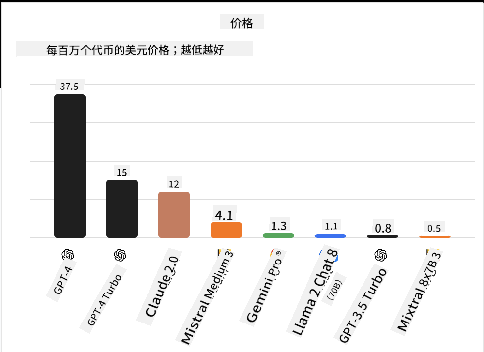
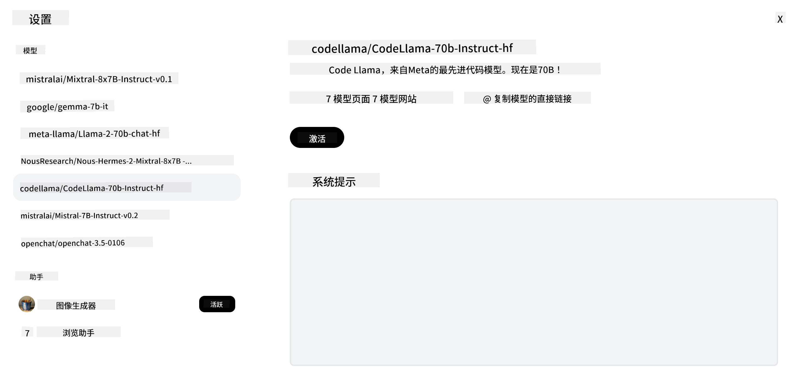
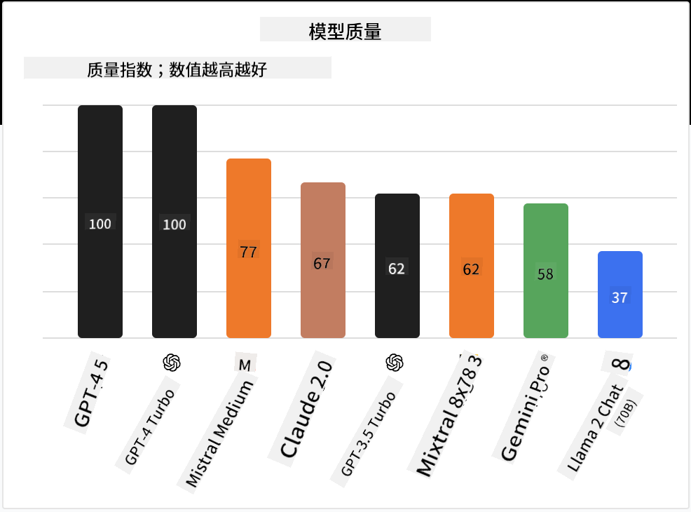

<!--
CO_OP_TRANSLATOR_METADATA:
{
  "original_hash": "0bba96e53ab841d99db731892a51fab8",
  "translation_date": "2025-05-20T06:48:13+00:00",
  "source_file": "16-open-source-models/README.md",
  "language_code": "zh"
}
-->

## 介绍

开源LLM的世界充满了激动和不断变化。本课旨在深入了解开源模型。如果您想了解专有模型与开源模型的比较，请访问["探索和比较不同LLM"课程](../02-exploring-and-comparing-different-llms/README.md?WT.mc_id=academic-105485-koreyst)。本课还将涵盖微调主题，但更详细的解释可以在["微调LLM"课程](../18-fine-tuning/README.md?WT.mc_id=academic-105485-koreyst)中找到。

## 学习目标

- 了解开源模型
- 理解使用开源模型的好处
- 探索Hugging Face和Azure AI Studio上的开源模型

## 什么是开源模型？

开源软件在各个领域的技术发展中发挥了关键作用。开源倡议（OSI）定义了[软件的10个标准](https://web.archive.org/web/20241126001143/https://opensource.org/osd?WT.mc_id=academic-105485-koreyst)，以便将其归类为开源。源代码必须在OSI批准的许可证下公开共享。

虽然LLM的开发与软件开发有相似之处，但过程并不完全相同。这在社区中引发了关于LLM背景下开源定义的许多讨论。为了使模型符合传统开源定义，以下信息应该公开：

- 用于训练模型的数据集。
- 作为训练一部分的完整模型权重。
- 评估代码。
- 微调代码。
- 完整模型权重和训练指标。

目前只有少数模型符合这些标准。[由Allen Institute for Artificial Intelligence (AllenAI)创建的OLMo模型](https://huggingface.co/allenai/OLMo-7B?WT.mc_id=academic-105485-koreyst)就是其中之一。

在本课中，我们将这些模型称为“开源模型”，因为它们在撰写时可能不符合上述标准。

## 开源模型的好处

**高度可定制** - 由于开源模型发布时附有详细的训练信息，研究人员和开发人员可以修改模型的内部。这使得能够创建针对特定任务或研究领域进行微调的高度专业化模型。一些例子包括代码生成、数学运算和生物学。

**成本** - 使用和部署这些模型的每个token成本低于专有模型。在构建生成式AI应用时，应该在使用这些模型时根据您的用例考虑性能与价格。

 来源：人工分析

**灵活性** - 使用开源模型使您可以灵活地使用不同模型或组合它们。一个例子是[HuggingChat Assistants](https://huggingface.co/chat?WT.mc_id=academic-105485-koreyst)，用户可以直接在用户界面中选择使用的模型：

## 探索不同的开源模型

### Llama 2

[LLama2](https://huggingface.co/meta-llama?WT.mc_id=academic-105485-koreyst)由Meta开发，是一个针对聊天应用优化的开源模型。这是由于其微调方法，包括大量对话和人类反馈。通过这种方法，模型产生的结果更符合人类期望，从而提供更好的用户体验。

一些微调版本的Llama包括[Japanese Llama](https://huggingface.co/elyza/ELYZA-japanese-Llama-2-7b?WT.mc_id=academic-105485-koreyst)，专注于日语，以及[Llama Pro](https://huggingface.co/TencentARC/LLaMA-Pro-8B?WT.mc_id=academic-105485-koreyst)，是基础模型的增强版本。

### Mistral

[Mistral](https://huggingface.co/mistralai?WT.mc_id=academic-105485-koreyst)是一个专注于高性能和效率的开源模型。它使用专家混合方法，将一组专业专家模型组合成一个系统，根据输入选择某些模型进行使用。这使得计算更有效，因为模型仅处理它们擅长的输入。

一些微调版本的Mistral包括[BioMistral](https://huggingface.co/BioMistral/BioMistral-7B?text=Mon+nom+est+Thomas+et+mon+principal?WT.mc_id=academic-105485-koreyst)，专注于医疗领域，以及[OpenMath Mistral](https://huggingface.co/nvidia/OpenMath-Mistral-7B-v0.1-hf?WT.mc_id=academic-105485-koreyst)，执行数学计算。

### Falcon

[Falcon](https://huggingface.co/tiiuae?WT.mc_id=academic-105485-koreyst)是由技术创新研究所（**TII**）创建的LLM。Falcon-40B在40亿参数上进行训练，已显示出比GPT-3更好的性能，同时计算预算更低。这是由于其使用FlashAttention算法和多查询注意力，使其能够在推理时减少内存需求。由于推理时间减少，Falcon-40B适用于聊天应用。

一些微调版本的Falcon是[OpenAssistant](https://huggingface.co/OpenAssistant/falcon-40b-sft-top1-560?WT.mc_id=academic-105485-koreyst)，一个基于开源模型的助手，以及[GPT4ALL](https://huggingface.co/nomic-ai/gpt4all-falcon?WT.mc_id=academic-105485-koreyst)，提供比基础模型更高的性能。

## 如何选择

选择开源模型没有唯一的答案。一个好的起点是使用Azure AI Studio的任务过滤功能。这将帮助您了解模型已训练的任务类型。Hugging Face还维护一个LLM排行榜，显示基于某些指标的最佳表现模型。

在比较不同类型的LLM时，[人工分析](https://artificialanalysis.ai/?WT.mc_id=academic-105485-koreyst)是另一个很好的资源：

 来源：人工分析

如果在特定用例上工作，寻找专注于同一领域的微调版本可能是有效的。尝试多个开源模型，看看它们如何根据您和用户的期望表现，是另一个好做法。

## 下一步

开源模型的最佳部分是您可以快速开始使用它们。查看[Azure AI Studio模型目录](https://ai.azure.com?WT.mc_id=academic-105485-koreyst)，其中包含我们在这里讨论的Hugging Face集合。

## 学习不会停止，继续旅程

完成本课后，请查看我们的[生成式AI学习集合](https://aka.ms/genai-collection?WT.mc_id=academic-105485-koreyst)，继续提升您的生成式AI知识！

**免责声明**：
本文档使用 AI 翻译服务 [Co-op Translator](https://github.com/Azure/co-op-translator) 进行翻译。虽然我们努力确保准确性，但请注意自动翻译可能包含错误或不准确之处。应将原始文档的母语版本视为权威来源。对于重要信息，建议使用专业人工翻译。对于因使用此翻译而产生的任何误解或误读，我们不承担责任。